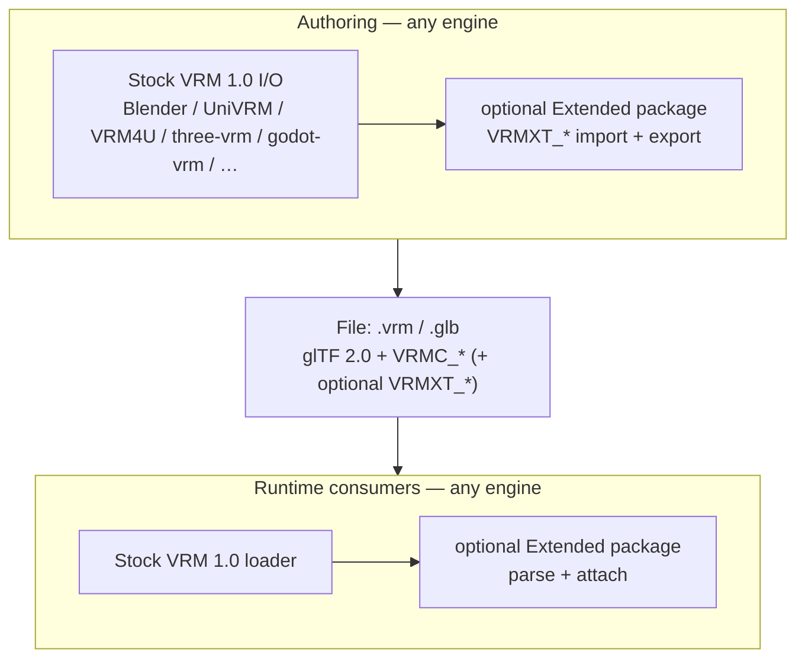

# Extended VRM Architecture

Layering of Extended VRM (`VRMXT_*` glTF extensions) for **multi-engine authoring**
(import/export) and **runtime consumers** relative to stock VRM 1.0. Normative field
rules live in [specs/](specs/); this note covers compatibility and integration seams
only.

## Claims

1. A valid VRM 1.0 file without `VRMXT_*` extensions loads and runs under stock
   VRM tools unchanged.
2. A VRM 1.0 file that also carries `VRMXT_*` data MUST remain loadable by stock
   importers that ignore unknown extensions (see each extension's
   `extensionsRequired` rules).
3. Extended behavior is optional. Consumers MAY ignore every `VRMXT_*` extension
   and still treat the file as ordinary VRM 1.0.
4. Extended support ships as an optional add-on package on each engine (for
   example [UniVRMXT](https://github.com/miramocha/UniVRMXT) on Unity, a
   separate Godot addon beside [godot-vrm](https://github.com/V-Sekai/godot-vrm),
   or an npm package beside [@pixiv/three-vrm](https://github.com/pixiv/three-vrm)).
   Baseline avatar import keeps the stock VRM loader; replacing or forking that
   loader is not required.
5. Authoring is multi-engine. Any host with stock VRM 1.0 import/export MAY add an
   optional Extended package that reads and writes `VRMXT_*` on the same `.vrm` /
   `.glb`. Blender and Unity (UniVRMXT + Extended-UniVRM) ship authoring paths today;
   Three.js, Unreal, Godot, and others stay in scope for the same file contract.

## Layers

The same optional Extended package on an engine often covers **both** editor
authoring (import/export) and runtime consume. Profiles document which directions
are implemented.

| Layer | Owns | Does not own |
|-------|------|--------------|
| Stock VRM 1.0 (`VRMC_vrm`, spring bone, …) | Humanoid, look-at, expressions, materials baseline | `VRMXT_*` semantics |
| Extended VRM specs (this repo) | Portable `VRMXT_*` schemas and compatibility rules | Engine-specific APIs |
| Authoring (per engine) | Edit + serialize `VRMXT_*` beside stock VRM export; re-import into editor data | Replacing stock VRM export; a second file format |
| Optional runtime package | Parse `VRMXT_*`, map to engine runtime | Replacing stock VRM import |

## File model

Extended VRM is ordinary glTF 2.0 / VRM 1.0 plus optional root or per-object
extensions named `VRMXT_*`.

| Rule | Requirement |
|------|-------------|
| Presence | `VRMXT_*` MAY be absent. Absence = stock VRM only. |
| `extensionsUsed` | Files that write a `VRMXT_*` extension MUST list that name in `extensionsUsed`. |
| `extensionsRequired` | Optional Extended designs MUST NOT put their `VRMXT_*` name in `extensionsRequired` (see each spec). |
| Unknown extensions | Stock importers ignore unknown extension objects per glTF rules. |
| Target | Current drafts target VRM 1.0 (`VRMC_vrm` 1.0). VRM 0.0 is out of scope unless a spec says otherwise. |

Stock tools that never heard of Extended VRM still open the avatar. Extended data
is skipped.

## Authoring

Authoring is **stock VRM 1.0 I/O + optional Extended I/O** on whatever engine the
creator uses. The file remains one `.vrm` / `.glb`. Engines MUST NOT invent a
parallel Extended-only format.

### Common rules (all engines)

1. Stock VRM import/export stays the baseline. Extended packages MUST NOT replace it.
2. Export order: write stock `VRMC_*` (and related) first, then append `VRMXT_*` and
   matching `extensionsUsed` entries.
3. Do **not** list optional `VRMXT_*` names in `extensionsRequired`.
4. Import: after stock node/bone (or equivalent) maps exist, parse `VRMXT_*` into
   editor-owned data. Skip invalid emitters / overrides per each spec; do not fail
   the whole avatar load.
5. Round-trip goal: portable fields survive export → import on the same engine and,
   where implemented, across engines. Exact editor UI and native preview differ per
   host.

| Host | Stock VRM I/O | Extended authoring package | Import `VRMXT_*` | Export `VRMXT_*` |
|------|---------------|----------------------------|------------------|------------------|
| Blender | [Extended-VRM-Addon-for-Blender](https://github.com/miramocha/Extended-VRM-Addon-for-Blender) | [VRMXT-Extension-for-Blender](https://github.com/miramocha/VRMXT-Extension-for-Blender) | [Blender VFX](implementations/blender-vfx.md), [Blender Materials Override](implementations/blender-materials-override.md) | Same (Addon Preferences enable hooks) |
| Unity | [UniVRM](https://github.com/vrm-c/UniVRM) / [Extended-UniVRM](https://github.com/miramocha/Extended-UniVRM) | [UniVRMXT](https://github.com/miramocha/UniVRMXT) | [UniVRM VFX](implementations/univrm-vfx.md), [UniVRM Materials Override](implementations/univrm-materials-override.md) | Same via Extended-UniVRM export hooks (Project Settings gate) |
| Three.js | [@pixiv/three-vrm](https://github.com/pixiv/three-vrm) | three-vrmxt (planned) | Planned: [three-vrm VFX](implementations/three-vrm-vfx.md) | **TBD** |
| Unreal | VRM4U | Extended package **TBD** | **TBD** | **TBD** |
| Godot | [godot-vrm](https://github.com/V-Sekai/godot-vrm) | godot-vrmxt (planned) | Planned: [Godot VFX](implementations/godot-vfx.md) | **TBD** |
| Other | Any VRM 1.0 tool | Optional Extended package | Implement specs | Implement specs |

### Blender (shipping)

| Piece | Repo | Role |
|-------|------|------|
| Stock Blender VRM add-on | [Extended-VRM-Addon-for-Blender](https://github.com/miramocha/Extended-VRM-Addon-for-Blender) (fork of [saturday06/VRM-Addon-for-Blender](https://github.com/saturday06/VRM-Addon-for-Blender); generic hooks to propose upstream) | Import/export `VRMC_*`, build node/bone maps |
| VRM1 extension hooks | Same add-on: `io_scene_vrm.extension_hooks` | After stock maps exist, call registered third-party callbacks when Addon Preferences enable import/export hooks (default off) |
| VRMXT Blender extension | [VRMXT-Extension-for-Blender](https://github.com/miramocha/VRMXT-Extension-for-Blender) | Registers hooks; authors and serializes `VRMXT_*` |

Hooks exist because glTF2 user extensions run too early to receive final VRM bone
and object index maps. Details:
[Blender Extension Hooks](implementations/blender-extension-hooks.md).

Blender flow (non-normative):

1. User builds a VRM 1.0 avatar with the stock VRM add-on.
2. Optional: enable the VRMXT Blender extension and author Extended data (emitters,
   overrides, …).
3. Export writes stock `VRMC_*` first. When export extension hooks are enabled in
   Addon Preferences, hook callbacks append `VRMXT_*` and `extensionsUsed` entries.
4. Result is one `.vrm` / `.glb`. No second file format.

Without the VRMXT Blender extension, export stays stock VRM. Hooks stay idle.

### Unity (shipping with Extended-UniVRM)

| Piece | Repo | Role |
|-------|------|------|
| Stock / fork UniVRM | [UniVRM](https://github.com/vrm-c/UniVRM) or [Extended-UniVRM](https://github.com/miramocha/Extended-UniVRM) | Stock `VRMC_*` I/O; Extended fork adds generic import/export extension registries |
| UniVRMXT | [UniVRMXT](https://github.com/miramocha/UniVRMXT) | Soft-detects those registries; authors and serializes `VRMXT_vfx` and `VRMXT_materials_override` |

Unity flow (non-normative):

1. Project uses Extended-UniVRM (or stock UniVRM for consume-only paths).
2. Project adds UniVRMXT. Enable Project Settings → VRM10 import/export extension gates when using hooks.
3. Import: hooks attach VFX / materials override onto the original `.vrm` when enabled; stock UniVRM (or hooks off) can still consume via companion / post-load attach.
4. Author: edit `VrmxtVfxInstance` / ParticleSystems, or assign Override Materials on `VrmxtMaterialsOverrideInstance`.
5. Export: with export hooks enabled, UniVRMXT writes `VRMXT_*` after stock `VRMC_*`. One `.vrm` / `.glb`.

Stock UniVRM without the Extended export registry does not write `VRMXT_*`. Full from-scratch VFX emitter UI still prefers Blender; Unity covers re-export and materials override authoring. Details: [UniVRM upstream hooks](implementations/univrm-upstream-hooks.md), [UniVRM VFX](implementations/univrm-vfx.md), [UniVRM Materials Override](implementations/univrm-materials-override.md).

### Other engines (authoring direction)

Three.js, Unreal, Godot, and similar hosts follow the same file contract.
Implementation profiles under `implementations/` state whether export is shipped or
**TBD**. Until an engine’s Extended export lands, use Blender or Unity to write
`VRMXT_*`; that engine’s package still MAY import and run the data.

## Consumers (runtime)

A **runtime consumer** reads `VRMXT_*` after (or beside) a stock VRM load and maps
portable fields onto engine types. When the same package also supports editor
export, see [Authoring](#authoring).

| Consumer | Host | Integration style |
|----------|------|-------------------|
| [UniVRMXT](https://github.com/miramocha/UniVRMXT) | Unity + [UniVRM](https://github.com/vrm-c/UniVRM) | Optional UPM package. Parse extension JSON; attach after `Vrm10` load. Runtime does not replace UniVRM. |
| Godot VRMXT addon (planned) | Godot + [godot-vrm](https://github.com/V-Sekai/godot-vrm) | Optional addon. Register `GLTFDocumentExtension` beside stock VRM plugins; runtime attach when `EditorPlugin` is absent. Does not replace godot-vrm. |
| three-vrmxt (planned) | Three.js + [@pixiv/three-vrm](https://github.com/pixiv/three-vrm) | Optional npm package. Peer `GLTFLoaderPlugin` beside `VRMLoaderPlugin`; optional explicit `tryAttach`. Does not replace three-vrm. |
| VRM4U path | Unreal + VRM4U | Optional profile docs under `implementations/`; stock VRM4U load remains baseline. |
| Other engines | Any VRM 1.0 loader | Implement the specs; ignore unknown `VRMXT_*` if unsupported. |

### Unity / UniVRM

[UniVRM](https://github.com/vrm-c/UniVRM) remains the stock VRM 1.0 importer. UniVRMXT
is additive. Editor import onto the original `.vrm` and `VRMXT_*` export use
[Extended-UniVRM](https://github.com/miramocha/Extended-UniVRM) generic
ScriptedImporter / export registries (to propose upstream to vrm-c); see
[UniVRM upstream hooks](implementations/univrm-upstream-hooks.md) and
[Authoring → Unity](#unity-shipping-with-extended-univrm).

1. Project keeps UniVRM (`com.vrmc.gltf`, `com.vrmc.vrm`) from
   [vrm-c/UniVRM](https://github.com/vrm-c/UniVRM) (or Extended-UniVRM when using hooks).
2. Project MAY add UniVRMXT (`com.miramocha.univrmxt`).
3. After stock load (`Vrm10.LoadGltfDataAsync` or equivalent), the app calls UniVRMXT
   helpers (for example `VrmxtVfxRuntime.TryAttach`,
   `VrmxtMaterialsOverrideRuntime.TryAttachFromGltfJson`) with glTF JSON and node
   transforms — or relies on Editor import hooks when Extended-UniVRM gates are on.
4. Missing extension or missing package → no Extended runtime objects; avatar still
   valid.

UniVRMXT Runtime avoids hard UniGLTF/VRM10 asmdef references where possible so
format parsing stays testable without replacing UniVRM assemblies. Full material
descriptor wrapping still runs inside a project that already has UniVRM.

Implementation notes:
[UniVRM VFX](implementations/univrm-vfx.md),
[UniVRM Materials Override](implementations/univrm-materials-override.md),
package [architecture](https://github.com/miramocha/UniVRMXT/blob/main/docs/architecture.md).

### Godot / godot-vrm

godot-vrm remains the VRM 1.0 importer. Extended support is a separate addon:

1. Project keeps [godot-vrm](https://github.com/V-Sekai/godot-vrm) (`addons/vrm` + MToon).
2. Project MAY enable a VRMXT addon that registers its own `GLTFDocumentExtension`
   instances with `GLTFDocument.register_gltf_document_extension`.
3. Editor `.vrm` import runs stock VRM extensions and VRMXT extensions in the same
   `GLTFDocument` pass (`_import_preflight` / `_import_post`).
4. Runtime loads MUST register the VRMXT extension (or call an explicit attach helper)
   because `EditorPlugin` does not run in exported games.
5. Missing extension or missing addon → no Extended nodes; avatar still valid.

Do not nest the VRMXT addon under `addons/vrm` or replace `import_vrm.gd`.

Implementation notes: [Godot VFX](implementations/godot-vfx.md).

### three-vrm / Three.js

[@pixiv/three-vrm](https://github.com/pixiv/three-vrm) remains the VRM 1.0 loader for
Three.js (WebGLRenderer by default; WebGPURenderer supported in v3+). Extended
support is a separate npm package:

1. App keeps `@pixiv/three-vrm` and registers `VRMLoaderPlugin` on `GLTFLoader`.
2. App MAY also register a VRMXT `GLTFLoaderPlugin` (or call an explicit attach
   helper after load).
3. The VRMXT plugin reads root `extensions.VRMXT_*` in `afterRoot`, resolves nodes
   via `parser.getDependencies('node')`, and attaches engine objects under those
   nodes.
4. Missing extension or missing package → no Extended objects; avatar still valid.

Do not fork pixiv/three-vrm or patch `VRMLoaderPlugin` as the only path.

Implementation notes: [three-vrm VFX](implementations/three-vrm-vfx.md).

### Compatibility matrix

| Scenario | Stock VRM load | Extended features |
|----------|----------------|-------------------|
| No `VRMXT_*` in file; no Extended package | Works | N/A |
| `VRMXT_*` in file; no Extended package | Works (extensions ignored) | Off |
| No `VRMXT_*` in file; Extended package present | Works | No-op attach / empty parse |
| `VRMXT_*` in file; Extended package present | Works | Features apply per consumer profile |

## What this architecture rejects

| Approach | Why rejected |
|----------|--------------|
| Fork UniVRM, godot-vrm, or three-vrm as the only way to get Extended features | Breaks drop-in use; forces replace of a maintained upstream |
| Put `VRMXT_*` in `extensionsRequired` for optional extras | Stock loaders would refuse the file |
| Separate binary format instead of glTF extensions | Splits the ecosystem; breaks “one avatar file” |
| Require Blender (or any single DCC) for all Extended export | Multi-engine authoring is in scope; stock VRM authoring must stay available without Extended |
| Engine-private Extended side-car files | Breaks “one avatar file” and cross-engine round-trip |

## Document map

| Need | Doc |
|------|-----|
| Extension schemas | [specs/](specs/) |
| Design decisions | [decisions/](decisions/) (e.g. [animation controller standardization](decisions/animation-controller-standardization.md)) |
| Blender hook API | [implementations/blender-extension-hooks.md](implementations/blender-extension-hooks.md) |
| Unity VFX profile | [implementations/univrm-vfx.md](implementations/univrm-vfx.md) |
| Unity materials override | [implementations/univrm-materials-override.md](implementations/univrm-materials-override.md) |
| UniVRM upstream hooks | [implementations/univrm-upstream-hooks.md](implementations/univrm-upstream-hooks.md) |
| Warudo VRMXT host | [implementations/warudo-vrmxt.md](implementations/warudo-vrmxt.md) |
| Godot VFX profile | [implementations/godot-vfx.md](implementations/godot-vfx.md) |
| three-vrm VFX profile | [implementations/three-vrm-vfx.md](implementations/three-vrm-vfx.md) |
| Repo index | [README.md](README.md) |

## Open questions

| Topic | Status |
|-------|--------|
| Shared post-load registry inside upstream UniVRM | TBD (Extended-UniVRM registries + UniVRMXT soft-detect; propose upstream) |
| Full Unity from-scratch VFX authoring UI (vs Blender + Unity re-export) | Open; re-export and materials override authoring already ship |
| Three.js / Unreal / Godot Extended **export** timelines | TBD per engine profile |
| Cross-engine authoring round-trip conformance tests for each `VRMXT_*` | TBD |
| Portable Animator-like controller (`VRMXT_*`) | Decision: [conditional / narrow](decisions/animation-controller-standardization.md); no extension draft until flip conditions met |
