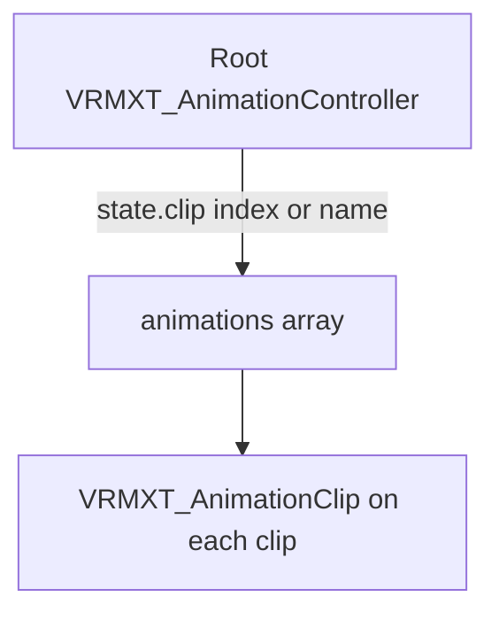

# Animation controller standardization

## Status

**Conditional / narrow, durable final scope.** Reject a full Unity Animator Controller
(Mecanim) dump. Pursue two optional extensions:

| Extension | Attachment |
|-----------|------------|
| `VRMXT_AnimationController` | Root `extensions` |
| `VRMXT_AnimationClip` | `animations[i].extensions` |

Clip packaging **A**: bake keyframes in-file via glTF `animations[]`. Authoring ships
first on **Unity + Blender**. Implementation order is not a schema version ladder.

Warudo deferred (Unity host). VRChat SDK = product analogy and converter target only.
**VRM 0.x out of scope** ([architecture](../architecture.md): VRM 1.0 / `VRMC_vrm`).

No ratified KHR owns this job; see [KHR / glTF overlap](../references/khr-gltf-overlap.md).

## Question

Should Extended VRM standardize an Animator Controller–like animation graph for Unity,
Unreal (VRM4U), Blender, Three.js, and Godot?

| Outcome | Meaning |
|---------|---------|
| No | Controllers stay host-owned; VRM/VRMXT ship clips and avatar data only |
| Conditional / narrow | Portable subset (locomotion + emote FSM + clip meta), not full Mecanim |
| Yes (full-ish) | Broad Animator-like graph as first-class portable data |

**Chosen:** conditional / narrow.

## Motivations

1. **Cross-engine portability:** one `.vrm` / `.glb` carries motion policy so consumers
   do not each invent incompatible graphs.
2. **VRChat-like apps:** hosts load user avatars and expect locomotion / gesture / emote
   policy in the file (host drives params; avatar ships graph + clips).
3. **Author once:** stop treating Unity `.controller` or Unreal AnimBP as the Extended
   source of truth.
4. **Future VRMXT → VRChat avatar converter:** maps portable graph + clips into a
   VRChat-ready Unity avatar. Converter consumes the contract; schema does not embed the
   VRChat SDK.

Primary product shape: **avatar ships the graph**. Game hosts that already own a full
character controller MAY ignore the extensions.

## Product goal

Users can:

1. **Swap / reassign clips** on named states (locomotion or emote) without rebuilding the
   whole graph.
2. **Drive states / emotes at runtime** via a first-party **VRMXT bridge**, not by forcing
   each host to author a native Animator/AnimBP.

### Bridge

A VRMXT runtime component (Unity example: `VrmxtAnimationBridge` on the avatar root) is
part of UniVRMXT / the engine Extended package (allowed under no-third-party rule).

| Host does | Bridge does |
|-----------|-------------|
| `PlayOneShot("Wave")` / `SetFloat("Speed", v)` / `GoToState("Locomotion")` | Maps name → portable state / parameter; drives stock Animator, AnimBP/montage, or a small interpreter |
| `SetStateClip("Walk", clipOrIndex)` | Rebinds state → `animations[]` entry |

Stable bridge surface (names finalized in `implementations/`): `PlayOneShot`, `GoToState`,
`SetFloat` / `SetBool` / `SetInt`, `SetStateClip`.

### One-shots: bridge only (no Trigger in file)

Unity `Trigger` auto-clears after a transition consumes it. Unreal has no matching type.

| Design | Choice |
|--------|--------|
| `trigger` param in file | **Rejected** (permanent). Fake consume-and-clear across engines; overlaps `PlayOneShot`. |
| Bridge + named one-shot states | **Chosen.** File params are `float` / `bool` / `int` only. |

Unreal MAY implement `PlayOneShot` with a Montage or forced state in the engine profile.

### Unity authoring (locked intent)

Do **not** ship a custom Mecanim replacement as the Unity authoring UI for phase 1.

| Piece | Unity authoring | On VRM export | On VRM import |
|-------|-----------------|---------------|---------------|
| Clip metadata | `VRMXT_AnimationClip` fields on each used `AnimationClip` (catalog / inspector helpers OK) | Write per `animations[i].extensions.VRMXT_AnimationClip`; bake keyframes into `animations[]` | Restore clip assets + meta |
| FSM | Stock **Animator Controller**: portable graph on **layer index 0** only; that layer’s display name SHOULD be `VRMXT` (Unity allows renaming Base Layer). Params: float/bool/int only; no Trigger in the portable subset | Read layer 0 states / params / transitions / blend trees → `VRMXT_AnimationController` | Rebuild Animator with layer 0 named `VRMXT` from the extension (or drive an interpreter); bridge talks to it |

Export MUST reject or strip non-portable Mecanim features (extra layers, sub-state machines, Trigger params, unsupported blend trees) with clear authoring errors. Layers above index 0 are **not** written to the file. Exporters MUST use **index 0** as the bind (name is a label). If layer 0’s name is not `VRMXT`, exporters SHOULD warn and MAY rename on import rebuild. The `.vrm` extensions are the portable metadata; the `.controller` asset is Unity-local authoring, not a sidecar in the file.

**Layers:** the portable schema has a single implicit pose layer (no `layers[]` field, no layer name in JSON). Unity maps that layer ↔ Animator **index 0**, display name **`VRMXT`** (renamed Base Layer — not a second layer). A host-owned extra layer beside it remains Unity-local and out of file scope.

Blender and other engines keep their own authoring; they do not read Unity `.controller` files.

## Two extensions

| Extension | Owns |
|-----------|------|
| `VRMXT_AnimationController` | Flat FSM, params, transitions, state→clip refs, bridge contract. Single layer. |
| `VRMXT_AnimationClip` | Clip metadata (role/tags, loop hint, display name, optional root-motion hints). No FSM. **Required** on every `animations[i]` the controller binds (expression → morph pattern). |

Controller binds are unresolved if the target animation lacks `VRMXT_AnimationClip`.
Animations not referenced by a controller MAY omit the clip extension. Neither name goes
in `extensionsRequired`.

Existing VRMXT ids often use snake_case (`VRMXT_materials_override`). These two keep the
Pascal form locked above unless a later family-wide casing pass.

## Final schema scope

| Include | Rule |
|---------|------|
| Extension names | `VRMXT_AnimationController` + `VRMXT_AnimationClip` |
| Single layer | One pose layer on the controller. No additive/override stacks, no bone masks. |
| Flat FSM | Named states + declarative transitions. No nested state machines. |
| Params | `float`, `bool`, `int` only |
| One-shots | Bridge `PlayOneShot` / `GoToState` + named one-shot states |
| Inter-state blend | Cut **or** one default crossfade (**exact policy TBD** in first specs draft) |
| One-shot end | **TBD** in first specs draft (auto-return vs bridge cancel) |
| Clip refs | Per-state swappable index/name into in-file `animations[]`; each bound clip MUST have `VRMXT_AnimationClip` |
| In-state blend spaces | **Optional** on a state (1D/2D). Absent = single clip |

| Exclude (permanent on controller) | Why |
|-----------------------------------|-----|
| `trigger` param type | Bridge one-shots + float/bool/int enough |
| Multi-layer / bone masks | Whole-body swap + emotes; layers explode cost |
| Nested FSMs | Flat list stays portable |
| EventGraph, Montages-in-file, IK graphs, sync groups | Engine-private |

## Hard constraints

| Constraint | Rule |
|------------|------|
| Target | VRM 1.0 (`VRMC_vrm`) only; VRM 0.x unsupported |
| Portable file | Optional `VRMXT_*` in the same glTF/VRM; no engine-private sidecar |
| Stock VRM | Humanoid, look-at, expressions stay `VRMC_vrm` |
| `extensionsRequired` | Controller and clip extensions MUST NOT be listed |
| No third-party deps | Stock engine animation APIs and/or first-party VRMXT interpreter only |
| Prod-safe I/O | UniVRM VRM 1.0 clip import/export MUST be opt-in flags (default off) |
| VRMXT respects flags | UniVRMXT / Blender VRMXT MUST check clip I/O flags before clip/controller authoring or export; flag off → no-op |
| Engine profiles | MAY map portable data onto Animator / AnimBP / AnimationTree / `AnimationMixer` |

## Platforms

| Platform | Native analog | Stock VRM / VRMXT today |
|----------|---------------|-------------------------|
| Unity | Animator Controller | VRM 1.0 skips animation import; export writes no `animations[]` |
| Unreal | AnimBP (FSM + Blend Space) | VRM4U maps clips / VRMA; topology host-owned |
| Blender | Actions / NLA | Import best-effort; export off unless Advanced + `export_gltf_animations` |
| Three.js | App mixer / custom SM | No portable graph |
| Godot | AnimationTree | No portable graph |

Upstream `VRMC_vrm_animation` (VRMA) maps humanoid / expressions / look-at onto clips.
State machines stay out of VRMA. Use VRMA for retarget packs; use packaging A for the
in-avatar controller.

## Concept overlap (Unity vs Unreal)

Host / bridge sets parameters → flat state machine → optional blend space inside a
locomotion state → pose. Single layer.

| Concept | Unity | Unreal | Portable |
|---------|-------|--------|----------|
| Named parameters | float / bool / int / trigger | AnimBP variables (no Trigger) | float / bool / int only |
| One-shots / emotes | Trigger or CrossFade | Montage or pulse bool | Bridge `PlayOneShot` / named states |
| FSM | Animator Controller | AnimGraph state machine | Declarative, flat |
| Inter-state blend | Transition curves / interrupts | Blend times / rules | Cut or single default crossfade |
| Clip references | AnimationClip | AnimSequence | `animations[]`, swappable per state |
| 1D / 2D in a state | Blend Tree | Blend Space | Optional on state |
| Layers / bone masks | Animator layers / Avatar Mask | Layered blend / branch filter | Out of this extension |
| Nested FSMs | Sub-State Machines | Nested SMs | Out |
| Arbitrary logic | C# | Event Graph | Host / bridge |
| IK / Control Rig | Animation Rigging | Anim nodes / Control Rig | Out |
| Montages in file | — | Montages | Out as file data (OK as Unreal impl of PlayOneShot) |

## Clip packaging

**Chosen: A.** Bake clips into the same `.vrm` / `.glb` via glTF `animations[]`.

Reject B (external VRMA-only for the avatar controller) and C (host-owned clips only) for
this track: one-avatar-file and VRChat-like / converter goals need in-file clips.

| Tool | Import clips in `.vrm` | Export clips into `.vrm` |
|------|------------------------|--------------------------|
| UniVRM VRM 1.0 | Skipped (`LoadAnimation = false`) | None written |
| Blender VRM add-on | Best-effort; may strip on failure | Opt-in advanced preference |

Fix path: feature-flagged VRM 1.0 animation import/export in Extended-UniVRM (then propose
upstream) + reliable Blender `export_gltf_animations`. **Default off** so prod VRM
pipelines stay unchanged.

| Flag surface (Unity, illustrative) | Default | When on |
|------------------------------------|---------|---------|
| Import glTF `animations[]` on VRM 1.0 | Off | `LoadAnimation = true` |
| Export clips into VRM 1.0 | Off | Write `animations[]` |

Real C# / pref names appear with the UniVRM fork or upstream PR. VRMXT soft-detects them.
Hooks do not own stock clip I/O; they stay for writing `VRMXT_*` after maps exist.

## Khronos overlap (summary)

No ratified KHR is a Mecanim-like FSM or clip-metadata catalog. Closed
`KHR_animation_controller` / `KHR_animation_clip` PRs moved to interactivity. Reuse
loop/speed/offset *ideas* on `VRMXT_AnimationClip` only. Avatar FSM stays independent of
`KHR_interactivity` and `KHR_animation_pointer`.

Detail: [KHR / glTF overlap](../references/khr-gltf-overlap.md).

## Criteria scores

| Criterion | Full Mecanim dump | Narrow portable profile | Host-owned only |
|-----------|-------------------|-------------------------|-----------------|
| Cross-engine fidelity | Fail | Pass if declarative | Pass |
| Authoring / round-trip | Fail outside Unity | Unity + Blender first | N/A |
| Clip dependency | Blocked by stock I/O | A chosen; needs flagged I/O | Host-local |
| VRChat-like + converter | Unity-only fit | Strong if Mecanim-shaped | Converter invents graph |
| Scope / architecture | Fail | Pass | Pass |
| No third-party deps | Fail if SDK required | Pass | Pass |

## Recommendation

1. **Do not** dump `.controller` / AnimBP assets, put VRChat SDK in the schema, or adopt
   `KHR_interactivity` as the avatar animation brain.
2. **Do** implement against the draft specs
   ([VRMXT_AnimationController](../specs/extensions/animation/vrmxt-animation-controller.md),
   [VRMXT_AnimationClip](../specs/extensions/animation/vrmxt-animation-clip.md)) under the final scope above.
   Crossfade policy and emote-end remain TBD inside those drafts until locked.
3. Keep materials / VFX / spring / lattice work in parallel; animation authoring waits on
   flagged UniVRM clip I/O.
4. Optimize for avatar-ships-graph consumers and a future VRChat converter.

### Implementation phasing (not schema versions)

| Phase | Scope |
|-------|-------|
| 1. Authoring (Unity + Blender) | Flagged `animations[]` I/O; Unity: Animator Controller → export maps to `VRMXT_AnimationController` + required clip meta; Blender graph/actions TBD; bridge prototype; round-trip `.vrm` |
| 2. Extra consumers | Same bridge surface on Unreal / Godot / Three (and converter) |
| 3. Optional host work | Extra authoring UIs; `KHR_animation_pointer` only if material-toggle clips matter |

### Flip conditions (when to open `specs/` drafts)

All of:

1. Packaging A proven on Unity and Blender with flags **on**; flags **off** preserve
   today’s no-clip VRM 1.0 behavior.
2. Unity and Blender remain the first authoring pair.
3. Confirmed product pull (VRChat-like host and/or converter work scheduled).
4. Short non-normative sketch that Unreal / Godot / Three can consume with stock APIs or
   a VRMXT interpreter.

### Flip conditions (when to abandon)

Any of:

- No VRChat-like / converter work planned and priority stays on materials / VFX / spring.
- Team refuses flagged VRM 1.0 in-file clip I/O on Unity and Blender.

## Follow-on

| Item | When |
|------|------|
| UniVRM VRM 1.0 clip I/O | Phase 1; flagged, default off; upstream propose or Extended until merge |
| UniVRMXT / Blender VRMXT check flags | Phase 1 |
| `specs/` for both animation extensions | Drafted; lock TBD crossfade / emote-end before implementers treat them as stable |
| Bridge + authoring UI | Phase 1: Unity = subset Animator export/import + clip meta helpers (no custom FSM editor) |
| `implementations/*` Unity + Blender | With authoring |
| Unreal / Godot / Three profiles | Phase 2 |
| VRMXT → VRChat converter | Separate product |

## Related

- [VRMXT_AnimationController](../specs/extensions/animation/vrmxt-animation-controller.md)
- [VRMXT_AnimationClip](../specs/extensions/animation/vrmxt-animation-clip.md)
- [Extended VRM Architecture](../architecture.md)
- [KHR / glTF overlap](../references/khr-gltf-overlap.md)
- Upstream [VRMC_vrm_animation](https://github.com/vrm-c/vrm-specification/tree/master/specification/VRMC_vrm_animation-1.0)
- [VRMXT_materials_override](../specs/extensions/materials/vrmxt-materials-override.md)
