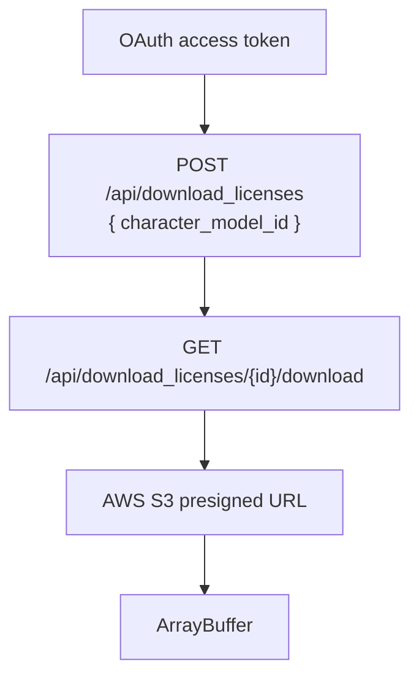

# VRoid Hub browser viewer architecture

## Status

Proposed. No shipped extension or Unity WebGL viewer yet. Capability schemas remain
drafts.

## Context

[VRoid Hub](https://hub.vroid.com/) hosts VRM 1.0 models and renders them with
[@pixiv/three-vrm](https://github.com/pixiv/three-vrm). That viewer ignores `VRMXT_*`
extensions. Empirical upload → original-download checks show
`VRMXT_materials_override` can survive in the original file
([VRoid Hub VRMXT round-trip](../references/vroid-hub-vrmxt-roundtrip.md)). Hub's
browser-optimized preview asset is a separate pipeline and is not treated as the
authoritative VRMXT source.

A product goal is to preview Hub-hosted models with Warudo-aligned VRMXT behavior
(UniVRM + UniVRMXT materials override and sprite particles). Constraints established
in design discussion:

- Chrome and Firefox extension support.
- Do not replace Hub React UI or inject Unity into Hub page DOM.
- Hub website login and extension OAuth are separate sessions.
- Official VRoid Hub API supplies original bytes after OAuth and download-license
  issuance ([OAuth](https://developer.vroid.com/en/api/oauth-api.html),
  [load character](https://developer.vroid.com/en/api/load-character.html)).
- Official Unity VRoid SDK does not support WebGL; OAuth and download stay in
  extension JavaScript.
- Token endpoints that require `client_secret` cannot keep that secret inside a
  published extension or WebGL build.
- Public Hub model metadata exposes `is_downloadable` and related flags. It does not
  expose a VRMXT presence field. Tags and model names are not proof of VRMXT data.
- Warudo VRMXT plugin targets Unity `2021.3.45f2`
  ([Warudo VRMXT](../implementations/warudo-vrmxt.md)). Viewer editor pin matches that
  consumer so package versions, shader compile path, and override apply behavior stay
  comparable.

## Decision

1. Ship a cross-browser extension. On Hub character-model routes, a content script
   mounts a small extension-owned status/action control. The control does not hide,
   delete, or replace Hub login/download UI.
2. Open one persistent extension viewer tab (or dedicated window) at an extension
   origin. Unity WebGL runs there, outside Hub DOM. Pass `characterModelId` through
   extension messaging and/or viewer URL state. Do not put access tokens or
   `client_secret` in query strings.
3. Keep Hub website session cookies and extension OAuth tokens separate. Extension
   auth uses a registered VRoid Hub application. Code that holds `client_secret`
   lives in a backend token broker / BFF. Extension and WebGL code hold only tokens
   issued for that app.
4. Download original model bytes with the documented API sequence. Prefer original
   download over Hub optimized preview for VRMXT.

5. Indicator semantics:
   - Public metadata MAY drive “download eligible / preview action available”
     states.
   - Confirmed VRMXT presence requires inspecting original GLB JSON
     (`extensionsUsed` / material or root `VRMXT_*` objects) after authorized download.
   - Do not treat Hub tags, titles, or description text as VRMXT proof.
6. Ship one Unity WebGL player initially from the shared
   [VRMXT Unity Player](../implementations/vrmxt-unity-player.md) project (desktop +
   WebGL builds; pin and repo split owned there; matches Warudo). The player app stays
   **outside** the UniVRMXT UPM package. Later players MAY register; swap by awaiting
   `unityInstance.Quit()`, removing the player iframe, then loading a fresh isolated
   instance. Do not infer Unity editor version from VRMXT metadata.
7. Unity receives model bytes (or a short-lived URL the extension already authorized)
   and loads with UniVRM + UniVRMXT. Unity does not perform VRoid OAuth or Hub API
   calls.
8. First package ships a single player. Dual Unity editor builds in one extension
   package are deferred until measured size, CSP, and Chrome/Firefox load tests pass.
   Firefox AMO package size limits apply.

## Rationale

Hub's three-vrm path cannot apply `VRMXT_*`. A separate extension-owned viewer keeps
CSP, WebAssembly, OAuth, and Unity lifecycle under extension control and avoids
fighting Hub's Next.js React tree.

Official download licenses return the original upload path that preserved materials
override in the round-trip note. Optimized preview blobs observed on Hub are opaque
to third-party GLB parsers and are the wrong fidelity target for Warudo parity.

Matching Warudo's editor pin (see [VRMXT Unity Player](../implementations/vrmxt-unity-player.md))
keeps one reference consumer pair (Warudo plugin and Hub WebGL) on the same baseline.
Do not downgrade the existing Extended-UniVRM `2022.3` authoring project in place.

## Alternatives considered

| Alternative | Reason rejected |
|-------------|-----------------|
| Inject Unity WebGL into Hub page DOM | Hub CSP, React ownership, dual WebGL contexts, and page lifetime fights |
| Replace Hub login/download UI with extension state | Next.js re-renders reclaim DOM; SPA nav fragile; ToS/UX risk |
| Reuse Hub page session cookies for internal APIs | Undocumented, CSRF-sensitive, breaks on Hub change |
| Official VRoid Unity SDK inside WebGL | SDK does not support WebGL |
| Embed `client_secret` in extension or player | Secret is extractable from published code |
| Toolbar popup as viewer | Closes on blur; wastes Unity startup |
| Infer VRMXT from title/tag heuristics alone | False positives/negatives; Hub has no VRMXT metadata field |
| Dual 2021.3 + 2022.3 players in first ship | Size/CSP cost; no VRMXT field selects Unity version |
| Nest player inside UniVRMXT UPM package | App ≠ library; bloats every UniVRMXT consumer |
| Separate Unity projects for desktop vs Hub WebGL (first ship) | Duplicate load/attach/shader inventory; prefer one Player project with two builds until pin/size forces split |
| Downgrade Extended-UniVRM 2022.3 project to 2021.3 | Project serialization and package graph are 2022-oriented |

## Consequences

- One player app profile
  ([VRMXT Unity Player](../implementations/vrmxt-unity-player.md)) plus two consumer
  surfaces: [VRoid Hub browser extension](../implementations/vroid-hub-browser-extension.md)
  and [Unity WebGL VRMXT viewer](../implementations/unity-webgl-vrmxt-viewer.md)
  (WebGL build of that app).
- Desktop edit/export and Hub WebGL view/apply share load, attach, and shader inventory;
  WebGL remains consumer-only.
- Product needs a registered VRoid Hub OAuth application and a token broker that
  never ships `client_secret` to clients.
- Content-script surface stays small: route detect, indicator, open/focus viewer.
- Confirmed-VRMXT badge costs an authorized download and GLB JSON parse.
- UniVRMXT package baseline for the Player / WebGL pin is compatibility work tracked in
  [VRMXT Unity Player](../implementations/vrmxt-unity-player.md).
- Architecture index and README list the player and Hub consumer pair.

## Open questions

| Topic | Status |
|-------|--------|
| Token broker deployment / PKCE public-client if VRoid grants it | TBD |
| Viewer container: extension tab vs dedicated window defaults | TBD (persistent tab preferred) |
| Model-byte cache retention and eviction policy | TBD |
| Whether indicator downloads eagerly or only after user opens viewer | TBD |
| First shipped VRMXT capability set and shader inventory | TBD in Unity viewer profile |
| Measured extension package size before second player | TBD |

## Related

- [VRMXT Unity Player](../implementations/vrmxt-unity-player.md)
- [VRoid Hub browser extension](../implementations/vroid-hub-browser-extension.md)
- [Unity WebGL VRMXT viewer](../implementations/unity-webgl-vrmxt-viewer.md)
- [Warudo VRMXT](../implementations/warudo-vrmxt.md)
- [VRoid Hub VRMXT round-trip](../references/vroid-hub-vrmxt-roundtrip.md)
- [VRMXT Conformance](../specs/core/vrmxt-conformance.md)
- [Extended VRM Architecture](../architecture.md)
- [VRoid Hub API outline](https://developer.vroid.com/en/api/)
- [Load a character model](https://developer.vroid.com/en/api/load-character.html)
- [OAuth API](https://developer.vroid.com/en/api/oauth-api.html)
