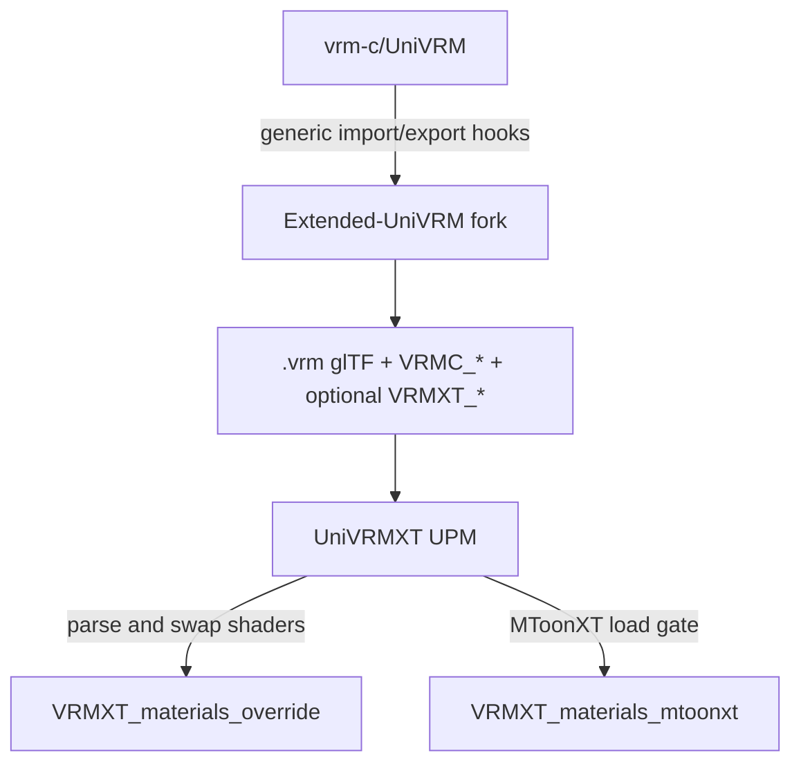
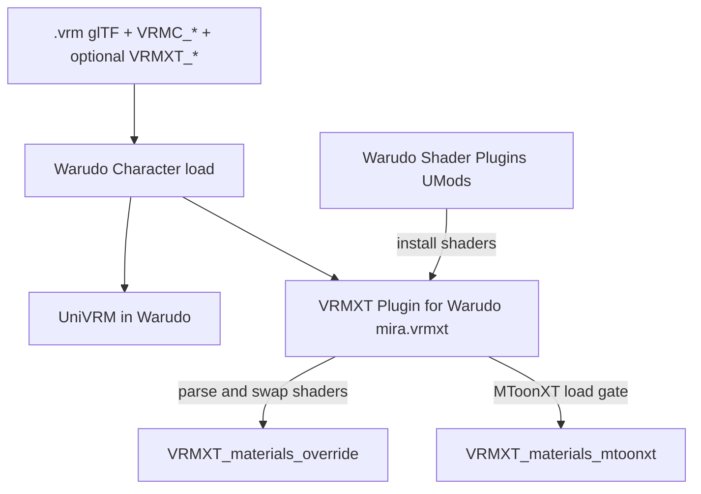
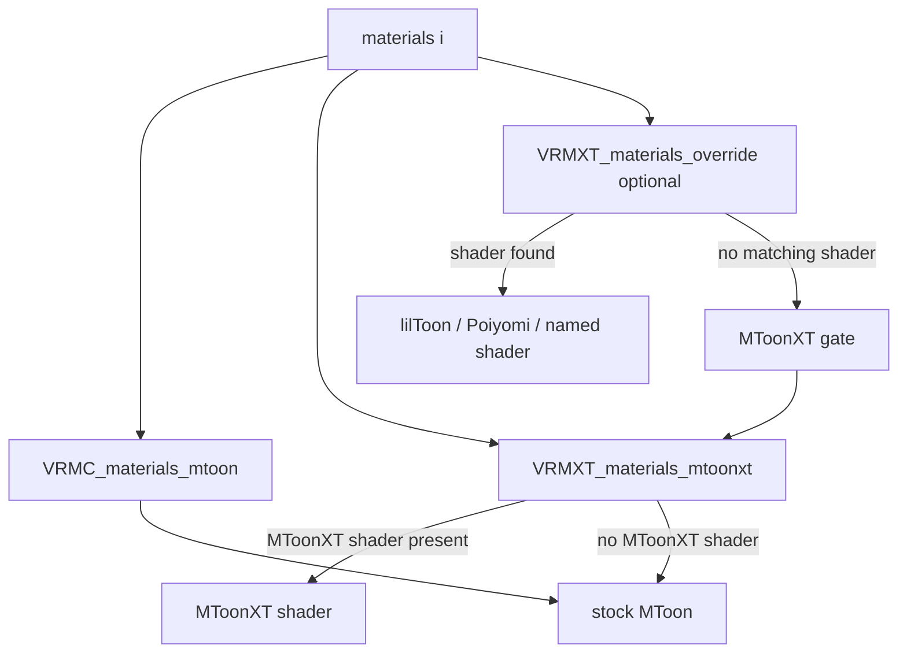
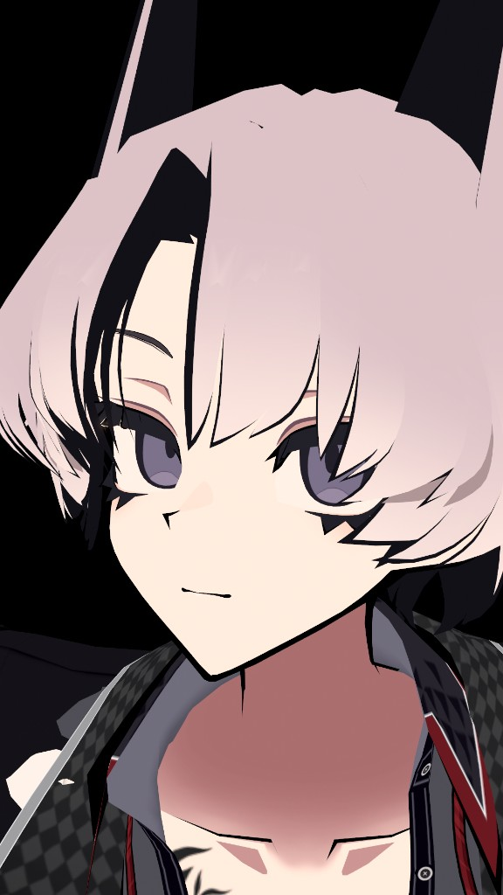
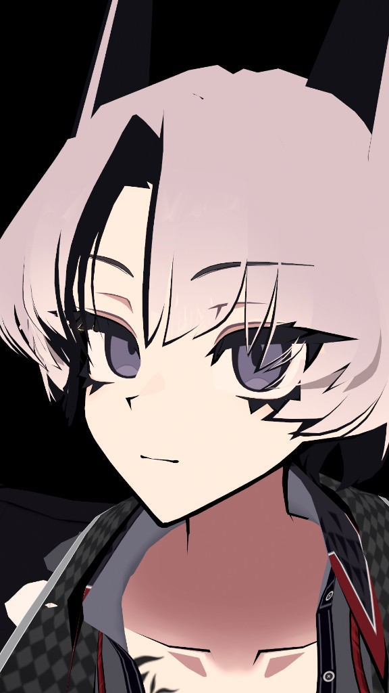
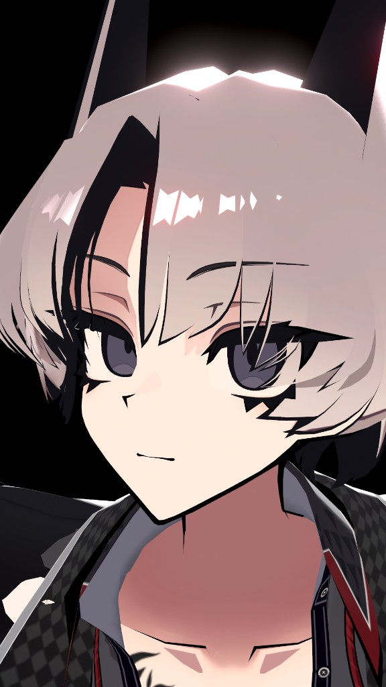

# MToonXT stencil and lilToon materials override in Warudo

A VRM 1.0 Character in Warudo can be loaded three ways: stock MToon, MToonXT stencil, and a Unity lilToon override. UniVRMXT (`com.vrmxt.univrmxt`) reads the extras and swaps shaders on the loaded avatar. The Warudo VRMXT plugin includes that package; shader plugins install lilToon and MToonXT.

## Unity stack

[Extended-UniVRM](https://github.com/miramocha/Extended-UniVRM) forks [vrm-c/UniVRM](https://github.com/vrm-c/UniVRM). Extra glTF extensions can import and export through hooks meant for upstream UniVRM. The fork does not define `VRMXT_*` itself.

[UniVRMXT](https://github.com/miramocha/UniVRMXT) (`com.vrmxt.univrmxt`) is a Unity package. It reads `VRMXT_*` from the file and applies them to the avatar. Stock UniVRM still loads VRM 1.0. Writing `VRMXT_*` on export needs those fork hooks.

`VRMXT_*` is listed in `extensionsUsed` only (not `extensionsRequired`). One `.vrm` / `.glb`.



[UniVRMXT](univrm-vrmxt.md), [UniVRM upstream hooks](univrm-upstream-hooks.md), [architecture](../architecture.md).

## Warudo (Unity) stack

After the Character loads, [VRMXT Plugin for Warudo](https://github.com/miramocha/VRMXT-Plugin-for-Warudo) (`mira.vrmxt`) runs. [Warudo Shader Plugins](https://github.com/miramocha/Warudo-Shader-Plugins) install lilToon and `VRMXT/MToonXT10`. Warudo still loads stock VRM through UniVRM. The plugin includes UniVRMXT. Without the shader plugins, lilToon and MToonXT are missing.



[Warudo VRMXT](warudo-vrmxt.md), [VRMXT Unity packages](vrmxt-unity-packages.md).

## Which shader wins

Per material, same order as [VRMXT_materials_mtoonxt](../specs/extensions/materials/vrmxt-materials-mtoonxt/README.md#load-gate):



If the lilToon (or other named) shader is installed, that material stays on it. MToonXT and stencil do not run on that material.

## Images

The following example uses a VRM converted from [SiuSiu (ADPX, Booth)](https://adpx.booth.pm/items/8426340). Mesh and textures belong to that product; this repo does not include the `.vrm`. Left to right: stock MToon, MToonXT stencil, lilToon override.

| Stock MToon | MToonXT stencil | lilToon override |
| :---: | :---: | :---: |
|  |  |  |

Stock: hair occludes eyes, eyebrows, and eyelashes. MToonXT: eyes, eyebrows, and eyelashes write over the hair using stencil. lilToon: `VRMXT_materials_override` swaps the shader to lilToon.

### Stock MToon

Hair draws in front of eyes, eyebrows, and eyelashes. `VRMC_materials_mtoon` and core glTF materials are UniVRM's import. No MToonXT swap and no override shader.

### MToonXT stencil

Shader `VRMXT/MToonXT10` (URP equivalent: `VRMXT/Universal Render Pipeline/MToonXT10`). Eyes, eyebrows, and eyelashes write a stencil mask. Hair is clipped where that mask is set (`outside`). Tutorial: [Unity MToonXT stencil](../tutorials/unity-mtoonxt-stencil.md).

Stencil is on two of twelve materials:

| `name` | `stencil` |
| --- | --- |
| `SiuSiu_FaceStencil_MToonXT` | `{ "op": "write" }` |
| `SiuSiu_HairStencil_MToonXT` | `{ "op": "outside", "materials": [1] }` |

`SiuSiu_FaceStencil_MToonXT`:

```json
{
  "extensions": {
    "VRMXT_materials_mtoonxt": {
      "specVersion": "1.0",
      "stencil": { "op": "write" }
    }
  }
}
```

`SiuSiu_HairStencil_MToonXT`:

```json
{
  "extensions": {
    "VRMXT_materials_mtoonxt": {
      "specVersion": "1.0",
      "stencil": { "op": "outside", "materials": [1] }
    }
  }
}
```

Field table: [stencil](../specs/extensions/materials/vrmxt-materials-mtoonxt/stencil.md).

### lilToon override

Every material carries `VRMXT_materials_override`: Unity, shader name `lilToon`, Built-in (`builtin`), provider `com.vrmxt.univrmxt`. Transparent clothing uses `Hidden/lilToonTransparent` (`SiuSiu_Alpha_MToonXT`). Each override lists about 470 lilToon properties (including leftover `_DummyProperty` rows). No MToon-to-lilToon `bindings`. Stencil JSON is still on `SiuSiu_FaceStencil_MToonXT` and `SiuSiu_HairStencil_MToonXT`; once lilToon is on the material, MToonXT and stencil do not run. Hair lighting is lilToon matcap with multiply. Conversion left MToon matcap addition blend unmapped. Tutorial: [Blender materials override](../tutorials/blender-materials-override.md). [VRMXT Editor](vrmxt-editor.md#materials-apply-materialize-and-transfer).

On `SiuSiu_Face_MToonXT`. About 470 `properties` follow; three shown:

```json
{
  "extensions": {
    "VRMXT_materials_override": {
      "specVersion": "1.0",
      "overrides": [
        {
          "engine": "unity",
          "material": {
            "id": "lilToon",
            "idType": "shaderName",
            "provider": { "id": "com.vrmxt.univrmxt", "version": "0.1.0" },
            "variant": "builtin"
          },
          "properties": [
            { "name": "_Invisible", "type": "scalar", "value": 0.0 },
            { "name": "_MainTex", "type": "texture", "texture": 0 },
            { "name": "_MatCapTex", "type": "texture", "texture": 8 },
            ...
          ]
        }
      ]
    }
  }
}
```

`engine` / `material` / `properties` / `bindings` match the Consortium draft [VRMC_materials_override](https://github.com/miramocha/vrm-specification/tree/master/specification/VRMC_materials_override-1.0) on the miramocha vrm-specification fork. Files still name the extension `VRMXT_materials_override`.

## Related

- [VRMXT_materials_override](../specs/extensions/materials/vrmxt-materials-override.md)
- [VRMXT_materials_mtoonxt](../specs/extensions/materials/vrmxt-materials-mtoonxt/README.md)
- [Warudo VRMXT](warudo-vrmxt.md)
- [Unity lilToon catalog](../references/catalogs/unity-liltoon.md) (`shaderName` `lilToon`)
