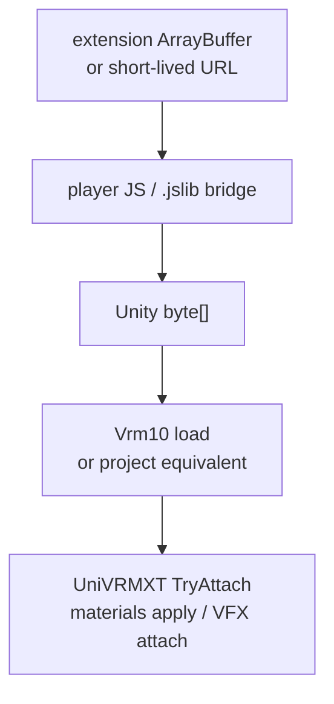

# Unity WebGL VRMXT viewer

Unity WebGL consumer profile for the VRoid Hub extension viewer. The WebGL build is
one target of the shared [VRMXT Unity Player](vrmxt-unity-player.md) project (same
tree as the desktop drag-drop player). Architecture:
[VRoid Hub browser viewer architecture](../decisions/vroid-hub-browser-viewer-architecture.md).
Browser shell / OAuth / download:
[VRoid Hub browser extension](vroid-hub-browser-extension.md).

Consumer only on this build: load original VRM bytes and attach supported `VRMXT_*`
runtime behavior. No authoring UI and no Hub API client inside Unity. Desktop edit /
export lives on the standalone build of the same project, not in WebGL.

## Goal

Render Hub-downloaded VRM 1.0 avatars with UniVRM + UniVRMXT behavior comparable to
the Warudo VRMXT plugin on the same editor pin.

| Item | Value |
|------|-------|
| Project | [VRMXT Unity Player](vrmxt-unity-player.md) (WebGL build target) |
| Unity editor | `2021.3.45f2` (Player / Warudo pin; details on Player profile) |
| Stock VRM | UniVRM packages compatible with 2021.3 (pin at implement time) |
| Extended | UniVRMXT post-load attach |
| Host | Extension `viewer.html` iframe |
| Auth / download | Extension JavaScript only |

## Package baseline

Use UniVRM + UniVRMXT pins documented on
[VRMXT Unity Player](vrmxt-unity-player.md) (2021.3 compatibility work tracked there).
Ship Always Included / retention shaders for claimed override inventory. Warudo
alignment = same editor pin and Apply semantics as [Warudo VRMXT](warudo-vrmxt.md).

## Architecture fit

| Architecture rule | Viewer approach |
|-------------------|-----------------|
| Stock VRM load unchanged | UniVRM loads bytes first |
| Optional Extended package | UniVRMXT attach after load |
| No `extensionsRequired` | Missing VRMXT → stock avatar still shows |
| Instance scope | Runtime objects stay on the loaded instance |
| Host owns I/O | Extension fetches Hub bytes; Unity only consumes |

Rejected: embedding official VRoid Unity SDK (no WebGL support) or calling Hub OAuth
from C#.

## Load seam

Bridge requirements:

1. Validate message origin as the extension viewer origin.
2. Prefer transferable `ArrayBuffer` into the player page, then copy into Unity heap
   through a dedicated `.jslib` entry.
3. On model switch: destroy prior avatar, release textures/meshes owned by the prior
   load, then load the new bytes.
4. On viewer close: call `unityInstance.Quit()`, await completion, remove the iframe.

Reference starting points in Extended-UniVRM (adapt; do not assume WebGL settings
match): `Packages/VRM10/Samples~/VRM10Viewer/` byte-load path and WebGL `.jslib`
helpers. Viewer product settings override sample defaults.

## WebGL / extension constraints

| Setting | Requirement |
|---------|-------------|
| Graphics | WebGL 2 |
| Threads | Off (avoid SharedArrayBuffer / COOP-COEP on extension pages) |
| Compression | Enable decompression fallback **or** ship uncompressed Build artifacts; `chrome-extension://` / `moz-extension://` may lack gzip/brotli content encoding Unity expects |
| CSP | Extension page CSP MUST allow local scripts and `wasm-unsafe-eval` as required |
| Instance count | One live Unity instance; additional players later use isolated iframes |
| Eval | Prefer loader paths that avoid ordinary `eval`; if Unity template requires it, host on a declared sandbox page with `postMessage` |

## Capability support

Declare support per concrete extension. Partial support MUST be labeled partial.

| Capability | Initial intent | Notes |
|------------|----------------|-------|
| Stock VRM 1.0 | Required | Always |
| `VRMXT_materials_override` | Planned | Unity slots only; shader inventory TBD |
| `VRMXT_sprite_particle` | Planned | Map per [UniVRMXT VFX](univrm-vrmxt.md#vfx) |
| Other `VRMXT_*` | Ignore | Per conformance |

Materials override rules:

1. Resolve shaders by name (and catalog / shipped inventory).
2. Missing shader → skip that override; keep stock material.
3. Arbitrary Hub-side shader names that are not in the shipped pack MUST NOT be
   fetched or compiled at runtime from the network.
4. Pipeline variant selection follows UniVRMXT / Warudo conventions for the single
   shipped player RP (Builtin or URP; pin at implement time).

## Player registry (future)

First ship: one player build.

Later players MAY register when:

1. Measured compressed extension size fits Chrome and Firefox AMO limits (Firefox
   upload limit historically 200 MB; confirm at ship time).
2. CSP and Quit/reload isolation are proven.
3. Selection uses an explicit product signal (user preference, pipeline variant,
   capability pack). Do **not** select by inferring Unity editor version from the
   VRM file.

Swap procedure: `Quit()` → remove iframe → create new iframe → `createUnityInstance`
for the selected build.

## Failure and fallback

| Case | Behavior |
|------|----------|
| Invalid / truncated bytes | Error UI; no partial corrupt avatar left running |
| VRM 1.0 load failure | Error; do not claim VRMXT apply |
| Missing UniVRMXT package | Stock VRM only |
| Missing `VRMXT_*` in file | Stock VRM only |
| Unsupported override shader | Skip override; keep stock mat |
| Invalid emitter / override unit | Skip unit; continue load |

## Tests

| Case | Expectation |
|------|-------------|
| Stock VRM bytes | Avatar visible; no VRMXT objects |
| Materials override with shipped shader | Override applies |
| Materials override with unknown shader | Stock mat remains |
| Sprite particle emitter on valid node | Particles attach |
| Bad emitter node | Emitter skipped; avatar remains |
| Model A then B | Prior instance released; B visible |
| Quit + reload iframe | Second instance starts clean |
| Chrome + Firefox extension page | Load succeeds under product CSP |

Unity EditMode / PlayMode coverage where possible; WebGL browser checks require a
built player and are not substituted by `dotnet test`.

## Out of scope

- Hub OAuth / download-license client in C#
- Authoring or re-export of VRMXT
- Shipping every possible third-party shader used on Hub
- Downgrading the Extended-UniVRM authoring project to 2021.3

## Build notes (non-normative)

1. Install Unity `2021.3.45f2`.
2. Open / create the [VRMXT Unity Player](vrmxt-unity-player.md) project; add UniVRM +
   UniVRMXT pins that pass 2021.3 import.
3. Configure WebGL 2, threads off, decompression fallback as required.
4. Add Always Included shaders for claimed override inventory.
5. Build the **WebGL** target into the extension `player/` (or equivalent) folder
   consumed by `viewer.html`. Desktop is a separate Player build from the same project.
6. Measure packaged size before proposing a second player.

## Related

- [VRMXT Unity Player](vrmxt-unity-player.md)
- [VRoid Hub browser viewer architecture](../decisions/vroid-hub-browser-viewer-architecture.md)
- [VRoid Hub browser extension](vroid-hub-browser-extension.md)
- [Warudo VRMXT](warudo-vrmxt.md)
- [UniVRMXT](univrm-vrmxt.md)
- [VRMXT Conformance](../specs/core/vrmxt-conformance.md)
- [VRoid Hub VRMXT round-trip](../references/vroid-hub-vrmxt-roundtrip.md)

## Open questions

| Topic | Status |
|-------|--------|
| Builtin vs URP for the single shipped player | TBD (also on [Player](vrmxt-unity-player.md)) |
| UniVRM / UniVRMXT pins on 2021.3 | TBD on Player profile |
| First shader inventory (lilToon / test overrides / …) | TBD |
| KTX2 / Basis support on 2021.3 WebGL | TBD |
| Memory budget for large Hub originals (~10–15 MB+) | TBD |
