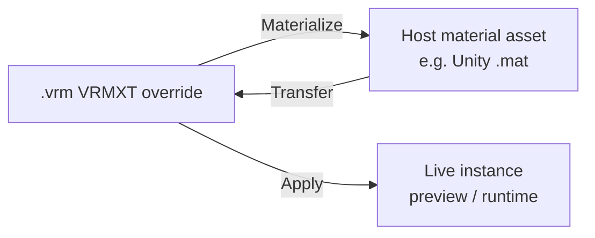
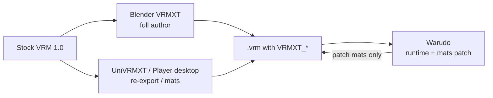

# VRMXT Editor

Cross-platform guide for tools that **edit stock VRM 1.0 into VRMXT** (read / create /
change `VRMXT_*`, then write one `.vrm` / `.glb`). Normative field schemas stay in
[specs/](../specs/). Per-host seams stay in [implementations/](.). This note defines
shared editor obligations and a **capability matrix** across shipping hosts.

Host I/O layering (stock VRM vs Extended packages):
[Architecture → Authoring](../architecture.md#authoring).

## Goal

A VRMXT editor lets creators start from a valid VRM 1.0 file (or scene that exports as
one), author portable Extended data, and export a single file that remains loadable as
stock VRM when Extended packages are absent.

| In scope | Out of scope |
|----------|--------------|
| Import `VRMXT_*` into host-owned edit state | Replacing stock VRM humanoid / expression / MToon I/O |
| Create and change portable fields through UI or host-native controls | A second Extended-only file format |
| Preview that matches portable semantics enough to author | Bit-identical UI across hosts |
| **Apply** / **Materialize** / **Transfer** for materials override (shader present) | Requiring every third-party shader; network-fetch shaders at apply time |
| Export `VRMXT_*` + `extensionsUsed` beside stock `VRMC_*` | Putting optional `VRMXT_*` in `extensionsRequired` |
| Document partial support honestly | Requiring one DCC for all Extended export |

## Hosts covered here

| Host | Package | Primary role today |
|------|---------|--------------------|
| Blender | [VRMXT-Extension-for-Blender](https://github.com/miramocha/VRMXT-Extension-for-Blender) on [Extended-VRM-Addon-for-Blender](https://github.com/miramocha/Extended-VRM-Addon-for-Blender) | Full DCC authoring + I/O |
| Unity (package) | [UniVRMXT](https://github.com/miramocha/UniVRMXT) + [Extended-UniVRM](https://github.com/miramocha/Extended-UniVRM) for hooks | Library: Editor import/attach, materials apply, VFX re-export; catalog authoring UI later |
| Unity (player app) | [VRMXT Unity Player](vrmxt-unity-player.md) (planned; depends on UniVRMXT) | Desktop drag-drop view + edit + export; WebGL view/apply for Hub extension |
| Warudo | [VRMXT Plugin for Warudo](https://github.com/miramocha/VRMXT-Plugin-for-Warudo) | Runtime apply + materials-override **patch** export (source-preserving) |

Profiles: [Blender VRMXT](blender-vrmxt.md), [UniVRMXT](univrm-vrmxt.md),
[VRMXT Unity Player](vrmxt-unity-player.md), [Warudo VRMXT](warudo-vrmxt.md). Patch
detail: [Warudo VRMXT Patch Export](../references/warudo-vrmxt-patch-export.md).

UniVRMXT is the UPM library. The Player is a separate app project (not nested in the
package). Desktop and Hub WebGL share that one Player project; WebGL has no authoring.

## Shared editor contract

Applies to every host that claims VRMXT authoring. Aligns with
[Architecture → Authoring](../architecture.md#authoring) and
[VRMXT Conformance](../specs/core/vrmxt-conformance.md).

1. Stock VRM 1.0 import/export remains the baseline. Extended code MUST NOT replace it.
2. Export order: stock `VRMC_*` (and related) first, then `VRMXT_*` and matching
   `extensionsUsed` entries.
3. Optional `VRMXT_*` names MUST NOT appear in `extensionsRequired`.
4. Import: after stock node/bone (or equivalent) maps exist, parse `VRMXT_*` into
   editor-owned data. Skip invalid units per each capability spec; do not fail the whole
   avatar load.
5. Round-trip: portable fields survive export → import on the same host. Cross-host
   survival is a goal where both hosts implement the same capability.
6. Editor UI and preview MAY be host-native. Portable bytes MUST match the capability
   specs.
7. Partial support MUST be documented (this matrix or the host profile). Do not claim
   full capability support when only import or only one extension ships.
8. Materials override hosts that claim Apply / Materialize / Transfer MUST follow
   [Materials Apply, Materialize, and Transfer](#materials-apply-materialize-and-transfer).
   Apply and Materialize are separate ops. Warudo and UniVRMXT ship Apply today; neither
   ships Materialize yet.

### Editor operation legend

| Op | Meaning |
|----|---------|
| **Import** | Parse extension into editable host state (or apply-only store that can be re-serialized) |
| **Create/edit** | UI or host controls can add or change portable fields from empty / stock VRM |
| **Preview** | Viewport or runtime preview of authored data before export |
| **Materialize** | Write override into a durable host **material asset** (not only a live instance); shader must resolve |
| **Apply** | Push override onto live / imported material instances for preview or runtime (may be ephemeral) |
| **Transfer** | Write host **material asset** → active engine override slot (Unity: from `.mat` asset) |
| **Export** | Write extension JSON (+ textures when required) into `.vrm` / `.glb` |
| **Done** | Shipped behavior documented in the host profile |
| **Partial** | Works with listed limits |
| **Planned** | Profile or code path marked planned; not shipped |
| **—** | Out of scope or not started on that host |

## Materials Apply, Materialize, and Transfer

Applies to `VRMXT_materials_override` on hosts that can resolve the target shader
(Unity Editor, Unity runtime / Player, Warudo, Unreal, …). Spec:
[vrmxt-materials-override](../specs/extensions/materials/vrmxt-materials-override.md).

These are **host operations**. They do not add glTF fields. Stock MToon / PBR in the
file stay until Export writes override JSON (or a host deliberately strips extensions —
out of scope here).

**Apply** and **Materialize** are separate. Shipping Apply does **not** count as Materialize.

| Today | Apply (live) | Materialize (`.mat` / asset) | Transfer (from asset) |
|-------|--------------|------------------------|------------------------|
| UniVRMXT | Done | — (Planned) | Done |
| Warudo | Done | — | Partial |

### Apply (VRMXT → live material)

| Rule | Requirement |
|------|-------------|
| Input | Imported override for the host engine (and pipeline `variant` when required) |
| Prerequisite | Target shader resolves in this environment |
| Action | Set live / imported material instance shader and write `properties[]` / `bindings[]` (bindings win on name overlap) |
| Result | Preview or runtime look matches portable intent |
| Does not mean | Creating a durable project material asset (that is Materialize) |

UniVRMXT: `VrmxtMaterialsOverrideApplier.Apply`, import hooks, `IMaterialDescriptorGenerator`
wrapper. Warudo: post-load Apply on Character materials. Both ship Apply; neither is Materialize.

### Materialize (VRMXT → material asset)

| Rule | Requirement |
|------|-------------|
| Input | Same override selection as Apply |
| Prerequisite | Target shader resolves; host can create durable assets (Unity AssetDatabase / Player write path / Unreal asset) |
| Action | Create (or overwrite) a durable host **material asset** with that shader, then write `properties[]` and `bindings[]` onto the asset |
| Unity | Materialize MUST produce a `Material` **asset** (e.g. `.mat`), not only mutate `renderer.sharedMaterial` / runtime instances |
| Missing shader | MUST NOT fail whole avatar load. Skip that material; keep stock import (base-spec rules 11–12) |
| Result | Asset for versioning, reassignment, and Transfer source |
| Does not mean | Apply alone; deleting the extension from the `.vrm`; replacing stock glTF MToon bytes by itself |

Materialize is **not shipped** on UniVRMXT or Warudo today. Planned for Unity Editor / Player
desktop where AssetDatabase (or an equivalent write path) exists. Warudo UMod has no
AssetDatabase → Materialize stays out of scope unless a future template/asset path lands.

### Transfer (material asset → VRMXT)

| Rule | Requirement |
|------|-------------|
| Input | Host **material asset** (Unity: project `Material` / `.mat`; Unreal: material asset / MIC as profile defines) |
| Prerequisite | Same environment that owns that asset type |
| Action | Upsert the active `(engine, variant)` override slot **from that asset**: `material.id` / `idType`, `properties[]` (textures registered for export when needed). Sibling pipeline slots and other engines MUST survive |
| Unity | Transfer MUST read a `Material` **asset**. MUST NOT use an ephemeral runtime `(Instance)` as source |
| Catalogs | MAY help pick property names; MUST NOT whitelist-reject unknown shader ids |
| Result | Extension JSON (or PropertyGroups) ready for Export |
| Does not mean | Apply (override → live mats), or inventing `bindings[]` unless the host implements that mapping |

Transfer is the reverse of Materialize. UniVRMXT: `SyncFromOverrideMaterials` /
`SyncUnityOverrideFromMaterial` — source = assigned Override **Material asset**.

### Host notes

| Host | Apply (live) | Materialize (asset) | Transfer (from asset) |
|------|--------------|--------------|------------------------|
| Unity Editor / UniVRMXT | Done | — Planned (create `.mat`) | Done |
| Unity Player desktop | Planned | Planned | Planned (from `.mat` only) |
| Unity Player WebGL | Planned | — | — |
| Warudo | Done | — | Partial (Manager / templates; no `.mat` Materialize) |
| Blender | — | — | — (PropertyGroups authored directly) |
| Unreal / VRM4U | Planned | Planned | Planned |

## Capability matrix (shipping hosts)

Statuses below summarize profile checklists as of this draft. Prefer the linked profile
when they disagree.

### `VRMXT_sprite_particle`

Spec: [vrmxt-sprite-particle](../specs/extensions/vfx/vrmxt-sprite-particle.md).

| Op | Blender | UniVRMXT | Unity Player (planned) | Warudo |
|----|---------|----------|------------------------|--------|
| Import | Done | Done (hooks or `TryAttach` / companion prefab) | Planned (post-load attach) | Done (post-load attach) |
| Create/edit | Done (armature emitter UIList) | Partial (edit `VrmxtVfxInstance` / live `ParticleSystem`; full from-scratch UI still prefers Blender) | Planned (desktop only; scope TBD) | — (no emitter authoring UI) |
| Preview | Done (GeoNodes helpers; export-excluded) | Done (`ParticleSystem` children) | Planned | Done (runtime `ParticleSystem`) |
| Export | Done (hooks; can register particle images) | Done with Extended-UniVRM export hooks; folds live preview back | Planned (desktop only; WebGL none) | Partial: patch export **preserves** existing root particle JSON; does not author emitters |
| Profile | [Blender → VFX](blender-vrmxt.md#vfx) | [UniVRMXT → VFX](univrm-vrmxt.md#vfx) | [Unity Player](vrmxt-unity-player.md) | [Warudo → VFX](warudo-vrmxt.md#vfx) |

### `VRMXT_materials_override`

Spec: [vrmxt-materials-override](../specs/extensions/materials/vrmxt-materials-override.md).
Catalogs: [Materials Override Catalogs](../references/materials-override-catalogs.md).

| Op | Blender | UniVRMXT | Unity Player (planned) | Warudo |
|----|---------|----------|------------------------|--------|
| Import | Done (PropertyGroups when Unity parse succeeds) | Done (`IMaterialDescriptorGenerator` / runtime apply) | Planned | Done (post-load apply + catalog rebuild) |
| Create/edit | Done (Material Properties panel; Engine / Variant / Shader; Add Common Props; bindings deferred) | Partial (assign Override Materials / sync active pipeline slot; shared catalog Editor UI **later**) | Planned (desktop only) | Partial (VRMXT Manager: per-material shader autocomplete + Character property catalog; no custom shader GUI; material templates **planned**) |
| Apply | — | Done (`Applier.Apply`; import hooks / generator) | Planned (desktop + WebGL) | Done (post-load Apply) |
| Materialize | — | — (Planned: create `.mat` asset) | Planned (desktop only) | — (no AssetDatabase) |
| Transfer | — (PropertyGroups authored directly) | Done (Sync from Override Material **asset**; variant survival) | Planned (desktop; from `.mat` only) | Partial (Manager / templates; no `.mat` Materialize) |
| Preview | Stock Blender viewport (override is Unity-targeted data) | Done (Editor / Play materials via Apply) | Planned | Done (live Character materials via Apply) |
| Export | Done (serialize groups; texture remap when helpers available) | Done with Extended-UniVRM export hooks; variant survival rules | Planned (desktop only; path TBD — full export vs patch) | Done: **patch** rewrite of materials-override JSON into copy of local source VRM; original BIN kept; **no new image payloads** |
| Profile | [Blender → Materials](blender-vrmxt.md#materials-override) | [UniVRMXT → Materials](univrm-vrmxt.md#materials-override) | [Unity Player](vrmxt-unity-player.md) | [Warudo → Materials](warudo-vrmxt.md#materials-override), [patch export](../references/warudo-vrmxt-patch-export.md) |

### Draft capabilities (no shipping editor yet)

| Extension | Spec | Blender | UniVRMXT | Unity Player | Warudo |
|-----------|------|---------|----------|--------------|--------|
| `VRMXT_springBone_override` | [spec](../specs/extensions/physics/vrmxt-spring-bone-override.md) | — | — | — | — |
| `VRMXT_lattice` | [spec](../specs/extensions/deformation/vrmxt-lattice.md) | — | — | — | — |
| `VRMXT_AnimationController` + `VRMXT_AnimationClip` | [controller](../specs/extensions/animation/vrmxt-animation-controller.md), [clip](../specs/extensions/animation/vrmxt-animation-clip.md); [decision](../decisions/animation-controller-standardization.md) | Planned (phase 1 authoring pair with Unity) | Planned (Animator subset export/import) | — | — |

## Minimum bar: “can edit VRM into VRMXT”

A host MAY claim a **VRMXT editor** for a capability when all of the following hold for
that capability:

1. **Import** portable data into host-owned state (or an apply store that round-trips).
2. **Create or edit** at least one complete valid unit (e.g. one emitter, one override
   slot) starting from stock VRM with no prior `VRMXT_*`.
3. **Export** writes that unit into a valid `.vrm` / `.glb` with correct
   `extensionsUsed`, without listing the name in `extensionsRequired`.
4. Stock VRM load still succeeds when Extended code is absent or the extension is
   skipped.
5. Limits (textures, pipelines, bindings, workshop paths, …) are documented in the host
   profile.

### Extra bar: Materials Apply / Materialize / Transfer

A host that resolves engine shaders MAY ship these ops independently:

1. **Apply** — Override → live material instances (consumers + preview).
2. **Materialize** — Override → durable **material asset** (Unity: `.mat`). Separate from Apply.
3. **Transfer** — Material **asset** → upsert active override slot (Unity: from `.mat` only).

UniVRMXT and Warudo today: **Apply Done**, **Materialize not shipped**. UniVRMXT also ships
Transfer. Apply alone MUST NOT be reported as Materialize.

Hosts that only author portable JSON without that engine’s shaders (e.g. Blender writing
`unity` slots) are not required to Apply/Materialize/Transfer engine materials; they still MUST
Import / Create-edit / Export portable fields.

Consume-only surfaces (Hub WebGL) MAY Apply without Materialize or Transfer.

### Claims by host (today)

| Host | Claims editor for | Does not claim (yet) |
|------|-------------------|----------------------|
| Blender | `VRMXT_sprite_particle`, `VRMXT_materials_override` (bindings authoring deferred) | Spring override, lattice, animation |
| UniVRMXT | `VRMXT_sprite_particle` (re-export / edit existing; from-scratch UI thin), `VRMXT_materials_override` (Apply + Transfer Done; Materialize not shipped; catalog UI later) | Spring override, lattice, animation; Materialize-to-`.mat`; full catalog-driven materials UI |
| Unity Player | None shipped (planned desktop Apply + Materialize + Transfer ± VFX) | WebGL authoring; spring / lattice / animation |
| Warudo | `VRMXT_materials_override` **patch** editor + Apply (no Materialize) | VFX authoring; Materialize; general live-avatar VRM export; workshop sources |

Warudo remains primarily a **runtime consumer** with a **source-preserving materials
patch**. Treat it as a specialized editor for materials override, not a general DCC.
Unity Player WebGL is view/apply only; desktop build is the editor surface.

## Recommended authoring paths (non-normative)

| Task | Prefer |
|------|--------|
| New sprite emitters from scratch | Blender |
| Unity scene re-export of emitters / override slots already on the avatar | UniVRMXT + Extended-UniVRM gates |
| Drag-drop Unity runtime view + edit without a full DCC | Unity Player desktop (planned) |
| Apply file override onto live mats (shader already in app) | Apply (UniVRMXT, Warudo, Player) |
| Create Unity `.mat` (or Unreal asset) from override | Materialize (Unity Editor / Player desktop Planned) |
| Capture tuned `.mat` into portable override | Transfer from Material asset (UniVRMXT; Player desktop planned) |
| Tune Unity materials on a live Warudo Character, write back override JSON | Warudo VRMXT Manager patch export |
| Cross-engine round-trip check | Export from one host → import on another; compare portable fields |

## Implementer checklist (new host)

Use when adding a fourth editor (Godot, three-vrmxt export, VRM4U, …).

1. Pick stock VRM I/O; add optional Extended package (do not fork-replace stock).
2. Wire import after node/bone maps exist (hook, plugin, or post-load).
3. For each capability you ship: implement Import + Create/edit + Export per the bar
   above; link a profile under `implementations/`.
4. Materials override on a shader-resolving host: treat Apply, Materialize, and Transfer as
   separate ops per [Materials Apply, Materialize, and Transfer](#materials-apply-materialize-and-transfer).
   Do not count Apply as Materialize.
5. Follow per-capability skip rules; never fail whole-avatar load on one bad unit.
6. Textures referenced by VFX or materials `properties[]` / bindings: register into
   `textures[]` / `images[]` on export when the capability requires it (materials
   base-spec rule 26; VFX texture path in host profile).
7. Update this matrix and [architecture.md](../architecture.md) authoring table.
8. Prefer shared catalog JSON from Specs for materials authoring aids
   ([catalogs](../references/materials-override-catalogs.md)); catalogs are not a
   whitelist.

## Open gaps

| Gap | Notes |
|-----|-------|
| UniVRMXT catalog-driven materials Editor UI | Specs/Blender catalogs ready; UniVRMXT MAY load later |
| UniVRMXT / Warudo Materialize (`.mat` asset) | Not shipped; both have Apply only for override → material |
| Unity Player desktop Apply + Materialize + Transfer | Planned; UniVRMXT has Apply / Transfer; Materialize not in library yet |
| Bindings authoring | Deferred in Blender; consumers still apply `bindings[]` |
| Warudo new textures in patch export | Out of scope; reuse source GLB images / Character defaults |
| Warudo material templates | Planned (`.mat` → property fill) |
| Full Unity from-scratch VFX authoring UI | Open; Blender preferred |
| Cross-host conformance tests per `VRMXT_*` | TBD ([architecture open questions](../architecture.md#open-questions)) |
| Spring / lattice / animation editors | Specs/decisions ahead of shipping UI |

## Related

- [Architecture](../architecture.md)
- [VRMXT Conformance](../specs/core/vrmxt-conformance.md)
- [Blender VRMXT](blender-vrmxt.md)
- [UniVRMXT](univrm-vrmxt.md)
- [VRMXT Unity Player](vrmxt-unity-player.md)
- [Warudo VRMXT](warudo-vrmxt.md)
- [Warudo VRMXT Patch Export](../references/warudo-vrmxt-patch-export.md)
- [Materials Override Catalogs](../references/materials-override-catalogs.md)
- [Animation controller standardization](../decisions/animation-controller-standardization.md)
