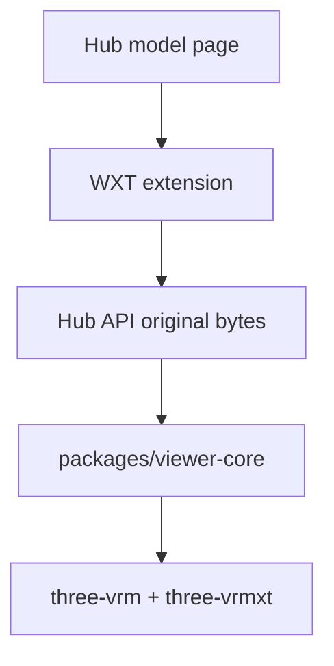

# VRMXT Hub extension

Planned browser extension that previews original VRoid Hub downloads with Three.js
(`@pixiv/three-vrm` + [three-vrmxt](three-vrmxt.md)). **Not v1.** v1 is the local
Vite host: [VRMXT web viewer](vrmxt-web-viewer.md).

Decision: [VRMXT three-vrm web viewer](../decisions/vrmxt-three-vrm-web-viewer.md).

Unity WebGL on Hub is **superseded**. Historical notes:

- [VRoid Hub browser viewer architecture](../decisions/vroid-hub-browser-viewer-architecture.md)
- [VRoid Hub browser extension](vroid-hub-browser-extension.md)
- [Unity WebGL VRMXT viewer](unity-webgl-vrmxt-viewer.md)

Those docs described a Unity Player iframe. This profile uses Three.js and
`packages/viewer-core` from [miramocha/three-vrmxt](https://github.com/miramocha/three-vrmxt).

This host is **view-only**. It is not a [VRMXT Editor](vrmxt-editor.md) host.

## Goal (planned)

| Item | Intent |
|------|--------|
| Shell | [WXT](https://wxt.dev/) (Chrome MV3 / Firefox WebExtension) |
| Hub site | `https://hub.vroid.com/` |
| Bytes | Official Hub API original download (OAuth + download-license), same sequence as the historical extension note |
| Renderer | Three.js in the extension origin; **no** Unity iframe |
| View core | Same `packages/viewer-core` as `apps/viewer` |
| MToonXT | Stencil apply when the extra is present; `renderer.stencil = true` |
| Edit / export | Out of scope |

Hub's stock three-vrm canvas stays Hub's. The extension does not replace that canvas
as the site viewer.

## Architecture fit

| Rule | Approach |
|------|----------|
| Stock Hub preview | Unchanged (ignores `VRMXT_*`) |
| Original file | Authorized download; inspect JSON after bytes arrive |
| Shared view | `viewer-core` already proven on local files |
| Unity WebGL | Do not ship |

OAuth, token broker, route detection, and license display from the historical
[VRoid Hub browser extension](vroid-hub-browser-extension.md) remain useful as
research. Re-implement them in WXT + JS. Do not revive the Unity `.jslib` byte
bridge.

## Out of scope

- v1 ship (local Vite first)
- Unity WebGL / Player iframe
- lilToon / Poiyomi in the browser
- Create/edit/Export
- Replacing Hub login/download UI

## Related

- [VRMXT three-vrm web viewer](../decisions/vrmxt-three-vrm-web-viewer.md)
- [VRMXT web viewer](vrmxt-web-viewer.md)
- [three-vrmxt](three-vrmxt.md)
- [VRMXT desktop Player primary](../decisions/vrmxt-desktop-player-primary.md)
- [VRoid Hub VRMXT round-trip](../references/vroid-hub-vrmxt-roundtrip.md)
- [VRMXT Conformance](../specs/core/vrmxt-conformance.md)
- [VRoid Hub API outline](https://developer.vroid.com/en/api/)
