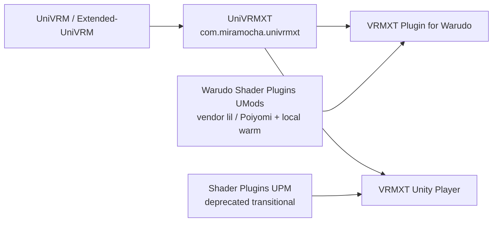
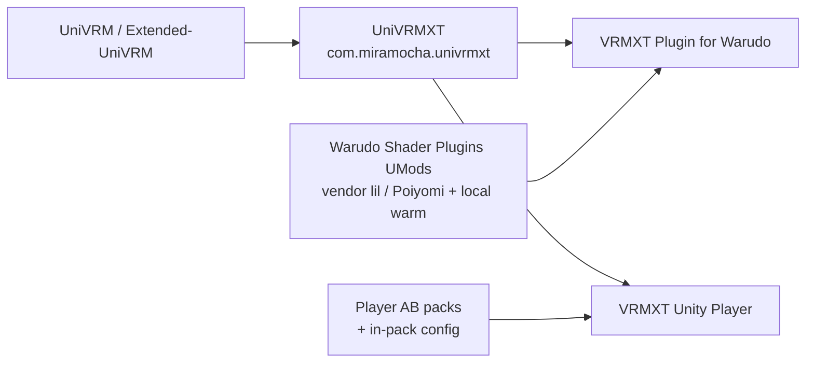

# VRMXT Unity packages

Map of Unity-space repos and UPM ids for Extended VRM. Portable `VRMXT_*` contract
stays in [Extended-VRM-Specs](https://github.com/miramocha/Extended-VRM-Specs). This
page is the dependency index for Unity hosts only.

## Package and app map

| Piece | Kind | Id / pin notes | Role |
|-------|------|----------------|------|
| [UniVRM](https://github.com/vrm-c/UniVRM) | Upstream UPM | `com.vrmc.gltf`, `com.vrmc.vrm` | Stock VRM 1.0 load / export |
| [Extended-UniVRM](https://github.com/miramocha/Extended-UniVRM) | Fork | UniVRM-compatible | Optional import/export extension registries (propose upstream) |
| [UniVRMXT](https://github.com/miramocha/UniVRMXT) | UPM | `com.miramocha.univrmxt` | Parse / attach / sync `VRMXT_*`; materials Apply / Transfer; VFX |
| [VRMXT-Unity-Shader-Plugins](https://github.com/miramocha/VRMXT-Unity-Shader-Plugins) | UPM (deprecated) | `com.miramocha.vrmxt.unity.shader-plugins` | Transitional Player inventory / warm C#; supersede with Player AssetBundle packs + in-pack config |
| VRMXT Unity Player | App (private repo today) | Unity `2021.3.45f2` | Desktop view / edit / export; today UniVRMXT + shader-plugins; planned UniVRMXT + StreamingAssets packs. Profile: [vrmxt-unity-player.md](vrmxt-unity-player.md) |
| [VRMXT Plugin for Warudo](https://github.com/miramocha/VRMXT-Plugin-for-Warudo) | Warudo UMod | `mira.vrmxt` | Runtime consumer; vendored or linked UniVRMXT paths |
| Warudo Shader Plugins | Warudo UMods (private repo today) | e.g. `mira.shaders.poiyomi.birp`, lil BIRP | Vendor shaders + ModHost warm; not nested in UniVRMXT; does not depend on shader-plugins |

Third-party pins used by host-shipped overrides (not VRMXT packages):

| Family | Typical pin | Notes |
|--------|-------------|--------|
| lilToon | `1.10.3` (Warudo / Player ship) | Host pin; authoring catalogs may also publish `2.3.4` samples — see [unity-liltoon.md](../references/catalogs/unity-liltoon.md) / [unity-liltoon-warudo.md](../references/catalogs/unity-liltoon-warudo.md) |
| Poiyomi Toon | `9.3.64` | Via Warudo Shader Plugins UMod or Player AssetBundle packs |

## Dependency direction

### Current



### Planned

Warudo Shader Plugins keep vendoring lil / Poiyomi in the UMod and keep local ModHost
warm. They do **not** consume `com.miramocha.vrmxt.unity.shader-plugins`
([Warudo-Shader-Plugins#7](https://github.com/miramocha/Warudo-Shader-Plugins/issues/7)
won’t-do).

Player loads lil / Poiyomi from runtime AssetBundles. Each pack carries config that
lists which ShaderLab names and warm assets to load. Remove the shader-plugins UPM
dep when that path ships.
See [VRMXT Player Shader AssetBundles](../references/vrmxt-player-shader-assetbundles.md).



Rules of thumb:

- **UniVRMXT** owns format attach, materials Apply / Transfer, and VFX
  (`VRMXT_sprite_particle` parse / map; packaged particle mat via `Resources.Load` or
  host `PackagedMaterialProvider`). It does **not** own lil / Poiyomi vendor trees or
  megashader SVC warm lists. Particle / VFX assets are not part of Player lil / Poiyomi
  packs or shader-plugins.
- **Hosts** own megashader load and warm. Supported override surface = what the host
  ships and registers (Warudo ModHost UMods, or Player pack config), then binds
  `ShaderResolveProvider`. Missing name → stock VRM (materials-override rules 11–12).
  No closed claim inventory in UniVRMXT or a shared UPM.
- **`com.miramocha.vrmxt.unity.shader-plugins`** is deprecated transitional Player code.
  Profile note: [VRMXT Unity Shader Plugins](vrmxt-unity-shader-plugins.md).
- **Player** and **Warudo** are apps / plugins. Do not nest them inside UniVRMXT.
- **Warudo Shader Plugins**: UMod packaging, vendor trees, local warm. No planned
  dependency on shader-plugins.
- **Player** (research → planned): AssetBundle packs + in-pack config. Drop
  UPM-in-app cook and the shader-plugins inventory dep.
  See [VRMXT Player Shader AssetBundles](../references/vrmxt-player-shader-assetbundles.md).

## Install snippets

UniVRMXT (see package README for exact UniVRM version):

```json
"com.miramocha.univrmxt": "https://github.com/miramocha/UniVRMXT.git"
```

Shader Plugins (Player interim only; do not add for Warudo):

```json
"com.miramocha.vrmxt.unity.shader-plugins": "https://github.com/miramocha/VRMXT-Unity-Shader-Plugins.git"
```

Player / Warudo pin Unity **`2021.3.45f2`** for Warudo-aligned shader cook
([desktop Player primary](../decisions/vrmxt-desktop-player-primary.md)).

## Profile docs

| Doc | Covers |
|-----|--------|
| [UniVRMXT](univrm-vrmxt.md) | Format package behavior |
| [VRMXT Unity Shader Plugins](vrmxt-unity-shader-plugins.md) | Deprecated host shader ship note |
| [VRMXT Unity Player](vrmxt-unity-player.md) | Desktop app |
| [Warudo VRMXT](warudo-vrmxt.md) | Warudo consumer |
| [UniVRM upstream hooks](univrm-upstream-hooks.md) | Extended-UniVRM registries |
| [Architecture](../architecture.md) | Multi-host layering |

## Open questions

| Topic | Status |
|-------|--------|
| Warudo ModHost adapter on shared shader-plugins package | Won’t do ([#7](https://github.com/miramocha/Warudo-Shader-Plugins/issues/7)) |
| Player AssetBundle shader packs (lil / Poiyomi) + in-pack config | Research note linked above |
| Single public npm-style registry vs git URL UPM only | Git URL for now |
| Align UniVRMXT `package.json` Unity floor vs Player `2021.3.45f2` pin | Tracked on UniVRMXT / Player profiles |
