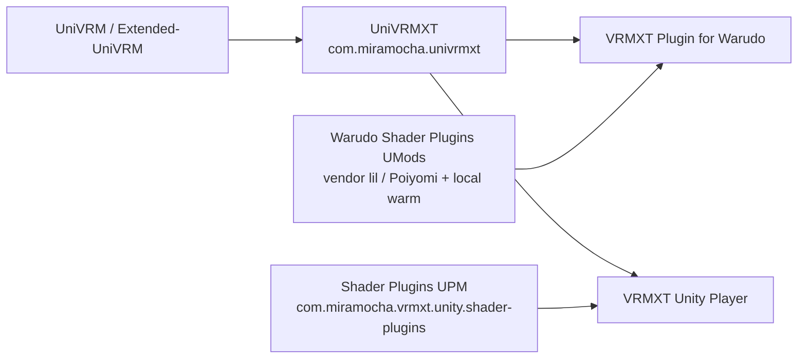
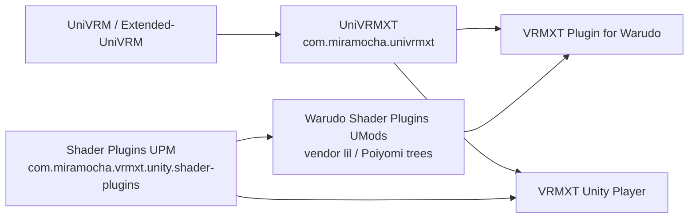

# VRMXT Unity packages

Map of Unity-space repos and UPM ids for Extended VRM. Portable `VRMXT_*` contract
stays in [Extended-VRM-Specs](https://github.com/miramocha/Extended-VRM-Specs). This
page is the dependency index for Unity hosts only.

## Package and app map

| Piece | Kind | Id / pin notes | Role |
|-------|------|----------------|------|
| [UniVRM](https://github.com/vrm-c/UniVRM) | Upstream UPM | `com.vrmc.gltf`, `com.vrmc.vrm` | Stock VRM 1.0 load / export |
| [Extended-UniVRM](https://github.com/miramocha/Extended-UniVRM) | Fork | UniVRM-compatible | Optional import/export extension registries (propose upstream) |
| [UniVRMXT](https://github.com/miramocha/UniVRMXT) | UPM | `com.miramocha.univrmxt` | Parse / attach / sync `VRMXT_*`; materials Apply / Transfer; VFX |
| [VRMXT-Unity-Shader-Plugins](https://github.com/miramocha/VRMXT-Unity-Shader-Plugins) | UPM | `com.miramocha.vrmxt.unity.shader-plugins` | Claimed BIRP ShaderLab inventory + warm helpers |
| VRMXT Unity Player | App (private repo today) | Unity `2021.3.45f2` | Desktop view / edit / export; depends on UniVRMXT + shader-plugins. Profile: [vrmxt-unity-player.md](vrmxt-unity-player.md) |
| [VRMXT Plugin for Warudo](https://github.com/miramocha/VRMXT-Plugin-for-Warudo) | Warudo UMod | `mira.vrmxt` | Runtime consumer; vendored or linked UniVRMXT paths |
| Warudo Shader Plugins | Warudo UMods (private repo today) | e.g. `mira.shaders.poiyomi.birp`, lil BIRP | Vendor shaders + ModHost warm; not nested in UniVRMXT |

Third-party pins used by claimed overrides (host-shipped, not VRMXT packages):

| Family | Typical pin | Notes |
|--------|-------------|--------|
| lilToon | `1.10.3` (Warudo / Player claimed) | Host pin; authoring catalogs may also publish `2.3.4` samples — see [unity-liltoon.md](../references/catalogs/unity-liltoon.md) / [unity-liltoon-warudo.md](../references/catalogs/unity-liltoon-warudo.md) |
| Poiyomi Toon | `9.3.64` | Via Warudo Shader Plugins UMod or Player UPM |

## Dependency direction

### Current



### Planned

Warudo Shader Plugins keeps **vendoring** lil / Poiyomi ShaderLab trees in the UMod.
It **depends on** the shared Shader Plugins UPM for claimed inventory and Layer A/B warm
helpers (ModHost load stays host-side), instead of duplicating that code.



Rules of thumb:

- **UniVRMXT** owns format attach and materials Apply APIs. It does **not** own lil/Poiyomi
  vendor trees or SVC warm lists.
- **Shader Plugins** owns claimed-name inventory and Layer A/B warm helpers. Hosts
  supply Resources, ModHost, or (Player research) AssetBundle asset load. Profile:
  [VRMXT Unity Shader Plugins](vrmxt-unity-shader-plugins.md).
- **Player** and **Warudo** are apps/plugins. Do not nest them inside UniVRMXT.
- **Warudo Shader Plugins** (current): owns UMod packaging, vendor shader trees, and
  local warm. **Planned:** keep vendor trees in the UMod; consume
  `com.miramocha.vrmxt.unity.shader-plugins` for inventory / warm helpers.
- **Player** (research): may load lil / Poiyomi from runtime AssetBundles instead of
  UPM-in-app cook.
  See [VRMXT Player Shader AssetBundles](../references/vrmxt-player-shader-assetbundles.md).

## Install snippets

UniVRMXT (see package README for exact UniVRM version):

```json
"com.miramocha.univrmxt": "https://github.com/miramocha/UniVRMXT.git"
```

Shader Plugins:

```json
"com.miramocha.vrmxt.unity.shader-plugins": "https://github.com/miramocha/VRMXT-Unity-Shader-Plugins.git"
```

Player / Warudo pin Unity **`2021.3.45f2`** for Warudo-aligned shader cook
([desktop Player primary](../decisions/vrmxt-desktop-player-primary.md)).

## Profile docs

| Doc | Covers |
|-----|--------|
| [UniVRMXT](univrm-vrmxt.md) | Format package behavior |
| [VRMXT Unity Shader Plugins](vrmxt-unity-shader-plugins.md) | Claim gates, host matrices |
| [VRMXT Unity Player](vrmxt-unity-player.md) | Desktop app |
| [Warudo VRMXT](warudo-vrmxt.md) | Warudo consumer |
| [UniVRM upstream hooks](univrm-upstream-hooks.md) | Extended-UniVRM registries |
| [Architecture](../architecture.md) | Multi-host layering |

## Open questions

| Topic | Status |
|-------|--------|
| Warudo ModHost adapter on shared shader-plugins package | Planned |
| Player AssetBundle shader packs (lil / Poiyomi) | Research note linked above |
| Single public npm-style registry vs git URL UPM only | Git URL for now |
| Align UniVRMXT `package.json` Unity floor vs Player `2021.3.45f2` pin | Tracked on UniVRMXT / Player profiles |
