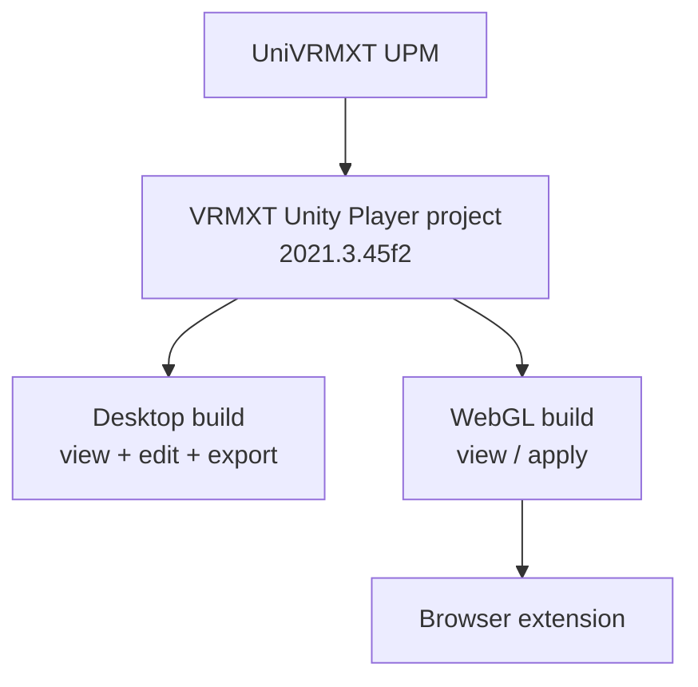

# VRMXT Unity Player

Planned **application** project: drag-and-drop view / edit of VRM 1.0 + `VRMXT_*`, and
the Unity WebGL build embedded by the VRoid Hub browser extension. Separate from the
[UniVRMXT](https://github.com/miramocha/UniVRMXT) UPM library.

WebGL consumer details:
[Unity WebGL VRMXT viewer](unity-webgl-vrmxt-viewer.md).
Hub shell:
[VRoid Hub browser extension](vroid-hub-browser-extension.md),
[architecture decision](../decisions/vroid-hub-browser-viewer-architecture.md).
Authoring contract: [VRMXT Editor](vrmxt-editor.md).

## Goal

One Unity project (`2021.3.45f2`), two product builds:

| Build | Surface | Role |
|-------|---------|------|
| Desktop standalone | OS window | Drag-drop load; view; edit supported `VRMXT_*`; export / write `.vrm` |
| WebGL | Extension `viewer.html` iframe | View / apply only; bytes from extension bridge |

UniVRMXT stays the parse / attach / sync package. This project owns scenes, player UI,
platform I/O, shader inventory, and Player Settings.

## Repo split

| Piece | Repo |
|-------|------|
| Format, runtime attach, materials authoring helpers, export hooks | [UniVRMXT](https://github.com/miramocha/UniVRMXT) (`com.miramocha.univrmxt`) |
| Stock VRM 1.0 load | UniVRM (versions compatible with `2021.3.45f2`) |
| Player app (desktop + WebGL) | **New** project (planned; do not nest inside UniVRMXT or Extended-UniVRM) |
| Hub OAuth / download / iframe host | Browser extension (planned) |

Rejected:

- Putting the player inside the UniVRMXT UPM package (bloated consumers; app ≠ library).
- Two Unity projects for desktop vs WebGL until pin or product split forces it.
- Downgrading Extended-UniVRM `2022.3.62f2` in place to host this app.

## Project baseline

| Item | Value |
|------|-------|
| Unity editor | `2021.3.45f2` |
| Pin reason | Match [Warudo VRMXT](warudo-vrmxt.md) and Hub WebGL |
| Stock VRM | UniVRM packages tested on 2021.3 |
| Extended | UniVRMXT UPM dependency (test 2021.3 compatibility; package.json currently declares `2022.3`) |
| Shared code | Load, camera, UniVRMXT attach, materials apply, claimed shader pack |
| Desktop-only | File dialog / drag-drop, edit UI, export / write |
| WebGL-only | `.jslib` byte bridge; no authoring UI; no Hub API in C# |

## Desktop build (planned)

| Concern | Intent |
|---------|--------|
| Load | Drag-drop or file picker → UniVRM load → UniVRMXT attach |
| View | Orbit camera; VFX + materials override preview |
| Apply | Planned (desktop + WebGL) |
| Materialize | — (Editor-only; not in Player) |
| Transfer | Planned (desktop; from `.mat` asset only) |
| Edit | Host UI for supported capabilities (start: materials override; VFX as profile allows) |
| Export | Write `VRMXT_*` into `.vrm` / `.glb` per [VRMXT Editor](vrmxt-editor.md) bar |
| Limits | Document partial support; do not claim Blender-parity VFX authoring on day one |

Editor claim status: update [VRMXT Editor](vrmxt-editor.md) matrix when Create/edit,
Transfer, and Export ship for each capability. Materialize stays on Unity Editor /
Unreal Editor hosts only.

## WebGL build

Normative consumer rules live in
[Unity WebGL VRMXT viewer](unity-webgl-vrmxt-viewer.md). This project **is** that
player’s source: WebGL Player Settings and the extension embed path are build targets
of the same project, not a second Unity tree.

WebGL MAY Apply overrides. WebGL MUST NOT ship Materialize, Transfer, authoring, or
re-export UI in the first product. Desktop Player also MUST NOT Materialize (no
AssetDatabase / editor asset write path).

## Capability intent

| Capability | Desktop | WebGL |
|------------|---------|-------|
| Stock VRM 1.0 | Required | Required |
| `VRMXT_materials_override` | View + Apply + Transfer + edit + export (planned); **no** Materialize | Apply only (planned) |
| `VRMXT_sprite_particle` | View + edit/export as profile allows | Attach only (planned) |
| Other `VRMXT_*` | Ignore until claimed | Ignore |

Shader resolve: same inventory discipline as Warudo / WebGL profile — ship claimed
shaders; missing name → stock material; no network shader fetch.

## When to split projects later

Keep one project until one of these is true:

1. Desktop must move to Unity `2022.3` + heavy Extended-UniVRM Editor export while WebGL
   must stay on `2021.3.45f2`.
2. Desktop UI / edit surface makes the WebGL build size or CSP story fail measured
   extension limits.
3. Product requires unrelated second WebGL players (see WebGL player registry).

If split: extract shared load/attach/UI-agnostic helpers into UniVRMXT or a thin shared
assembly; keep two apps consuming that library.

## Out of scope

- Replacing UniVRMXT as the library
- Hub OAuth / download-license client in Unity
- Nesting this app under Extended-UniVRM Samples
- Shipping every third-party Hub shader

## Related

- [Unity WebGL VRMXT viewer](unity-webgl-vrmxt-viewer.md)
- [VRoid Hub browser extension](vroid-hub-browser-extension.md)
- [VRoid Hub browser viewer architecture](../decisions/vroid-hub-browser-viewer-architecture.md)
- [VRMXT Editor](vrmxt-editor.md)
- [UniVRMXT](univrm-vrmxt.md)
- [Warudo VRMXT](warudo-vrmxt.md)
- [Architecture](../architecture.md)

## Open questions

| Topic | Status |
|-------|--------|
| Public GitHub repo name | TBD |
| Builtin vs URP for shipped builds | TBD (align with WebGL profile) |
| Exact UniVRM / UniVRMXT pins on 2021.3.45f2 | TBD |
| First desktop edit surface (mats Transfer ± VFX; no Materialize) | TBD |
| Desktop export path (full UniVRM export vs JSON patch like Warudo) | TBD |
