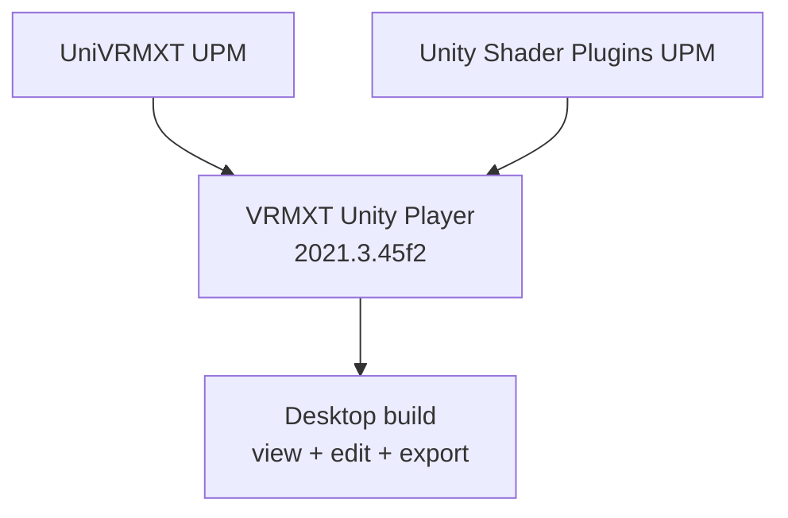

# VRMXT Unity Player

**Application** project: desktop drag-and-drop view / edit of VRM 1.0 + `VRMXT_*`.
Separate from the [UniVRMXT](https://github.com/miramocha/UniVRMXT) UPM library.

Product decision:
[VRMXT desktop Player primary](../decisions/vrmxt-desktop-player-primary.md)
(supersedes Hub browser extension + WebGL as a shipping path).

Authoring contract: [VRMXT Editor](vrmxt-editor.md). Claimed shaders:
[VRMXT Unity Shader Plugins](vrmxt-unity-shader-plugins.md).
Package map: [VRMXT Unity packages](vrmxt-unity-packages.md).

## Goal

One Unity project (`2021.3.45f2`), **desktop** product build:

| Build | Surface | Role |
|-------|---------|------|
| Desktop standalone | OS window | Drag-drop / file open; view; edit supported `VRMXT_*`; export / write `.vrm` |

UniVRMXT stays the parse / attach / sync package. This project owns scenes, player UI,
platform I/O, shader inventory, and Player Settings.

A WebGL build MAY remain in the same project for experiments. It is **not** a Hub
product path and MUST NOT claim Warudo-parity megashader support. Historical notes:
[Unity WebGL VRMXT viewer](unity-webgl-vrmxt-viewer.md) (superseded).

## Repo split

| Piece | Repo |
|-------|------|
| Format, runtime attach, materials authoring helpers, export hooks | [UniVRMXT](https://github.com/miramocha/UniVRMXT) (`com.miramocha.univrmxt`) |
| Stock VRM 1.0 load | UniVRM (versions compatible with `2021.3.45f2`) |
| Player app (desktop) | VRMXT Unity Player (do not nest inside UniVRMXT or Extended-UniVRM) |
| Claimed shader warm helpers | `com.miramocha.vrmxt.unity.shader-plugins` |

Rejected:

- Putting the player inside the UniVRMXT UPM package (bloated consumers; app ≠ library).
- Downgrading Extended-UniVRM `2022.3.62f2` in place to host this app.
- Shipping Hub browser extension + WebGL as the preview product
  ([desktop Player primary](../decisions/vrmxt-desktop-player-primary.md)).

## Project baseline

| Item | Value |
|------|-------|
| Unity editor | `2021.3.45f2` |
| Pin reason | Match [Warudo VRMXT](warudo-vrmxt.md) |
| Stock VRM | UniVRM packages tested on 2021.3 |
| Extended | UniVRMXT UPM dependency (test 2021.3 compatibility; package.json currently declares `2022.3`) |
| Shared with Warudo | Load, UniVRMXT attach, materials Apply, claimed shader pack |
| Desktop | File dialog / drag-drop, edit UI, export / write |

```mermaid
flowchart TB
  pkg["UniVRMXT UPM"]
  shaders["Unity Shader Plugins UPM"]
  app["VRMXT Unity Player<br/>2021.3.45f2"]
  desk["Desktop build<br/>view + edit + export"]
  pkg --> app
  shaders --> app
  app --> desk
```

## Desktop build

| Concern | Intent |
|---------|--------|
| Load | Drag-drop or file picker → UniVRM load → UniVRMXT attach |
| View | Orbit camera; VFX + materials override preview |
| Apply | Planned |
| Materialize | — (Editor-only; not in Player) |
| Transfer | Planned (from `.mat` asset only) |
| Edit | Host UI for supported capabilities (start: materials override; VFX as profile allows) |
| Export | Write `VRMXT_*` into `.vrm` / `.glb` per [VRMXT Editor](vrmxt-editor.md) bar |
| Limits | Document partial support; do not claim Blender-parity VFX authoring on day one |

Ingest is local files first. Hub OAuth / download inside the Player is deferred.

Editor claim status: update [VRMXT Editor](vrmxt-editor.md) matrix when Create/edit,
Transfer, and Export ship for each capability. Materialize stays on Unity Editor /
Unreal Editor hosts only.

## Capability intent

| Capability | Desktop |
|------------|---------|
| Stock VRM 1.0 | Required |
| `VRMXT_materials_override` | View + Apply + Transfer + edit + export (planned); **no** Materialize |
| `VRMXT_sprite_particle` | View + edit/export as profile allows |
| Other `VRMXT_*` | Ignore until claimed |

Shader resolve: [VRMXT Unity Shader Plugins](vrmxt-unity-shader-plugins.md) —
ship claimed shaders; missing name → stock material; no network shader fetch.

## Out of scope

- Replacing UniVRMXT as the library
- Hub OAuth / download-license client in Unity (deferred)
- Nesting this app under Extended-UniVRM Samples
- Claiming every third-party avatar shader
- Hub browser extension or WebGL as a shipping consumer

## Related

- [VRMXT desktop Player primary](../decisions/vrmxt-desktop-player-primary.md)
- [VRMXT Unity Shader Plugins](vrmxt-unity-shader-plugins.md)
- [VRMXT Editor](vrmxt-editor.md)
- [UniVRMXT](univrm-vrmxt.md)
- [Warudo VRMXT](warudo-vrmxt.md)
- [Architecture](../architecture.md)
- [Unity WebGL VRMXT viewer](unity-webgl-vrmxt-viewer.md) (superseded)
- [VRoid Hub browser extension](vroid-hub-browser-extension.md) (superseded)

## Open questions

| Topic | Status |
|-------|--------|
| Public GitHub repo | Private today (`miramocha/VRMXT-Unity-Player`); public name TBD |
| Builtin vs URP for shipped builds | TBD (align with Warudo BIRP first) |
| Exact UniVRM / UniVRMXT pins on 2021.3.45f2 | TBD |
| First desktop edit surface (mats Transfer ± VFX; no Materialize) | TBD |
| Desktop export path (full UniVRM export vs JSON patch like Warudo) | TBD |
| Hub download API inside desktop Player | Deferred |
