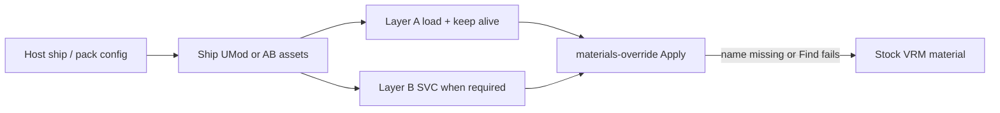

# VRMXT Unity Shader Plugins

**Deprecated.** Package id `com.miramocha.vrmxt.unity.shader-plugins`
([VRMXT-Unity-Shader-Plugins](https://github.com/miramocha/VRMXT-Unity-Shader-Plugins))
is a transitional Player helper (hardcoded inventory + warm C#). Do not add a Warudo
ModHost adapter. Do not treat `BirpClaimedShaderInventory` as the product source of
truth.

Planned Player surface: AssetBundle packs with **in-pack config** that lists load /
warm / Apply ShaderLab names.
See [VRMXT Player Shader AssetBundles](../references/vrmxt-player-shader-assetbundles.md).
Warudo stays UMod-local ModHost warm
([Warudo Material Warm-Up](../references/warudo-material-warmup.md));
[Warudo-Shader-Plugins#7](https://github.com/miramocha/Warudo-Shader-Plugins/issues/7)
won’t-do.

Unity dependency map: [VRMXT Unity packages](vrmxt-unity-packages.md).

This note does not change glTF schema. Catalogs stay non-normative discovery
([Materials Override Catalogs](../references/materials-override-catalogs.md)).
Unresolved override names follow materials-override rules 11–12 (stock VRM for that
material). File validity does not require catalog or inventory membership (rules
18–19).

Interim package consumer: [VRMXT Unity Player](vrmxt-unity-player.md) only.
[Warudo VRMXT](warudo-vrmxt.md) uses separate UMod ModHost warm and does **not**
depend on this package. Poiyomi exclusion detail:
[Warudo Poiyomi Exclusions](../references/warudo-poiyomi-exclusions.md).

Experimental WebGL notes:
[Unity WebGL VRMXT viewer](unity-webgl-vrmxt-viewer.md) (superseded).

## Goal

Name-agnostic cook / ship gates so hosts know when a family is safe to put in a UMod
or Player pack. Apply discipline: ship and register shaders; missing name → stock
material; no network shader fetch.

Supported ShaderLab names live in **host ship config** (Warudo UMod trees + warm code,
or Player pack config), not in a shared claim-list UPM.

## Support means

A ShaderLab name (or discrete `shaderFeature` / keyword) is **supported** for a host
only when Apply works using:

- host engine APIs available to that consumer; and
- shaders, materials, and packages that consumer **ships** (including first-party VRMXT
  packages it distributes).

Aligns with materials-override rules 27–28. Files may still emit host-dependent
features; consumers ignore unresolvable entries and MUST NOT require those stacks to
load the VRM.

### Admission gates (name-agnostic)

| Gate | Pass when |
|------|-----------|
| Ship-set | Correct runtime behavior does not need a third-party plugin, package, or world stack outside the host ship set |
| Stable Apply identity | Documented ShaderLab string resolves after a **normal** player/plugin build (`Shader.Find` / host warm map) |
| No optimizer dependency | Support does not require vendor lock, unlock, strip-disable, or optimizer bake for that public name to exist at runtime |
| Presence mechanism | Family is kept alive by Resources / ModHost / pack materials and documented warm, not by Always Included alone for megashader families |

Unity’s ordinary ShaderLab/HLSL compile is part of a normal build. Vendor optimizer
pipelines that strip or rename unlocked public names (for example Thry unlocked-shader
stripping) are outside “normal” unless the host documents and enforces a build policy
that keeps those names, **or** the family is omitted from that host’s ship / pack
config.

### `Hidden/` ShaderLab names

`Hidden/` is allowed when it **is** the documented Apply identity for a rendering mode
(example: `Hidden/lilToonCutout`, `Hidden/lilToonTransparent`). Catalogs pin those
strings when a family uses them.

Do not use optimizer lock copies (`Hidden/Locked/…`) as Apply identities. Overrides
store the unlocked public name the consumer documents for that family.

## Structural qualification (new families)

Before adding a family to a host ship set or pack config, score the `.shader` /
includes. Do not admit on popularity alone. Report at least:

| Signal | Role |
|--------|------|
| `#pragma multi_compile` / `_local` axis count and product estimate | Cook / Always Included pressure |
| `#pragma shader_feature` count | Hitch risk if shipped “warmed” without SVC |
| Pass count / PassTypes | Warm cost |
| Sibling ShaderLab alts in the same package tree | Extra compile even when omitted from load config |
| Optimizer / lock markers | Strip risk for public names |
| External package hooks (AudioLink, LTCGI, VRC volumes, …) | Rule 27: demote features or reject “full support” |
| Properties block size | Catalog / Apply surface; curate a subset |

Verdict bands (cook decision language; not a glTF allowlist):

| Verdict | Meaning |
|---------|---------|
| `ship` | Passes all admission gates; `multi_compile` product fits the host cook budget without Always Included; self-contained in the ship set |
| `ship_with_demote` | Passes gates only after a documented `multi_compile` cut and warm lists sized to that host |
| `desktop_only` | Fits desktop / ModHost budgets; fails experimental WebGL cook, strip, or size limits |
| `reject` | Needs Always Included alone, lock-only Apply, or third-party stacks outside the ship set |

`shader_feature` volume alone is not a reject. Unbounded `multi_compile` product and
optimizer strip of public names are hard fails for `ship` (use `ship_with_demote`,
`desktop_only`, or omit). Each host sets numeric cook budgets; desktop Player and
Warudo are the product budgets.

Poiyomi BIRP keyword / warm mechanics:
[Warudo Poiyomi BIRP Variants](../references/warudo-poiyomi-birp-variants.md).

## Current ship notes (non-normative)

Pins and exact ShaderLab names live in Warudo UMod trees and (planned) Player pack
config. Exclusions:
[Warudo Poiyomi Exclusions](../references/warudo-poiyomi-exclusions.md).

Typical pins today:

| Family | Pin | Notes |
|--------|-----|--------|
| Stock MToon | UniVRM | VRM 1.0 default path (not an override) |
| lilToon | **1.10.3** | Authoring catalogs may also sample **2.3.4** — see [Unity lilToon Catalog](../references/catalogs/unity-liltoon.md) / [Warudo lilToon catalog](../references/catalogs/unity-liltoon-warudo.md) |
| Poiyomi Toon | **9.3.64** | Primary Toon + Lil Fur common; World / Pro World / Two Pass often deferred from Player load config (Warudo UMod may still ship Two Pass assets) |

Host-only FX keywords (AudioLink, LTCGI, mirrors, Beat Saber fog, …): never treat as
supported. Poiyomi needs unlocked public names through build (document strip-disable
or equivalent), Layer B SVC warm where required, and **no** Poiyomi on Always Included
Shaders.

Experimental WebGL builds are outside this product ship set. Historical lite intent
(MToon + lil only) lived under
[Unity WebGL VRMXT viewer](unity-webgl-vrmxt-viewer.md) (superseded).

## Warm and cook

**Today (Player interim):** helpers in `com.miramocha.vrmxt.unity.shader-plugins`
(`ResourcesBirpShaderWarmHost`, `PoiyomiBirpWarm`, `BirpClaimedShaderInventory`).
Operational notes: Player repo `Assets/VRMXTPlayer/SHADERS.md`.

**Planned Player:** pack config + selective `LoadAsset` + baked
`ShaderVariantCollection.WarmUp` (and Blit / `SetPass` if still needed). Poi-specific
keyword tables need not live in a shared UPM.
See [VRMXT Player Shader AssetBundles](../references/vrmxt-player-shader-assetbundles.md).

**Warudo:** local UMod ModHost warm only.
[Warudo Material Warm-Up](../references/warudo-material-warmup.md).

## Future validator (outline)

Editor / CI scorecard for “may we ship this?”, separate from glTF file validation:

1. Pack or UMod config membership vs deferred alts.
2. Structural metrics above vs host cook budget.
3. Optimizer markers → require documented policy or omit family.
4. Post-build / player-build resolve check for each primary shipped name.
5. Minimal Apply smoke (set shader + one prop / binding).
6. Lint: shipped megashaders absent from Always Included.

## Related

- [VRMXT Unity packages](vrmxt-unity-packages.md)
- [VRMXT_materials_override](../specs/extensions/materials/vrmxt-materials-override.md)
- [Materials Override Catalogs](../references/materials-override-catalogs.md)
- [Warudo Poiyomi Exclusions](../references/warudo-poiyomi-exclusions.md)
- [Warudo Poiyomi BIRP Variants](../references/warudo-poiyomi-birp-variants.md)
- [Warudo Material Warm-Up](../references/warudo-material-warmup.md)
- [VRMXT Player Shader AssetBundles](../references/vrmxt-player-shader-assetbundles.md)
- [VRMXT Unity Player](vrmxt-unity-player.md)
- [Warudo VRMXT](warudo-vrmxt.md)
- [VRMXT desktop Player primary](../decisions/vrmxt-desktop-player-primary.md)
- [Unity WebGL VRMXT viewer](unity-webgl-vrmxt-viewer.md) (superseded)

## Open questions

| Topic | Status |
|-------|--------|
| Drop Two Pass / unused alts from shipped trees | Open (compile cost even if omitted from load config) |
| Per-host Always Included allowlist for shipped helpers | Per-host Player Settings |
| Numeric cook budgets per host (desktop Player vs Warudo) | Open |
| Player Layer A via AssetBundle packs + in-pack config | Research: [Player Shader AssetBundles](../references/vrmxt-player-shader-assetbundles.md) |
