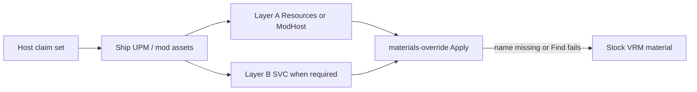

# VRMXT Unity Shader Plugins

Host profile for Unity packages that ship a **claimed** ShaderLab inventory for
[VRMXT_materials_override](../specs/extensions/materials/vrmxt-materials-override.md)
Apply. Package id: `com.miramocha.vrmxt.unity.shader-plugins`
([VRMXT-Unity-Shader-Plugins](https://github.com/miramocha/VRMXT-Unity-Shader-Plugins)).
Unity dependency map: [VRMXT Unity packages](vrmxt-unity-packages.md).

This note scopes **which shaders a host may present as supported**. It does not change
glTF schema. Catalogs remain non-normative discovery
([Materials Override Catalogs](../references/materials-override-catalogs.md)).
Unresolved or unclaimed override names follow materials-override rules 11–12 (stock VRM
import for that material). File validity does not require catalog membership (rules
18–19).

Product consumers: [VRMXT Unity Player](vrmxt-unity-player.md) (desktop),
[Warudo VRMXT](warudo-vrmxt.md). Poiyomi exclusion inventory:
[Warudo Poiyomi Exclusions](../references/warudo-poiyomi-exclusions.md).

Experimental WebGL notes (not a product claim set):
[Unity WebGL VRMXT viewer](unity-webgl-vrmxt-viewer.md) (superseded).

## Goal

Declare admission gates and per-host claim matrices so desktop Player and Warudo agree
on Apply resolve discipline: ship claimed shaders; missing name → stock material; no
network shader fetch.

## Support means

A ShaderLab name (or discrete `shaderFeature` / keyword) is **supported** for a host
only when Apply works using:

- host engine APIs available to that consumer; and
- shaders, materials, and packages that consumer **ships** (including first-party VRMXT
  packages it distributes).

Aligns with materials-override rules 27–28. Files may still emit host-dependent
features; consumers ignore unresolvable entries and MUST NOT require those stacks to
load the VRM.

### Admission gates (name-agnostic)

| Gate | Pass when |
|------|-----------|
| Ship-set | Correct runtime behavior does not need a third-party plugin, package, or world stack outside the host ship set |
| Stable Apply identity | Documented ShaderLab string resolves after a **normal** player/plugin build (`Shader.Find` / host warm map) |
| No optimizer dependency | Support does not require vendor lock, unlock, strip-disable, or optimizer bake for that public name to exist at runtime |
| Presence mechanism | Family is kept alive by Resources/ModHost materials and/or documented warm, not by Always Included alone for megashader families |

Unity’s ordinary ShaderLab/HLSL compile is part of a normal build. Vendor optimizer
pipelines that strip or rename unlocked public names (for example Thry unlocked-shader
stripping) are outside “normal” unless the host documents and enforces a build policy
that keeps those names, **or** the family is omitted from the claim set.

### `Hidden/` ShaderLab names

`Hidden/` is allowed when it **is** the documented Apply identity for a rendering mode
(example: `Hidden/lilToonCutout`, `Hidden/lilToonTransparent`). Catalogs pin those
strings when a family uses them.

Do not use optimizer lock copies (`Hidden/Locked/…`) as Apply identities. Overrides
store the unlocked public name the consumer documents for that family.

## Structural qualification (new families)

Before adding a family to a claim set, score the `.shader` / includes. Do not admit
on popularity alone. Report at least:

| Signal | Role |
|--------|------|
| `#pragma multi_compile` / `_local` axis count and product estimate | Cook / Always Included pressure |
| `#pragma shader_feature` count | Hitch risk if claimed “warmed” without SVC |
| Pass count / PassTypes | Warm cost |
| Sibling ShaderLab alts in the same package tree | Extra compile even when unclaimed |
| Optimizer / lock markers | Strip risk for public names |
| External package hooks (AudioLink, LTCGI, VRC volumes, …) | Rule 27: demote features or reject “full support” |
| Properties block size | Catalog / Apply surface; curate a subset, do not claim the entire block |

Verdict bands:

| Verdict | Meaning |
|---------|---------|
| `claim` | Passes all admission gates; `multi_compile` product fits the host cook budget without Always Included; self-contained in the ship set |
| `claim_with_demote` | Passes gates only after a documented `multi_compile` cut and warm lists sized to that host |
| `desktop_only` | Fits desktop / ModHost budgets; fails experimental WebGL cook, strip, or size limits |
| `reject` | Needs Always Included alone, lock-only Apply, or third-party stacks outside the ship set |

`shader_feature` volume alone is not a reject. Unbounded `multi_compile` product and
optimizer strip of public names are hard fails for `claim` (use `claim_with_demote`,
`desktop_only`, or omit). Each host sets numeric cook budgets; desktop Player and
Warudo are the product budgets.

Poiyomi BIRP keyword / warm mechanics:
[Warudo Poiyomi BIRP Variants](../references/warudo-poiyomi-birp-variants.md).

## Host claim matrix

Pins match Warudo BIRP shader plugins unless a host documents otherwise.
Warudo/Player claimed lilToon pin is **1.10.3**. Separate authoring catalog samples may
use **2.3.4** — see [Unity lilToon Catalog](../references/catalogs/unity-liltoon.md) and
[Warudo lilToon catalog](../references/catalogs/unity-liltoon-warudo.md).

| Family | Pin | Primary ShaderLab names |
|--------|-----|-------------------------|
| Stock MToon | UniVRM | VRM 1.0 default path (not an override claim) |
| lilToon | **1.10.3** | `lilToon`, `Hidden/lilToonCutout`, `Hidden/lilToonTransparent`, … |
| Poiyomi Toon | **9.3.64** | `.poiyomi/Poiyomi Toon`, `.poiyomi/Poiyomi Toon + Lil Fur` |

Deferred (same spirit as Warudo): Poiyomi **World**, Pro World, **Two Pass** alts.
Host-only FX keywords (AudioLink, LTCGI, mirrors, Beat Saber fog, …): never “supported”.
See [Warudo Poiyomi Exclusions](../references/warudo-poiyomi-exclusions.md).

| ShaderLab / class | Desktop Player | Warudo BIRP |
|-------------------|----------------|-------------|
| Stock MToon | yes | yes |
| lilToon (opaque + documented Hidden modes) | yes | yes |
| Poiyomi Toon + Lil Fur | yes* | yes* |
| Two Pass / World / Pro | no | no |
| Host-only FX keywords | no | no |

\*Poiyomi claim requires: unlocked public names kept through build (document strip-disable
or equivalent), Layer B SVC warm, and **no** Poiyomi on Always Included Shaders.

Experimental WebGL builds are outside this product matrix. Historical lite intent
(MToon + lil only) lived under
[Unity WebGL VRMXT viewer](unity-webgl-vrmxt-viewer.md) (superseded).

## Warm and cook

Shared helpers live in `com.miramocha.vrmxt.unity.shader-plugins`:

| Layer | Role | Typical API |
|-------|------|-------------|
| A | Keep ShaderLab alive via Resources / ModHost mats | `ResourcesBirpShaderWarmHost`, host Ensure menus |
| B | Keyword subsets via SVC + Blit where the family needs it | `PoiyomiBirpWarm` (Poiyomi today) |
| Inventory | Claimed name tests | `BirpClaimedShaderInventory` |

Player operational notes (Thry Config ensure, menus): in-repo
`Assets/VRMXTPlayer/SHADERS.md` on the Unity Player project.

## Future validator (outline)

Editor / CI scorecard for “may we claim this?”, separate from glTF file validation:

1. Inventory membership vs deferred alts.
2. Structural metrics above vs host cook budget.
3. Optimizer markers → require documented policy or omit family.
4. Post-build / player-build `Shader.Find` for each primary claimed name.
5. Minimal Apply smoke (set shader + one prop / binding).
6. Lint: claimed megashaders absent from Always Included.

## Related

- [VRMXT Unity packages](vrmxt-unity-packages.md)
- [VRMXT_materials_override](../specs/extensions/materials/vrmxt-materials-override.md)
- [Materials Override Catalogs](../references/materials-override-catalogs.md)
- [Warudo Poiyomi Exclusions](../references/warudo-poiyomi-exclusions.md)
- [Warudo Poiyomi BIRP Variants](../references/warudo-poiyomi-birp-variants.md)
- [Warudo Material Warm-Up](../references/warudo-material-warmup.md)
- [VRMXT Unity Player](vrmxt-unity-player.md)
- [Warudo VRMXT](warudo-vrmxt.md)
- [VRMXT desktop Player primary](../decisions/vrmxt-desktop-player-primary.md)
- [Unity WebGL VRMXT viewer](unity-webgl-vrmxt-viewer.md) (superseded)

## Open questions

| Topic | Status |
|-------|--------|
| Drop Two Pass / unused alts from shipped UPM tree | Open (compile cost even if unclaimed) |
| Promote structural validator into package Editor menu | Open |
| Per-host Always Included allowlist for claimed helpers | Per-host Player Settings |
| Numeric cook budgets per host (desktop Player vs Warudo) | Open |
