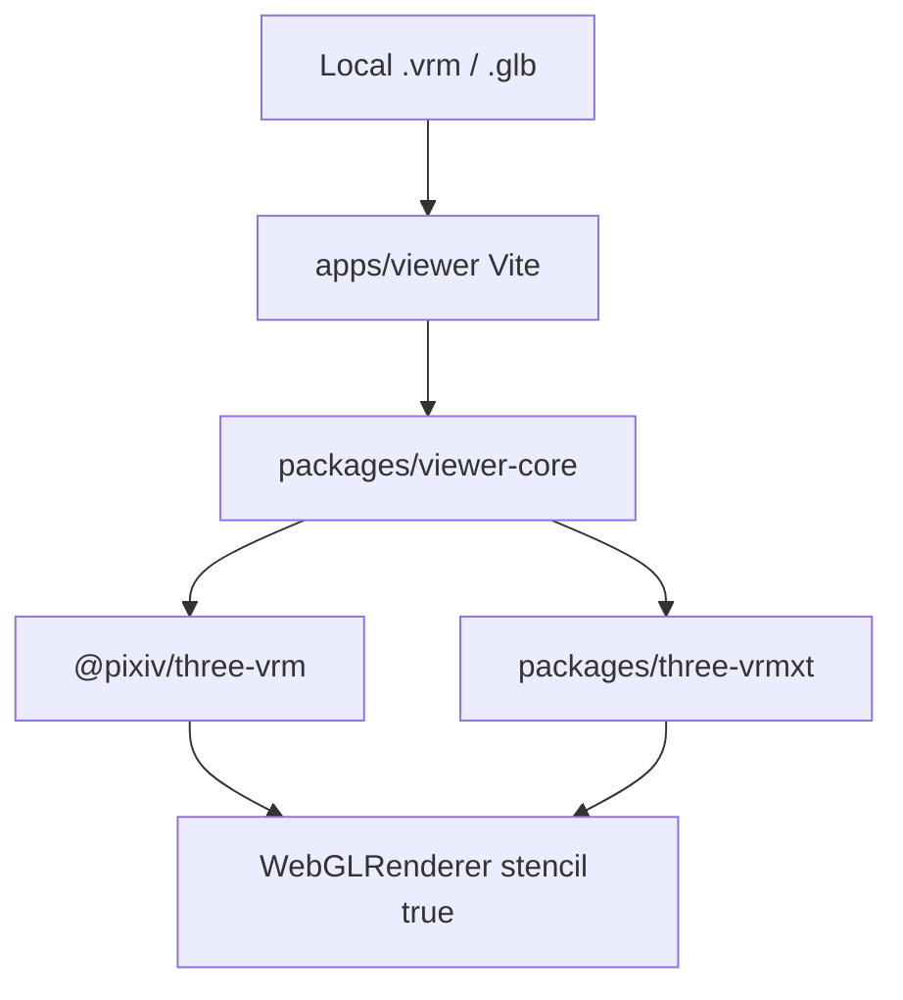

# VRMXT web viewer

Standalone Vite host in [miramocha/three-vrmxt](https://github.com/miramocha/three-vrmxt)
(`apps/viewer`). Loads a local `.vrm` / `.glb` with `@pixiv/three-vrm` plus
[`@vrmxt/three-vrmxt`](three-vrmxt.md) (or `@miramocha/three-vrmxt` if that npm name
ships). Product decision:
[VRMXT three-vrm web viewer](../decisions/vrmxt-three-vrm-web-viewer.md).

This is a **view** surface. Create/edit/Export follow
[VRMXT Editor](vrmxt-editor.md) and are **not** claimed for v1.

## Goal

| Item | v1 |
|------|----|
| Host | Vite app, `apps/viewer` |
| Ingest | File picker and drag-drop (local bytes) |
| Camera | Orbit |
| Stock VRM | VRM 1.0 MToon via `@pixiv/three-vrm` |
| MToonXT | Apply / view [VRMC_materials_mtoonxt](../specs/extensions/materials/vrmc-materials-mtoonxt/README.md) stencil |
| Renderer | Three.js `WebGLRenderer` with `stencil: true` (`renderer.stencil = true`) |
| Shared code | `packages/viewer-core` (also the later Hub mount) |

## Claimed vs planned

| Capability | v1 | Later |
|------------|----|-------|
| Stock VRM 1.0 | View | — |
| `VRMC_materials_mtoonxt` stencil | View + Apply onto Three.js material stencil state | Face SDF |
| `VRMXT_sprite_particle` | — | Planned (library) |
| `VRMXT_materials_override` (lil / Poiyomi) | — | Out of scope in-browser |
| Create/edit portable fields | — | Planned in-memory |
| Export / write `.vrm` | — | Planned; never `extensionsRequired` |
| Hub API | — | [VRMXT Hub extension](vrmxt-hub-extension.md) |
| Electron / Tauri | — | Out of scope for this host |

## Architecture fit

| Architecture rule | Viewer approach |
|-------------------|-----------------|
| Stock VRM load unchanged | `@pixiv/three-vrm` `VRMLoaderPlugin` |
| Optional Extended package | Peer plugin from `packages/three-vrmxt` |
| No `extensionsRequired` | Viewer does not write files in v1; later export MUST omit that list |
| Missing package / missing extra | Avatar still loads; stencil extras skipped |

## File I/O (v1)

1. User picks a file or drops it on the page.
2. Host reads `ArrayBuffer` in the page origin (no Hub fetch).
3. `GLTFLoader` + `VRMLoaderPlugin` + VRMXT plugin parse the buffer.
4. Scene shows the avatar; orbit controls the camera.

Do not persist the file to a server. Do not call VRoid Hub APIs from this app.

## MToonXT apply

Stencil extras follow the portable spec
([stencil](../specs/extensions/materials/vrmc-materials-mtoonxt/stencil.md)). Mapping
is Three.js material stencil state, not Unity ShaderLab. Face SDF is later.

If the extra is absent, keep stock three-vrm MToon.

## Out of scope (this host)

- Hub OAuth / download (see [Hub extension](vrmxt-hub-extension.md))
- Unity WebGL iframe ([superseded Unity WebGL notes](unity-webgl-vrmxt-viewer.md))
- Desktop Unity Player features ([Unity Player](vrmxt-unity-player.md))
- lilToon / Poiyomi in the browser
- Authoring UI in v1

## Related

- [VRMXT three-vrm web viewer](../decisions/vrmxt-three-vrm-web-viewer.md)
- [three-vrmxt](three-vrmxt.md)
- [VRMXT Hub extension](vrmxt-hub-extension.md)
- [VRMXT Editor](vrmxt-editor.md)
- [VRMXT Unity Player](vrmxt-unity-player.md)
- [Architecture](../architecture.md)
- [miramocha/three-vrmxt](https://github.com/miramocha/three-vrmxt)
