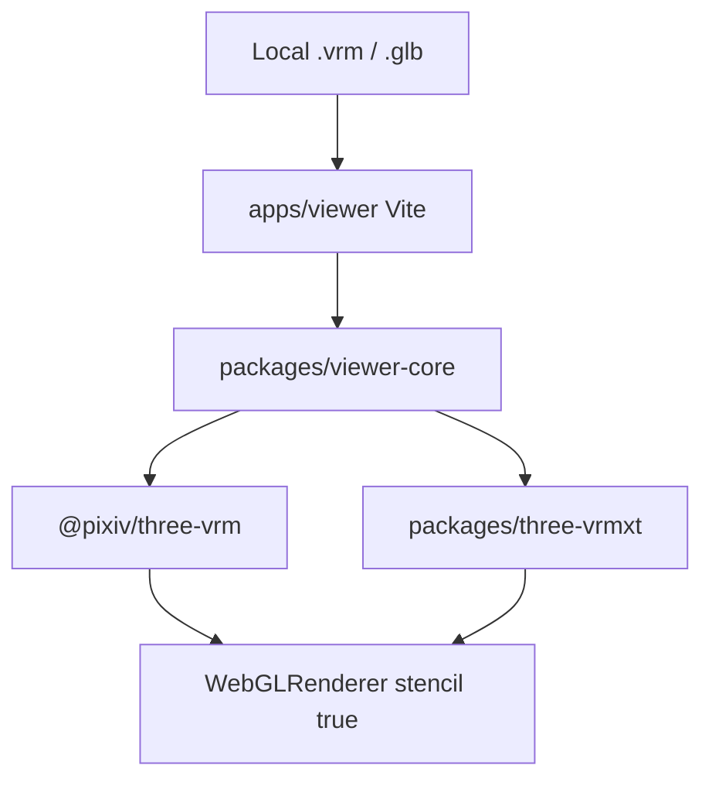

# VRMXT web viewer

Standalone Vite host in [miramocha/three-vrmxt](https://github.com/miramocha/three-vrmxt)
(`apps/viewer`). Loads a local `.vrm` / `.glb` with `@pixiv/three-vrm` plus
[`@vrmxt/three-vrmxt`](three-vrmxt.md) (or `@miramocha/three-vrmxt` if that npm name
ships). Product decision:
[VRMXT three-vrm web viewer](../decisions/vrmxt-three-vrm-web-viewer.md).

This is a **view + stencil editor** surface. `VRMXT_materials_face_sdf` and materials override stay
out of this host. Sprite VFX plays when the file has `VRMXT_sprite_particle`.
Create/edit/Export for stencil follow
[VRMXT Editor](vrmxt-editor.md).

## Goal

| Item | v1 |
|------|----|
| Host | Vite app, `apps/viewer` |
| Ingest | File picker and drag-drop (local bytes) |
| Camera | Orbit |
| Stock VRM | VRM 1.0 MToon via `@pixiv/three-vrm` |
| MToonXT | Apply / view / edit / export [VRMXT_materials_mtoonxt](../specs/extensions/materials/vrmxt-materials-mtoonxt/README.md) stencil |
| Renderer | Three.js `WebGLRenderer` constructed with `stencil: true` |
| Shared code | `packages/viewer-core` (also the later Hub mount) |

## Claimed vs planned

| Capability | v1 | Later |
|------------|----|-------|
| Stock VRM 1.0 | View | — |
| `VRMXT_materials_mtoonxt` stencil | View + Apply onto Three.js material stencil state; inspector Create/edit; Download VRM (JSON+BIN patch) | `VRMXT_materials_face_sdf` |
| `VRMXT_sprite_particle` | View (library attach + `apps/viewer` update loop) | Authoring |
| `VRMXT_materials_override` (lil / Poiyomi) | — | Out of scope in-browser |
| Create/edit portable fields | Stencil / `outlineStencil` only | Other `VRMXT_*` |
| Export / write `.vrm` | GLB JSON patch of MToonXT stencil; never `extensionsRequired`. Loose `.gltf` not written | Other extras |
| Hub API | — | [VRMXT Hub extension](vrmxt-hub-extension.md) |
| Electron / Tauri | — | Out of scope for this host |

## Architecture fit

```mermaid
flowchart TB
  file["Local .vrm / .glb"]
  vite["apps/viewer Vite"]
  core["packages/viewer-core"]
  pixiv["@pixiv/three-vrm"]
  xt["packages/three-vrmxt"]
  gl["WebGLRenderer stencil true"]
  file --> vite --> core
  core --> pixiv
  core --> xt
  pixiv --> gl
  xt --> gl
```

| Architecture rule | Viewer approach |
|-------------------|-----------------|
| Stock VRM load unchanged | `@pixiv/three-vrm` `VRMLoaderPlugin` |
| Optional Extended package | Peer plugin from `packages/three-vrmxt` |
| No `extensionsRequired` | Export lists `VRMXT_materials_mtoonxt` in `extensionsUsed` only |
| Missing package / missing extra | Avatar still loads; stencil extras skipped |

## File I/O (v1)

1. User picks a file or drops it on the page.
2. Host reads `ArrayBuffer` in the page origin (no Hub fetch).
3. `GLTFLoader` + `VRMLoaderPlugin` + VRMXT plugin parse the buffer.
4. Scene shows the avatar; orbit controls the camera.
5. HUD **Download VRM** writes a GLB with patched JSON and the original BIN chunk.
   Inspector **MToonXT stencil** edits per-material extras.

Do not persist the file to a server. Do not call VRoid Hub APIs from this app.

## MToonXT apply

Stencil extras follow the portable spec
([stencil](../specs/extensions/materials/vrmxt-materials-stencil.md)). Mapping
is Three.js material stencil state, not Unity ShaderLab. `VRMXT_materials_face_sdf` is later.

If the extra is absent, keep stock three-vrm MToon.

Inspector edits mutate `parser.json`, reset Three.js stencil/depth on the live
materials, then Apply again. Export clones JSON, drops unresolvable clip objects,
rebuilds the GLB.

## Out of scope (this host)

- Hub OAuth / download (see [Hub extension](vrmxt-hub-extension.md))
- Unity WebGL iframe ([superseded Unity WebGL notes](unity-webgl-vrmxt-viewer.md))
- Desktop Unity Player features ([Unity Player](vrmxt-unity-player.md))
- lilToon / Poiyomi in the browser
- `VRMXT_materials_face_sdf`, materials-override authoring

## Related

- [VRMXT three-vrm web viewer](../decisions/vrmxt-three-vrm-web-viewer.md)
- [three-vrmxt](three-vrmxt.md)
- [VRMXT Hub extension](vrmxt-hub-extension.md)
- [VRMXT Editor](vrmxt-editor.md)
- [VRMXT Unity Player](vrmxt-unity-player.md)
- [Architecture](../architecture.md)
- [miramocha/three-vrmxt](https://github.com/miramocha/three-vrmxt)
