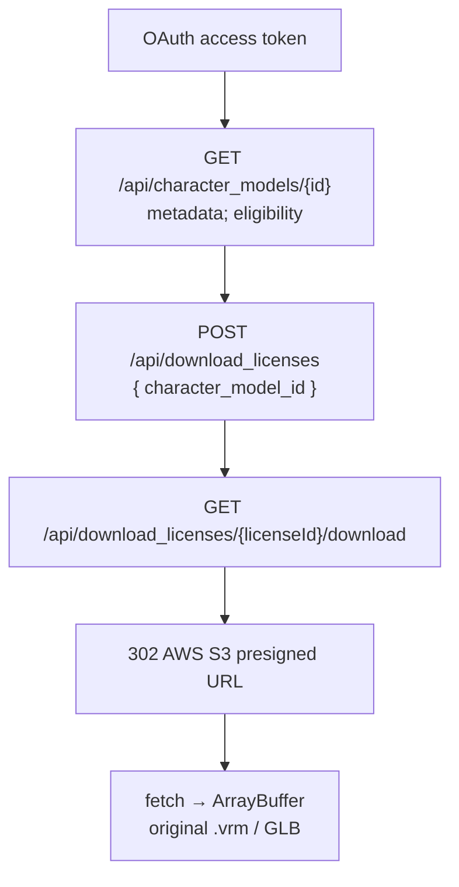
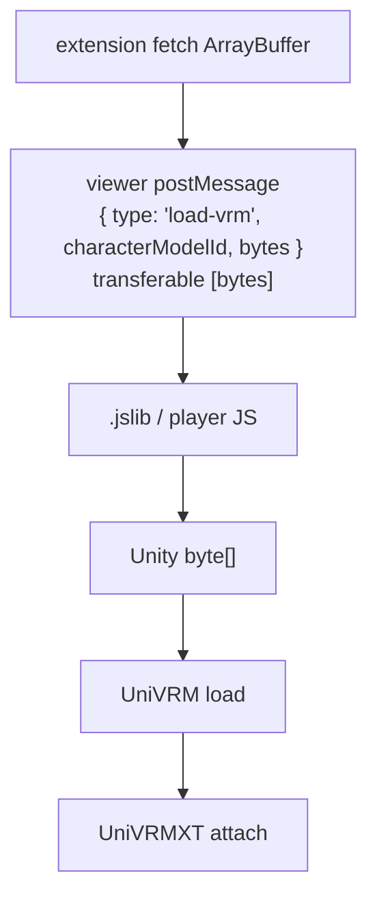

# VRoid Hub browser extension

Cross-browser extension profile for previewing VRoid Hub models with VRMXT support.
Architecture decision:
[VRoid Hub browser viewer architecture](../decisions/vroid-hub-browser-viewer-architecture.md).
Unity WebGL load and apply:
[Unity WebGL VRMXT viewer](unity-webgl-vrmxt-viewer.md).

This note is a **consumer product profile**. It does not define a glTF extension.
Hub's stock three-vrm viewer remains unchanged.

## Goal

On a Hub character-model page, show an extension-owned indicator and open a
persistent extension viewer that downloads the **original** `.vrm` through the
official VRoid Hub API and renders it with UniVRM + UniVRMXT.

| Item | Value |
|------|-------|
| Hosts | Chrome (MV3), Firefox (WebExtension) |
| Hub site | `https://hub.vroid.com/` |
| Viewer surface | Extension tab or dedicated window (extension origin) |
| Auth | Extension OAuth app; separate from Hub website session |
| Download | Documented download-license → S3 presigned URL |
| Renderer | Unity WebGL player (see Unity profile) |
| Unity editor pin | `2021.3.45f2` (Warudo match; see Unity profile) |

## Components

| Piece | Owns |
|-------|------|
| Content script | Match Hub model routes; mount indicator; request open/focus viewer with `characterModelId` |
| Background / service worker | Auth state, token storage coordination, download orchestration, single-viewer tab lifecycle |
| Viewer page (`viewer.html`) | Host player iframe, login UI, usage conditions, postMessage bridge into Unity |
| Token broker (backend) | OAuth code exchange and any API that requires `client_secret` |
| Official Hub API | Model metadata, download licenses, original file redirect |

Do **not** put VRoid OAuth or Hub API clients inside Unity C#.

## Route detection

Content script activates on Hub model URLs of the form:

```text
https://hub.vroid.com/{locale}/characters/{characterId}/models/{modelId}
```

Example inspected during design:
`…/characters/4116290793935686116/models/6940073241531936558`.

Hub is a Next.js SPA. Re-run detection on:

- initial load
- client-side route changes (URL / history observers)
- soft navigation that keeps the document alive

Extract `characterModelId` from the path. Ignore tags and title text as VRMXT proof.

## Indicator

Mount an extension-owned DOM node. Do not delete or restyle Hub login/download
controls.

| State | Meaning | Trigger |
|-------|---------|---------|
| Idle / unavailable | No action or explain why | Wrong route, private model, preview denied |
| Download eligible | Public metadata allows original download | `is_downloadable === true` (and related public flags) |
| Auth required | User must connect extension OAuth | Eligible model; no valid extension token |
| Opening viewer | User chose preview | Button / keyboard action |
| VRMXT confirmed | Original GLB JSON lists supported `VRMXT_*` | After authorized download + JSON inspect |
| Stock VRM only | Original loads; no supported `VRMXT_*` | Download succeeded; no matching extensions |
| Error | Auth, license, network, or parse failure | Surfaced message; no silent retry loop |

Public metadata MAY drive eligibility. Confirmed VRMXT MUST wait for original-byte
inspection. Model name, description, and Hub tags MUST NOT alone assert VRMXT.

## Viewer lifecycle

1. Content script sends `{ type, characterModelId }` to background.
2. Background focuses an existing viewer tab if present; otherwise opens one at the
   extension origin.
3. Viewer receives `characterModelId` via extension messaging and MAY mirror it in
   URL state for reload (`?characterModelId=`). Tokens stay out of the URL.
4. Model switch reuses the same viewer: revoke prior license if required by policy,
   clear prior Unity instance memory, then load the new model.
5. Closing the viewer stops the WebGL instance (`Quit()` + iframe remove) per the
   Unity profile.

Toolbar popups MUST NOT host the Unity player.

## Authentication

Hub website login and extension OAuth are independent.

1. Register a VRoid Hub application (Client ID; Client Secret only on broker).
2. Extension starts OAuth 2.0; user completes Hub consent in a browser flow.
3. Authorization code exchange that needs `client_secret` runs on the token broker.
4. Extension stores access/refresh tokens in extension storage with least privilege.
5. Logout clears local tokens and calls revoke when the API supports it
   ([OAuth API](https://developer.vroid.com/en/api/oauth-api.html)).

Never embed `client_secret` in extension JS, content scripts, or WebGL assets.
If VRoid grants a public-client / PKCE-only flow later, the broker MAY shrink; until
then treat confidential-client exchange as required.

## Download flow

Use documented endpoints
([load character model](https://developer.vroid.com/en/api/load-character.html)):



Rules:

1. Prefer original download. Do not treat Hub `optimized_preview` as the VRMXT source.
2. Send `X-Api-Version` as required by the current Hub API docs.
3. Display Hub usage / license conditions associated with the model before or during
   load (fields from Hub metadata / license responses). Exact UI layout is
   implementation detail.
4. Invalidate or drop download licenses per Hub expiry and product policy.
5. After bytes arrive, parse GLB JSON enough to decide VRMXT indicator state, then
   hand bytes to the Unity bridge.

## Byte handoff

Preferred path:



Validate `event.origin` as the extension origin. Use transferable `ArrayBuffer` to
avoid an extra copy when possible. Alternative: pass a short-lived presigned URL to
player JS for fetch when CORS permits; still keep OAuth tokens in the extension.

## Security

| Rule | Requirement |
|------|-------------|
| Host permissions | Least privilege for Hub API / S3 hosts actually used |
| Tokens | Extension storage; no query-string leakage |
| Secrets | Broker only |
| Messaging | Origin checks; typed message schema |
| Scripts | Local extension scripts; MV3 CSP includes `wasm-unsafe-eval` as required by Unity |
| Cache | Explicit retention for model bytes; clear on logout and configurable eviction |
| Hub UI | Do not scrape private endpoints or forge Hub website session as the auth path |

## Failure and fallback

| Case | Behavior |
|------|----------|
| Not logged into extension | Indicator offers connect; no download |
| `is_downloadable` false | Do not claim original preview; explain |
| OAuth / license error | Error state; keep Hub page usable |
| Original has no `VRMXT_*` | Load stock VRM in Unity; mark stock-only |
| Unsupported `VRMXT_*` present | Load stock + supported subset; document partial support |
| SPA nav away from model | Tear down or idle indicator; viewer may keep last model until switched |

Stock VRM load MUST succeed when VRMXT data is missing or partially unsupported
([VRMXT Conformance](../specs/core/vrmxt-conformance.md)).

## Tests

| Case | Expectation |
|------|-------------|
| Logged out | Auth required state; no license POST |
| Non-downloadable model | No original download attempt presented as available |
| Downloadable stock VRM | Viewer loads avatar; VRMXT confirmed false |
| Downloadable VRMXT materials override | JSON detect + Unity apply per Unity profile |
| Expired token / license | Re-auth or re-issue; no infinite silent loop |
| SPA navigate model A → B | Indicator updates; viewer can switch model |
| Chrome MV3 + Firefox | Same user-visible states |
| Logout | Tokens and cached bytes cleared per policy |

## Out of scope

- Replacing Hub three-vrm canvas
- Authoring or re-export of VRMXT from the extension
- Using Hub tags as the VRMXT gate
- Shipping dual Unity editor players in the first package

## Related

- [VRoid Hub browser viewer architecture](../decisions/vroid-hub-browser-viewer-architecture.md)
- [Unity WebGL VRMXT viewer](unity-webgl-vrmxt-viewer.md)
- [Warudo VRMXT](warudo-vrmxt.md)
- [VRoid Hub VRMXT round-trip](../references/vroid-hub-vrmxt-roundtrip.md)
- [VRMXT Conformance](../specs/core/vrmxt-conformance.md)
- [VRoid Hub API outline](https://developer.vroid.com/en/api/)
- [Load a character model](https://developer.vroid.com/en/api/load-character.html)
- [OAuth API](https://developer.vroid.com/en/api/oauth-api.html)

## Open questions

| Topic | Status |
|-------|--------|
| Default viewer: tab vs window | TBD (tab preferred) |
| Eager vs on-open download for VRMXT confirm | TBD |
| Byte cache TTL / disk quota | TBD |
| Exact Hub API version header pin | TBD at implement time |
| Broker hosting and refresh rotation | TBD |
