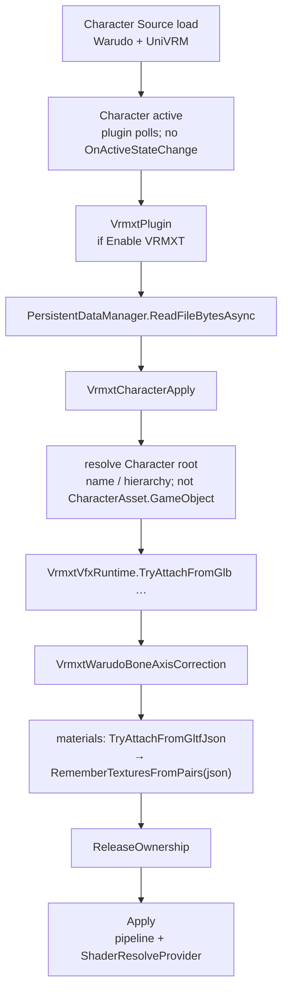
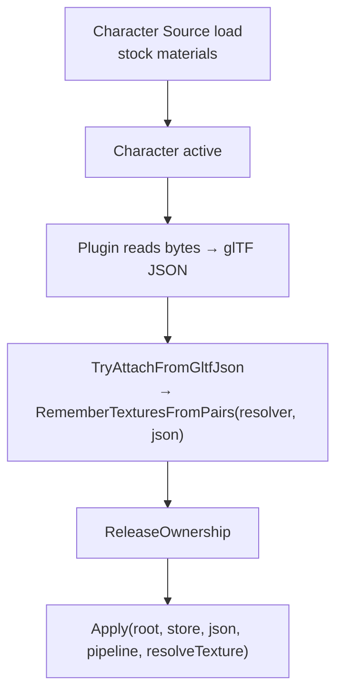

# Warudo VRMXT

Host integration for [VRMXT_sprite_particle](../specs/extensions/vfx/vrmxt-sprite-particle.md) and
[VRMXT_materials_override](../specs/extensions/materials/vrmxt-materials-override.md) on
[Warudo](https://warudo.app/) Characters. Implementation:
[VRMXT Plugin for Warudo](https://github.com/miramocha/VRMXT-Plugin-for-Warudo)
(`Assets/Vrmxt/`), exported as a UMod plugin to `StreamingAssets/Plugins`.

Warudo remains a runtime consumer: the plugin applies VRMXT data after Character load.
A VRMXT patch export rewrites materials-override JSON into a copy of the original local
VRM. It does not export live geometry or other Warudo scene state.

Related: [UniVRMXT](univrm-vrmxt.md).
Planned Hub WebGL viewer uses the same Unity `2021.3.45f2` pin via
[VRMXT Unity Player](vrmxt-unity-player.md):
[Unity WebGL VRMXT viewer](unity-webgl-vrmxt-viewer.md),
[VRoid Hub browser viewer architecture](../decisions/vroid-hub-browser-viewer-architecture.md).

## Goal

After Character **Source** loads a VRM 1.0 `.vrm`, attach:

1. `VRMXT_sprite_particle` → ParticleSystem children
2. `VRMXT_materials_override` → unity-slot shader/properties/bindings on matching mats

| Item | Value |
|------|-------|
| Plugin id | `mira.vrmxt` |
| Mod folder | `Assets/Vrmxt` |
| Export | `Warudo_Data/StreamingAssets/Plugins` |
| Extensions | `VRMXT_sprite_particle`, `VRMXT_materials_override` |
| Plugin version (shipped) | `0.1.1` (see `VrmxtPlugin`) |
| Steam Workshop | [VRMXT](https://steamcommunity.com/sharedfiles/filedetails/?id=3767350210) |
| Warudo Mod Tool | `0.14.5.1` (`app.warudo.modtool` `#upm/0.14.5.1`) |
| UniVRM (Warudo runtime) | `0.130.1` (`UniGLTF.PackageVersion` / `UniGLTFVersion` `2.66.1` in `Warudo_Data/Managed/UniGLTF.dll`) |
| UniVRM (Mod Tool editor) | `0.129.1` (`com.vrmc.*@96a7b03851` embedded in Mod Tool `0.14.5.1`) |
| VRMXT patch export | Implemented (`VrmxtManagerAsset` + `GlbChunks.TryRebuild`); see #8 |

## Package split

| Piece | Where |
|-------|-------|
| Extension JSON | `.vrm` glTF |
| Parse + VFX map + materials apply | Vendored UniVRMXT Format/Vfx/MaterialsOverride `.cs` under the mod (no UPM/DLL/`.asmdef`) |
| Packaged shaders / mats | Particles Unlit + sample `TestOverrideBuiltin` / `TestOverrideURP` under `Assets/Vrmxt/` |
| Character watch + byte re-read | `VrmxtPlugin` / `VrmxtCharacterApply` |
| Emit-axis correction | `VrmxtWarudoBoneAxisCorrection` (VRM 1.0 **ReverseX**) |
| Stock VRM load | Warudo Character asset |
| VRMXT patch export | Original GLB bytes + rewritten materials-override JSON; `VrmxtManagerAsset`; sandboxed `PersistentDataManager` output |

## Flow

**Status: shipped** (plugin `0.1.1`). Warudo owns stock VRM load; the plugin attaches
after the Character is active.

## VFX

### Node resolve

`emitters[].node` by GLB `nodes[].name` (`VrmxtVfxNodeResolver`). VFX-only textures
via second GLB read (`VrmxtVfxGlbTextures`); plugin owns them until unbind/reload.

## Materials override

After Character **Source** loads a VRM 1.0 `.vrm`, the plugin **Applies**
`engine: "unity"` override slots whose `material.variant` matches the active pipeline
(live Character materials). That is Apply, not Materialize: no Unity `.mat` asset is created.
See [VRMXT Editor → Apply / Materialize / Transfer](vrmxt-editor.md#materials-apply-materialize-and-transfer).
Shaders and sample materials ship in the plugin mod.

### Why post-load re-read

Warudo owns Character Source loading. Mod Tool stubs do not expose
`IMaterialDescriptorGenerator`, retained `GltfData`, or a post-parse extension callback.
UniVRM disposes the `GltfData` that held the source JSON. The plugin reads the Character
bytes through `PersistentDataManager`, parses the glTF JSON, and applies the override to
live materials.

Materials apply after VFX while GLB texture ownership is live:

### Character material catalog

Apply mutates live renderer materials in place. The plugin does not write
`CharacterAsset.Materials`; accessing Warudo members typed with
`UnityEngine.Material` causes UMod compiler error CS0012 because Warudo and the mod
reference different `UnityEngine` assemblies.

After apply, the plugin rebuilds `CharacterAsset.MaterialProperties` for overridden
keys. It matches store and live material names using the same `(Instance)` suffix
normalization as apply, enumerates each live shader locally, and writes the resulting
`List<ShaderProperty>` into the existing catalog. This changes the Character material UI
catalog from MToon to the active override shader.

Warudo's `Shader.GetShaderProperties()` extension cannot be called from the mod because
its CoreModule `Shader` parameter also triggers CS0012.

### Pipeline and shaders

| Concern | Behavior |
|---------|----------|
| Active RP | `DetectActivePipelineForWarudo`: `currentRenderPipeline == null` → Builtin, else Urp |
| Slot select | UniVRMXT `UnityOverrideSelector` (`variant` match among `unity` siblings) |
| Shader resolve | ModHost-warmed name-to-Shader map → `ShaderResolveProvider` (`Shader.Find` returns null for mod shaders) |
| Sample URP shader | CG + `SRPDefaultUnlit`; no URP package includes |

The Mod Tool must ship a drawable sample URP pass without `PackageRequirements`.

### Material matching

Store keys retain glTF `materials[].name`, including a trailing ` (Instance)` when
present. Live `sharedMaterials` names are matched after stripping ` (Instance)` from
both sides. Duplicate names use `Name#N` keys. `GltfMaterialIndex` on pairs drives
sibling MToon and binding texture resolution.

### Textures

`RememberTexturesFromPairs` collects indices from override `properties[]` and
texture-targeting MToon `bindings` before GLB release. Apply resolves textures from
`ImportedTextures` after ownership release.

An unresolved shader or unmatched variant leaves the stock material in place for that
entry. Stock MToon or PBR may appear briefly before the override is applied.

## Plugin setting

`Enable VRMXT` (default on) lives on the plugin entity and persists across scenes.
Disabling it unbinds Characters and clears VFX. Material overrides remain on mutated
host materials until the scene reloads. Enabling it again rebinds and reapplies.

## Per-character VRMXT Manager

Manually add a scene asset **VRMXT Manager** (`VrmxtManagerAsset`, not singleton). Pick one
local Character. At most one Manager may claim a given Character; a second assign
is rejected and soft-reconcile clears duplicates on scene bind.

Per-asset toggles (both default on):

- **Enable Sprite Particle** — apply / clear `VRMXT_sprite_particle`
- **Enable Materials Override** — apply / clear `VRMXT_materials_override` (also gates
  Apply / Clear / Export)

No Manager → plugin still auto-applies both features (same as both toggles on).
Plugin **Enable VRMXT** remains the global kill-switch.

## VRMXT patch export

**Status: implemented** (see
[VRMXT Plugin for Warudo #8](https://github.com/miramocha/VRMXT-Plugin-for-Warudo/issues/8)
and [export plan](../references/warudo-vrmxt-patch-export.md)).

On the same **VRMXT Manager** (`VrmxtManagerAsset`):

- Refresh a per-material list with shader autocomplete.
- Apply shader overrides into the runtime `VRMXT_materials_override` store and re-apply live.
- Export patches current store JSON into a new file (default `Characters/<stem>.vrmxt.vrm`)
  via `PersistentDataManager`, preserving original BIN and unrelated JSON.

`GlbChunks.TryRebuild` lives in UniVRMXT (vendored into the plugin). Host injection and
paths stay outside `Scripts/UniVRMXT/` (`VrmxtPatchExport`).

## UMod compile constraints

These constraints describe the current Warudo Mod Tool and are non-normative:

- Do **not** read `CharacterAsset.GameObject` or `OnActiveStateChange` / `UnityEvent`
  (CS0012 under UMod).
- Do **not** use `System.Reflection` (includes `GetType().Name`).
- Do **not** use `System.IO`; file reads and writes use `PersistentDataManager`.
- `referencePaths` is for other mods, not UnityEngine DLLs.
- Load shaders and materials with `ModHost.Assets.Load`, not `Resources.Load`.
- `Shader.Find` returns null for mod-shipped shaders. `VrmxtPlugin` warms assets into
  `VrmxtMaterialsOverrideApplier.ShaderResolveProvider`.
- Pipeline detection uses `DetectActivePipelineForWarudo`: null means Builtin; any
  active render pipeline means Urp.

## Local Source URIs only

Apply and export accept `character://data/Characters/….vrm` (and bare
`Characters/….vrm`). Workshop and other schemes are skipped with a log line.

## Limitations, workarounds, and planned authoring

VRMXT patch export rewrites materials-override JSON onto a copy of the original
local VRM and keeps the original BIN (no new image payloads). Authoring in Warudo uses
Warudo's material property catalog, not Unity's Material Inspector or custom shader GUIs.

| Pain point | Workaround today | Planned |
|------------|------------------|---------|
| Export cannot pack **new** textures into the `.vrm` | Set default textures (and other defaults) on the Character asset material properties so Warudo already holds them at runtime | Packing new images stays out of export scope; reuse image indices already in the source GLB |
| Shader / property-catalog authoring drops **custom shader UI** (lilToon, Poiyomi, etc.) | Edit properties one by one in the Character material catalog after Apply refreshes it | Author a `.mat` in Unity (Mod Tool or a shader-plugin project), copy it into a Warudo-resolvable folder, pick it as a **material template** |
| Filling every property by hand is slow | Same Character-catalog path; prefer shaders already warm in ModHost | Material-template flow above |

### New textures

Exporter keeps the original BIN chunk. New textures are not written into the exported
file. Runtime workaround without packing:

1. Assign the texture (and any other defaults) on the Character asset material properties.
2. Export or apply the override so shader and property names match that catalog.

Textures already in the source GLB (stock MToon or override bindings that point at
existing image indices) still resolve through the plugin's remembered import list.

### Custom shader UI vs Character catalog

After Apply, the plugin rebuilds `CharacterAsset.MaterialProperties` from the live
shader's declared properties. That catalog is a flat property list. Custom Material
Editor drawers and shader GUI folders from Unity do not appear in Warudo.

### Planned: material templates

Not shipped yet:

1. Create and tune a material in Unity with the target shader and full Inspector UI.
2. Move the `.mat` (plus any textures Warudo can load) into a folder the plugin can
   resolve.
3. Select that material as a template when authoring or exporting overrides so property
   values and texture refs come from the `.mat`.

Status: planned.

## Out of scope

- General live-avatar VRM export
- Automatic overwrite or replacement of the loaded Character source
- New GLB image payloads in the VRMXT patch export (see
  [Limitations](#limitations-workarounds-and-planned-authoring))
- Blueprint nodes for materials override authoring
- Full per-shader custom Material Editor UI in Warudo (template `.mat` flow planned)
- Workshop Character byte access
- Hiding the Character until apply finishes (first-frame stock flash possible)
- `IMaterialDescriptorGenerator` inject on Character load (Warudo does not expose it)
- Assigning into `CharacterAsset.Materials` (UMod CS0012)
- Rewriting expression or blend-shape `MaterialPropertyEntry` lists after apply

## Build

1. Unity `2021.3.45f2` + Warudo Mod Tool; Api Compatibility Level **.NET Framework**;
   Assembly Version Validation **off**.
2. Local Mod Settings: copy `umod/ExportSettings.example.asset` →
   `Assets/ExportSettings.asset` (gitignored). Backup/restore:
   `umod/export-settings.ps1 -Backup` / `-Restore`. Restore **after** script recompile
   settles (UMod wipes profiles on code change).
3. Editor project may use URP (`Assets/Settings/VrmxtUniversalRP`, outside the mod
   folder) so sample URP shaders compile; that does not change Warudo’s runtime RP.
4. **Warudo → Build Mod** profile **VRMXT**.
5. Enable plugin in Warudo; load a Character whose `.vrm` contains the extensions.

Repo: https://github.com/miramocha/VRMXT-Plugin-for-Warudo  
Steam Workshop: https://steamcommunity.com/sharedfiles/filedetails/?id=3767350210
