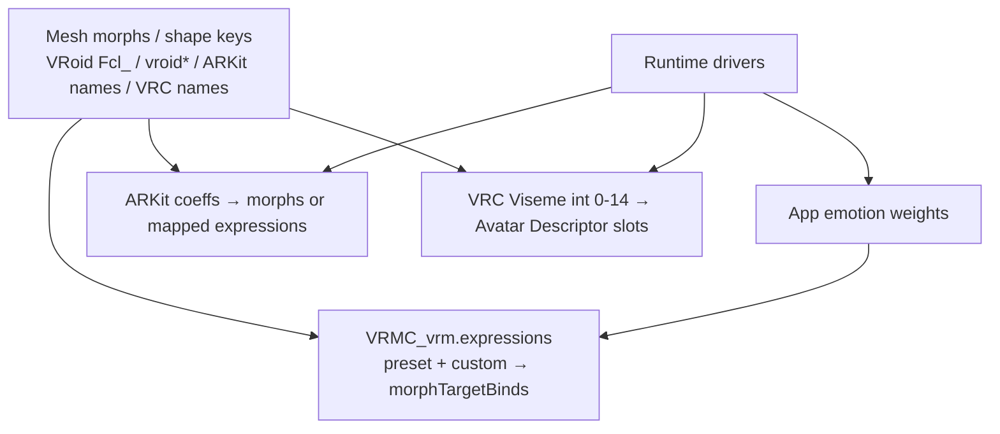

# Face / expression systems

Non-normative research note. Avatar pipelines that touch VRM, face tracking,
or VRChat usually hit three face-control systems:

| System | What it names | Typical driver |
|--------|---------------|----------------|
| VRM 1.0 expressions (`VRMC_vrm`) | Semantic presets + custom | App weights (emotion, lip sync, blink, look-at) |
| Apple ARKit blendshapes | 52 facial feature coeffs | Face tracking (Perfect Sync, Live Link, …) |
| VRChat visemes | 15 lip-sync mouth shapes | Mic → Oculus LipSync → `Viseme` int |

Mesh morph / shape-key **names** differ from VRM **expression** names. VRM
binds expressions to morph indices (and optional material / UV ops). ARKit and
VRC usually expect morphs whose names match their catalogs.

Stock VRM owns expressions. Extended VRM (`VRMXT_*`) leaves them alone today;
see [architecture](../architecture.md). This note is for converters and
authoring (including the planned VRMXT→VRChat path in [README](../README.md)).

## Sources

| Source | Role |
|--------|------|
| [`VRMC_vrm` expressions](https://github.com/vrm-c/vrm-specification/blob/master/specification/VRMC_vrm-1.0/expressions.md) | VRM 1.0 preset list, binds, overrides |
| [`VRMC_vrm` README](https://github.com/vrm-c/vrm-specification/blob/master/specification/VRMC_vrm-1.0/README.md) | Expression vs BlendShape rename; update order |
| [Apple `blendShapes`](https://developer.apple.com/documentation/arkit/arfaceanchor/blendshapes) | Coeff dictionary `0.0`–`1.0` |
| [Apple `BlendShapeLocation`](https://developer.apple.com/documentation/arkit/arfaceanchor/blendshapelocation) | Named facial feature ids |
| [ARKit blendshape visual ref](https://arkit-face-blendshapes.com/) | Per-name visual examples |
| [VRChat Visemes](https://wiki.vrchat.com/wiki/Visemes) | Avatar Descriptor slots; `Viseme` 0–14 |
| [Meta OVRLipSync viseme reference](https://developers.meta.com/horizon/documentation/unity/audio-ovrlipsync-viseme-reference/) | Phoneme groups; MPEG-4 lineage |

## Layering

One mesh can carry several naming catalogs at once. VRM metadata, face-track
tools, and the VRChat Avatar Descriptor each pick how those morphs get driven.

## VRM 1.0 expressions

Location: `extensions.VRMC_vrm.expressions`.

- `preset`: map of fixed keys (all optional).
- `custom`: map of author-chosen names.

Each expression object may include:

| Field | Role |
|-------|------|
| `morphTargetBinds` | Node + morph index + weight at expression weight `1.0` |
| `materialColorBinds` | Material color overrides |
| `textureTransformBinds` | UV transform overrides |
| `isBinary` | Weight `> 0.5` → `1.0`, else `0.0` |
| `overrideMouth` / `overrideBlink` / `overrideLookAt` | `none` \| `block` \| `blend` vs procedural mouth / blink / look-at |

Expression weight range is `[0, 1]`.

### Preset names

| Group | Preset keys |
|-------|-------------|
| Emotion | `happy`, `angry`, `sad`, `relaxed`, `surprised`, `neutral` |
| Mouth (AIEOU) | `aa`, `ih`, `ee`, `oh`, `ou` |
| Blink | `blink`, `blinkLeft`, `blinkRight` |
| Look | `lookUp`, `lookDown`, `lookLeft`, `lookRight` |

UniVRM `ExpressionPreset` matches this set (impl citation only; not normative
here).

### VRM 0.x notes

VRM 0.x called the same concept **BlendShape**. Common migration deltas:

| Topic | VRM 0.x | VRM 1.0 |
|-------|---------|---------|
| Naming | e.g. `joy` | `happy` |
| Morph weight in binds | often `0`–`100` | `0`–`1` |
| Spec term | BlendShape group / clip | Expression |

## ARKit blendshapes (52)

Apple face tracking exposes a dictionary of named coeffs on
`ARFaceAnchor.blendShapes`. Each key is an `ARFaceAnchor.BlendShapeLocation`;
each value is a float from `0.0` (neutral) to `1.0` (max).

Industry tools (Perfect Sync, Live Link Face, Beyond Expressions, …) use these
**camelCase** strings as morph / shape-key names.

### Eyes (14)

| Name |
|------|
| `eyeBlinkLeft`, `eyeBlinkRight` |
| `eyeLookDownLeft`, `eyeLookDownRight` |
| `eyeLookInLeft`, `eyeLookInRight` |
| `eyeLookOutLeft`, `eyeLookOutRight` |
| `eyeLookUpLeft`, `eyeLookUpRight` |
| `eyeSquintLeft`, `eyeSquintRight` |
| `eyeWideLeft`, `eyeWideRight` |

### Jaw (4)

| Name |
|------|
| `jawForward`, `jawLeft`, `jawRight`, `jawOpen` |

### Mouth (23)

| Name |
|------|
| `mouthClose`, `mouthFunnel`, `mouthPucker` |
| `mouthLeft`, `mouthRight` |
| `mouthSmileLeft`, `mouthSmileRight` |
| `mouthFrownLeft`, `mouthFrownRight` |
| `mouthDimpleLeft`, `mouthDimpleRight` |
| `mouthStretchLeft`, `mouthStretchRight` |
| `mouthRollLower`, `mouthRollUpper` |
| `mouthShrugLower`, `mouthShrugUpper` |
| `mouthPressLeft`, `mouthPressRight` |
| `mouthLowerDownLeft`, `mouthLowerDownRight` |
| `mouthUpperUpLeft`, `mouthUpperUpRight` |

### Brow, cheek, nose (10)

| Name |
|------|
| `browDownLeft`, `browDownRight` |
| `browInnerUp` |
| `browOuterUpLeft`, `browOuterUpRight` |
| `cheekPuff` |
| `cheekSquintLeft`, `cheekSquintRight` |
| `noseSneerLeft`, `noseSneerRight` |

### Tongue (1)

| Name |
|------|
| `tongueOut` |

ARKit has no AIEOU or Oculus viseme names. Apps that feed ARKit into VRM or
VRC define their own maps.

## VRChat visemes (15)

VRChat lip sync uses the **Oculus LipSync** 15-viseme set (MPEG-4 lineage). It
is not a VRC-invented phoneme catalog.

When Avatar Descriptor Lip Sync is **Viseme Blend Shape** or **Viseme Parameter
Only**, the built-in animator parameter `Viseme` is an **Int** `0`–`14`. Jaw
Bone Flap / Jaw Flap Blend Shape modes use volume-style `0`–`100` instead.

| Index | Name | Phonemes (approx.) |
|------:|------|--------------------|
| 0 | `sil` | silence |
| 1 | `pp` | p, b, m |
| 2 | `ff` | f, v |
| 3 | `th` | th |
| 4 | `dd` | t, d |
| 5 | `kk` | k, g |
| 6 | `ch` | ch, sh, j, … |
| 7 | `ss` | s, z |
| 8 | `nn` | n, l |
| 9 | `rr` | r |
| 10 | `aa` | ah / aw |
| 11 | `e` | eh |
| 12 | `i` | ih / ee |
| 13 | `o` | oh |
| 14 | `u` | ou |

Docs mix case (`PP` vs `pp`). Slot order on the Avatar Descriptor follows the
index table above.

## Cross maps

### VRM mouth presets ↔ VRC vowels

| VRM preset | VRC index | VRC name | Notes |
|------------|----------:|----------|-------|
| `aa` | 10 | `aa` | Same token |
| `ih` | 12 | `i` | Name differs |
| `ee` | 11 or 12 | `e` / `i` | App-defined; no single official pair |
| `oh` | 13 | `o` | Name differs |
| `ou` | 14 | `u` | Name differs |

### VRC consonants

`sil`, `pp`, `ff`, `th`, `dd`, `kk`, `ch`, `ss`, `nn`, `rr` have **no** VRM 1.0
preset keys. A converter must invent morphs, reuse custom expressions, or leave
slots empty.

### ARKit → VRM / VRC (approximate, app-defined)

There is no upstream 1:1 table. Common *illustrative* proxies only:

| Goal | ARKit coeffs often used | Caveat |
|------|-------------------------|--------|
| Open mouth / `aa`-like | `jawOpen`, sometimes `mouthClose` inverse | Not a vowel set |
| Rounded lips / `oh`/`ou`-like | `mouthFunnel`, `mouthPucker` | Overlaps consonants in VRC |
| Smile emotion | `mouthSmileLeft` + `mouthSmileRight` | Maps toward VRM `happy`, not visemes |
| Blink | `eyeBlinkLeft` / `eyeBlinkRight` | VRM has dedicated blink presets |

Treat any ARKit→VRM or ARKit→VRC matrix as product policy, not portable file
contract.

## Authoring notes

| Layer | Typical content |
|-------|-----------------|
| Mesh morph names | VRoid `Fcl_*` (often remapped to `vroid*`), ARKit camelCase, optional VRC-named keys |
| `VRMC_vrm.expressions` | Preset/custom rows bind **morph indices** (VRM 1.0), not display names |
| Face track | Drive ARKit-named morphs directly, or map coeffs into VRM expression weights |
| VRChat | Avatar Descriptor viseme slots point at morphs; separate from VRM expression JSON |

VRoid mouth keys such as `Fcl_MTH_A` are mesh assets. Export tools bind them
into VRM `aa` / `ih` / … (or leave custom). Renaming shape keys without
updating binds breaks expressions.

ARKit morphs and VRoid morphs often coexist on the same face mesh. Keep catalogs
distinct in naming so tools do not collide.

## Relation to Extended VRM

| Topic | Status |
|-------|--------|
| Stock expressions / look-at | Stay in `VRMC_vrm` ([architecture](../architecture.md), [animation controller decision](../decisions/animation-controller-standardization.md)) |
| `VRMXT_*` face / viseme extension | Not defined. Open question below. |
| VRMXT→VRChat converter | Planned product; consumes portable VRM + VRMXT; does not put VRC SDK types in the file schema ([README](../README.md)) |

## Open questions

| Question | Notes |
|----------|-------|
| Does Extended VRM need a face / viseme `VRMXT_*` extension? | TBD. Stock VRM already covers semantic expressions; ARKit/VRC are mesh + host concerns today. |
| Canonical ARKit→VRM / VRC maps for the converter? | TBD; product decision, not glTF schema. |
| Should custom VRM expressions encode VRC consonants? | TBD; possible without a new extension. |
