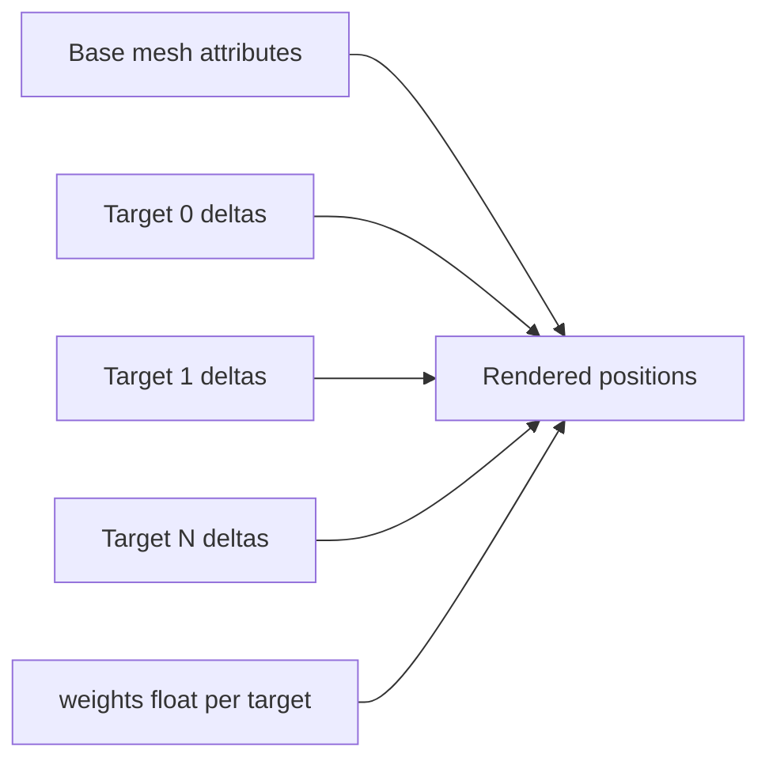

# glTF morph targets

Non-normative research note. Summarizes core glTF 2.0 morph targets (Blender
shape keys / Unity blend shapes), how they relate to weight animation, and
current support in Extended-VRM-Addon-for-Blender, Extended-UniVRM,
VRMXT-Extension-for-Blender, and UniVRMXT. Checked against those repos as of
2026-08-06.

**Finding:** Morph **geometry** is § Morph Targets (`primitives[].targets`,
optional default `mesh.weights` / `node.weights`). Multi-stop weight changes
over time are **not** morph-target schema — they are ordinary glTF
§ Animations (`channel.target.path` = `"weights"`). No FBX-style per-key
vertex rewrite. Stock VRM / UniVRM / Blender support static morphs and VRM
expression binds. Embedded `.vrm` weight clips are packaging of that animation
path; VRM10 import defaults off (`LoadAnimation: false`), Extended-UniVRM
opts in via Project Settings → VRM10 → **Import glTF animations**. Imported
clips are normal Unity `AnimationClip` / `blendShape.*` curves.

**Research disposition:** No further Extended VRM research into morph-weight
keyframes for now. Treat them as stock glTF animation + host importer
settings. This note keeps the morph model, the animation boundary, and
implementation gotchas for implementers.

Related: [Face / expression systems](face-expression-systems.md) (VRM presets
vs mesh morph names), [KHR / glTF overlap](khr-gltf-overlap.md) (animation
extensions).

## Sources

| Source | Role |
|--------|------|
| [glTF 2.0 Spec — Morph Targets](https://registry.khronos.org/glTF/specs/2.0/glTF-2.0.html#morph-targets) | Mesh `primitives[].targets`, default `weights` only (no keyframes) |
| [glTF 2.0 Spec — Animations](https://registry.khronos.org/glTF/specs/2.0/glTF-2.0.html#animations) | Time samples; `path: "weights"` for morph steps |
| [glTF 2.0 Reference Guide (PDF)](https://www.khronos.org/files/gltf20-reference-guide.pdf) | Compact morph + weight animation diagrams |
| [`VRMC_vrm` expressions](https://github.com/vrm-c/vrm-specification/blob/master/specification/VRMC_vrm-1.0/expressions.md) | Expression → morph index binds |
| [`VRMC_vrm_animation`](https://github.com/vrm-c/vrm-specification/tree/master/specification/VRMC_vrm_animation-1.0) | VRMA retarget; expression channels ≠ mesh `weights` |

## Spec boundary

| Spec section | Defines | Does not define |
|--------------|---------|-----------------|
| [Morph Targets](https://registry.khronos.org/glTF/specs/2.0/glTF-2.0.html#morph-targets) | Fixed delta poses; optional default weight vector | Timed steps / open-close curves |
| [Animations](https://registry.khronos.org/glTF/specs/2.0/glTF-2.0.html#animations) | Samplers + channels, including `path: "weights"` | New morph geometry |

Keyframe “steps” on a shape key = animation sample times + weight outputs, not
extra fields under `targets[]`.

## Model

- Each morph target stores **fixed** displacement accessors (`POSITION`,
  optional `NORMAL` / `TANGENT`) relative to the base mesh.
- Default contribution: `mesh.weights` or `node.weights` (missing → zeros).
- Names: common convention `mesh.extras.targetNames` (and sometimes
  `primitives[].extras.targetNames`). Not required by core glTF; UniVRM weight
  animation import expects them.

Final attribute ≈ base + Σ (weightᵢ × targetᵢ).

### Weight keyframes

One morph target has one weight scalar. That scalar may have many time samples.

| Concept | glTF meaning |
|---------|----------------|
| Shape key / blend shape | One entry in `primitives[].targets` |
| Keyframe | One time in an animation sampler `input` |
| Animated value | Full weight vector for **all** targets at that time (`path: "weights"`) |

Sampler output is interleaved: at each key time, a float array whose length
equals the morph count. Tools may author one curve per shape name; on disk the
channel still targets the whole weight vector.

Interpolation: `LINEAR`, `STEP`, or `CUBICSPLINE` (same as other glTF channels).

### Slider vs weight timeline

Easy to confuse in Blender and Unity:

| Control | What it does |
|---------|----------------|
| Shape key / blend shape **slider** (Blender value, Unity SMR weight 0–100) | Blends **one** fixed target pose toward Basis. 0 = rest, 1 (or 100) = full target. No multi-stop open/close inside one drag. |
| Weight **animation** (`path: "weights"` / Unity `AnimationClip`) | Changes that scalar **over time** (e.g. 0 → 1 → 0.3 → 0). Needs playback (timeline, Animator, Animation window). |

Dragging the inspector blend shape never walks clip keyframes. Importing a
weight clip does not auto-assign an Animator Controller; the sub-asset sits
on the `.vrm` until something plays it.

### What morph animation cannot do

A single target cannot change **which** vertices move, or by how much, at each
key. Example that needs **three targets** plus weight keys (not one evolving
delta mesh):

| Time | Desired geometry | Encode as |
|------|------------------|-----------|
| 0.5 | Vertex A up 1 | Target A-up weight → 1 |
| 0.75 | Vertices A,B down 1 | Target AB-down weight → 1 |
| 1.0 | Vertices A,B left | Target AB-left weight → 1 |

Core glTF 2.0 animates node TRS and morph **weights** only. Per-vertex
keyframe tracks (FBX-style “vertex A moves differently every key”) are out of
scope unless encoded as more morph targets or another mechanism (skinning,
custom extension).

## Layers next to VRM

| Layer | What it stores | Animation |
|-------|----------------|-----------|
| Mesh morph targets | Fixed deltas on primitives | glTF `weights` channels |
| `VRMC_vrm` expressions | Semantic presets/custom → `morphTargetBinds` (+ material/UV binds) | App / VRMA expression weights, not mesh `weights` |
| `.vrma` (`VRMC_vrm_animation`) | Humanoid + expression proxy mapping | Expression often as proxy node `translation`, remapped at load |

See [Face / expression systems](face-expression-systems.md). Expression weight
`1.0` scales bind weights onto morph indices; that is a different control path
from embedding a glTF `weights` animation on the mesh node.

## Packaging: `.vrm` weights vs separate glTF / Unity clips

After UniVRM / UniGLTF import, morph weight channels become Unity
`AnimationClip` assets with `blendShape.<name>` curves. Runtime playback is
the same whether the clip came from:

| Source | Role |
|--------|------|
| Embedded `animations[]` inside `.vrm` | One file ships mesh + morphs + weight clip. VRM10 import opt-in (Extended toggle). Handy for round-trip tests; not a special morph runtime. |
| Standalone `.gltf` / `.glb` | UniGLTF loads anim by default. Clear split from avatar packaging. |
| Hand-authored Unity `AnimationClip` | Typical game pipeline (Animator Controller, clip libraries, reuse across models). |
| `.vrma` (`VRMC_vrm_animation`) | Humanoid + expression proxies — **not** mesh `weights`. Different layer. |

**Benefit of embedding in `.vrm`:** packaging convenience (avatar + demo clip
together). **Not** a richer morph system than glTF weights elsewhere. Prefer
separate clips or VRMA for production motion; use embedded weights mainly for
authoring checks.

## Implementation status (2026-08-06)

Checked in-tree forks. VRMXT packages do not implement morph I/O; they leave it
to the host VRM/glTF stack.

| Capability | Extended-VRM-Addon-for-Blender | VRMXT-Extension-for-Blender | Extended-UniVRM (UniGLTF / VRM / VRM10) | UniVRMXT |
|------------|--------------------------------|-----------------------------|----------------------------------------|----------|
| Static morph targets (import + export) | Yes | No | Yes | No |
| VRM expression ↔ morph binds | Yes (0.x + 1.0) | No | Yes (0.x + 1.0) | No |
| Keyframed mesh `path: "weights"` **import** | Partial: stock Blender glTF importer; failed anim import may strip **all** `animations` | No | Partial: UniGLTF yes (`LoadAnimation` default true → `blendShape.*`, needs `targetNames`); VRM10 `.vrm` ScriptedImporter default off — Project Settings **Import glTF animations** (Extended-UniVRM) | No |
| Keyframed mesh `weights` **export** | Partial: VRM 1.0 only if **Export glTF Animations** on (default off); VRM 0.x custom exporter writes no `animations` | No | Partial: glTF export dialog yes (`EditorAnimationExporter`); typical `.vrm` / VRM10 avatar export passes no `IAnimationExporter` | No |
| VRMA expression animation | Yes: expression preview ↔ proxy `translation` | No | Yes: same pattern; not mesh `weights` | No |

### Extended-VRM-Addon-for-Blender notes

- Mesh shape keys come from Blender’s `import_scene.gltf` / `export_scene.gltf`.
- Addon writes VRM `morphTargetBinds` / 0.x blendShape binds and may set static
  `mesh.weights` from current key values on VRM 0.x export.
- Preference `export_gltf_animations` gates VRM 1.0 glTF animation passthrough.
  Addon docs prefer VRMA for avatar animation instead of embedding glTF clips
  in `.vrm`.
- Known export hazards: non-armature modifiers + shape keys; optional sparse
  accessors; optional drop of shape-key normals for MToon.

### Extended-UniVRM notes

- Import: morph deltas → Unity `AddBlendShapeFrame`; weight curves (when
  loaded) → `SkinnedMeshRenderer` `blendShape.<name>` (glTF `[0,1]` ↔ Unity
  `[0,100]`).
- **VRM10 `.vrm` import skips glTF animations by default.** Upstream
  `Vrm10Importer` default is `LoadAnimation: false`. Extended-UniVRM exposes
  Project Settings → VRM10 → **Import glTF animations**; when on, ScriptedImporter
  passes `ImporterContextSettings(loadAnimation: true, …)` and embeds clips
  (including morph `weights`). Static morph targets and `VRMC_vrm` expression
  binds still load either way. UniGLTF’s standalone glTF path still defaults
  `LoadAnimation` to true.
- Lab checks (2026-08-06, griddungeon `Core_03.vrm`):
  - **Default (Import glTF animations off):** file had
    `testUnityMouthU_weights` (Face `weights`, 0→1→0.3→0); after ScriptedImporter,
    `AnimationClip` sub-asset count **0**. Morph `testUnityMouthU` present;
    manual SMR weight drove the mesh. Animator controller null.
  - **Toggle on + reimport:** clip `testUnityMouthU_weights` (length 2s)
    appeared as a sub-asset. BakeMesh 0→100 on that blend shape moved 1429
    verts (max delta ~0.009 — easy to miss in Scene view). Still no autoplay
    without an Animator Controller or Animation component.
- Export settings: sparse morph accessors; VRM10 defaults
  `ExportOnlyBlendShapePosition = true`.
- Unity multi-frame blend shapes: export takes the **last** frame only;
  validator rejects multi-frame meshes for export.
- Morph tangents and some partial-primitive morph cases are limited or
  unimplemented in the mesh path.
- VRM10 `ReduceBlendshape` UI exists but is marked not implemented.

### VRMXT

[VRMXT-Extension-for-Blender](../implementations/blender-vrmxt.md) and
[UniVRMXT](../implementations/univrm-vrmxt.md) cover
`VRMXT_sprite_particle` and `VRMXT_materials_override` only. No morph / shape
key / `weights` animation code in those packages as of this check.

## Open questions

- Morph-weight **keyframe** research: **closed for now.** Use stock glTF
  animation; no Extended morph-animation extension planned from this note.
- Whether any future `VRMXT_*` deformation work (e.g. lattice) should interact
  with morph **geometry** / expression binds; today
  [VRMXT_lattice](../specs/extensions/deformation/vrmxt-lattice.md) is separate.
  Weight playback stays host animation.
- No decision here on shipping FBX-like per-key vertex animation; core glTF
  does not provide it.
