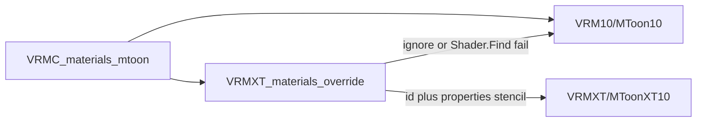

# MToon10 stencil shader fork

Non-normative research. Lives under `references/research/` only.

Portable stencil (and Face SDF) JSON now lives on
[`VRMC_materials_mtoonxt`](../../specs/extensions/materials/vrmc-materials-mtoonxt/README.md)
([stencil](../../specs/extensions/materials/vrmc-materials-mtoonxt/stencil.md)).
Do not attach MToonXT by pointing `VRMXT_materials_override` `shaderName` at
`VRMXT/MToonXT10`. This note still records Unity fork property names and ShaderLab
stencil wiring.

**Question:** how can a VRM 1.0 MToon material gain GPU stencil (mask write / test /
outline clip) while a stock UniVRM importer still shows ordinary MToon?

**Short finding:** stock MToon10 has no authorable `Stencil` block. Stencil only runs if
a supporting Unity consumer **ships a shader fork** that binds ShaderLab stencil to
material properties. File attach is existing `VRMXT_materials_override`:
`material.id` names the fork; `properties[]` holds Unity stencil ints. Ignore the
extension, or fail `Shader.Find`, and the material stays `VRM10/MToon10` (override
rules 11–12). Fallback is look. Stencil is gone on that path.

Checked against [VRMC_materials_mtoon 1.0](https://github.com/vrm-c/vrm-specification/blob/master/specification/VRMC_materials_mtoon-1.0/README.md),
UniVRM MToon10 ShaderLab (`Packages/VRM10/MToon10/Shaders/`), Unity ShaderLab Stencil
docs, and UniVRMXT override apply rules as of **2026-08-14**.

## Scope

| In | Out |
|----|-----|
| Unity MToon10 fork (Built-in + URP) with pass stencil | lilToon, Poiyomi, other megashaders |
| Override `shaderName` + `properties[]` targeting that fork | New `VRMXT_*` extension in this note |
| Stock ignore / missing-shader fallback to MToon look | Extending `VRMC_materials_mtoon` |
| Body + outline stencil property split | Shader source, UniVRMXT C#, Player packs |

## Stock MToon has no stencil

`VRMC_materials_mtoon` 1.0 defines shade, rim, matcap, inverse-hull outline, UV anim,
`transparentWithZWrite`, and `renderQueueOffsetNumber`. No stencil fields. GitHub search
on `vrm-c/vrm-specification` for `Stencil` returned no hits (2026-08-14).

UniVRM shaders `VRM10/MToon10` and `VRM10/Universal Render Pipeline/MToon10` expose
Unity pass state as `_M_CullMode`, `_M_SrcBlend`, `_M_DstBlend`, `_M_ZWrite`,
`_M_AlphaToMask`. Forward, outline, depth, and shadow passes have **no** `Stencil { }`
and **no** `_Stencil*` / `_M_Stencil*` properties.

Setting override `properties[]` named `_M_StencilRef` on stock `VRM10/MToon10` does
nothing. Unity will not stencil-test a pass that never declared a Stencil block.

URP MToon10 **does** write stencil on the `XRMotionVectors` pass only, hardcoded:

```
WriteMask 1
Ref 1
Comp Always
Pass Replace
```

Source:
[`vrmc_materials_mtoon_urp.shader`](https://github.com/vrm-c/UniVRM/blob/master/Packages/VRM10/MToon10/Shaders/vrmc_materials_mtoon_urp.shader)
(UniVRM `master` as of this note). That pass writes object-motion bits. A fork
that keeps it collides with avatar **bit 0 / ref 1**.

three-vrm `MToonMaterial` inherits Three.js `Material.stencilWrite`, `stencilRef`,
`stencilFunc`, and related fields. Those are runtime renderer state. They are not in
VRM JSON. three.js r163+ defaults `WebGLRenderer` stencil **off**. Out of scope for
this Unity fork.

MToon outline is an extra inverted-hull pass (`LightMode` `MToonOutline` on URP):
vertices expand along normals. Stencil on that pass is a mask so the hull skips
pixels the body already wrote.

## Options

Stock UniVRM always loads `VRMC_materials_mtoon` onto `VRM10/MToon10` (or the URP
name). Unknown `VRMXT_*` is ignored. Stencil draws only where the host ships a shader
with a Stencil block.

| | Attach | Fallback to stock MToon | Stencil in the file | Cost |
|---|---------|-------------------------|---------------------|------|
| **A (this note)** | `VRMXT_materials_override` `shaderName` → fork | Ignore extension, or missing fork (rules 11–12) | Unity ints in `properties[]` | No new glTF extension. Enums are Unity `CompareFunction` / `StencilOp` ints. Apply must `bindings` shade onto the fork |
| **B** | New sibling `VRMXT_*` stencil object on the material | Ignore unknown extension | Portable string enums (`comp`: `always`) | New spec. Later engines can share JSON. Still needs a shader that honors it |
| **C** | B for MToon stencil; override only when leaving MToon | Same as B for MToon+stencil | Two mechanisms | Extra surface for a MToon-only ship |
| **D** | Replace ShaderLab name `VRM10/MToon10` in supporting apps | Other apps keep UniVRM’s shader | No stencil in VRM unless A or B also exists | Two shaders cannot share one name in one Unity project. Round-trip drops stencil |

Reject extra keys inside `VRMC_materials_mtoon`: UniVRM export may drop unknowns;
upstream schema stays shade/outline/UV.

Reject option D as the file contract: supporting and stock UniVRM cannot both own
`VRM10/MToon10` in one project.

**File contract (2026-08-17):** option B shipped as
[`VRMC_materials_mtoonxt`](../../specs/extensions/materials/vrmc-materials-mtoonxt/README.md)
(`stencil` / `outlineStencil` string enums). Override `shaderName` → `VRMXT/MToonXT10` is
not the attach path. This note keeps Unity `_M_Stencil*` property names for the fork.



Editor import in UniVRMXT attaches override data and leaves stock MToon on the
renderer until Apply / Materialize. Until Apply, renderers keep `VRM10/MToon10`.

## Proposed fork contract

Look stays MToon10: same lighting, inverse-hull outline, UV anim, and UniVRM property
names used by override bindings (`_ShadeTex`, `_ShadingShiftFactor`,
`_ShadingToonyFactor`, `_GiEqualizationFactor`, and the rest of the MToon10 set).
Stencil is pass state only.

ShaderLab names follow UniVRMXT `VRMXT/…` and UniVRM’s pipeline split. Candidates
until a first shader lands:

| Pipeline | Stock | Proposed fork |
|----------|--------|----------------|
| Built-in | `VRM10/MToon10` | `VRMXT/MToonXT10` |
| URP | `VRM10/Universal Render Pipeline/MToon10` | `VRMXT/Universal Render Pipeline/MToonXT10` |

Render-state properties stay in UniVRM’s `_M_*` group (`_M_CullMode`, `_M_SrcBlend`,
`_M_ZWrite`). Do not copy third-party stencil names.

| Property | Role | Default |
|----------|------|---------|
| `_M_StencilRef` | Ref 0–255 | 0 |
| `_M_StencilReadMask` | 0–255 | 255 |
| `_M_StencilWriteMask` | 0–255 | 255 |
| `_M_StencilComp` | `UnityEngine.Rendering.CompareFunction` | Always (8) |
| `_M_StencilPass` | `UnityEngine.Rendering.StencilOp` | Keep (0) |
| `_M_StencilFail` | `StencilOp` | Keep (0) |
| `_M_StencilZFail` | `StencilOp` | Keep (0) |
| `_M_OutlineStencilRef` | Outline pass Ref | 0 |
| `_M_OutlineStencilReadMask` | Outline ReadMask | 255 |
| `_M_OutlineStencilWriteMask` | Outline WriteMask | 255 |
| `_M_OutlineStencilComp` | Outline Comp | Always (8) |
| `_M_OutlineStencilPass` | Outline Pass | Keep (0) |
| `_M_OutlineStencilFail` | Outline Fail | Keep (0) |
| `_M_OutlineStencilZFail` | Outline ZFail | Keep (0) |

Unity enum ints (non-normative; match `UnityEngine.Rendering` on 2021.3 / 2022.3):

| `CompareFunction` | Int | `StencilOp` | Int |
|-------------------|-----|-------------|-----|
| Disabled | 0 | Keep | 0 |
| Never | 1 | Zero | 1 |
| Less | 2 | Replace | 2 |
| Equal | 3 | IncrementSaturate | 3 |
| LessEqual | 4 | DecrementSaturate | 4 |
| Greater | 5 | Invert | 5 |
| NotEqual | 6 | IncrementWrap | 6 |
| GreaterEqual | 7 | DecrementWrap | 7 |
| Always | 8 | | |

Forward (and Built-in ForwardAdd if the fork keeps that pass):

```
Stencil
{
    Ref [_M_StencilRef]
    ReadMask [_M_StencilReadMask]
    WriteMask [_M_StencilWriteMask]
    Comp [_M_StencilComp]
    Pass [_M_StencilPass]
    Fail [_M_StencilFail]
    ZFail [_M_StencilZFail]
}
```

Outline pass uses `_M_OutlineStencil*`. UniVRM **0.131.2** forks:

- Built-in: ForwardAdd uses the same body stencil as ForwardBase. ShadowCaster has no
  Stencil block. Apply disables that pass on `inside` / `insideOverlay` readers so BIRP
  SSAO (`_CameraDepthTexture`) does not see the unclipped card.
- URP: UniversalForward uses body stencil; MToonOutline uses `_M_OutlineStencil*`.
  DepthOnly, DepthNormals, and ShadowCaster have no Stencil block. Apply disables those
  three on the same readers. The stock UniVRM
  `XRMotionVectors` pass (hardcoded `WriteMask 1` / `Ref 1`) is omitted.

Defaults Ref 0, Comp Always, Pass Keep match “stencil off” (buffer stays 0, no
replace).

## How `VRMXT_materials_override` targets the fork

No schema change. Unity slot `material.idType` is `shaderName`. `variant` is `builtin`
or `urp` per the [UniVRMXT profile](../../implementations/univrm-vrmxt.md#materials-override).

Non-normative Built-in example. Shade `bindings` copy sibling MToon onto the fork
(same target names as stock MToon10). Stencil is `properties` only; there is no
MToon `source` for stencil.

```json
{
  "engine": "unity",
  "material": {
    "idType": "shaderName",
    "id": "VRMXT/MToonXT10",
    "variant": "builtin"
  },
  "bindings": [
    {
      "source": "shadeColorFactor",
      "target": "_ShadeColor",
      "targetType": "vector"
    },
    {
      "source": "shadeMultiplyTexture",
      "target": "_ShadeTex",
      "targetType": "texture"
    },
    {
      "source": "shadingShiftFactor",
      "target": "_ShadingShiftFactor",
      "targetType": "scalar"
    },
    {
      "source": "shadingToonyFactor",
      "target": "_ShadingToonyFactor",
      "targetType": "scalar"
    }
  ],
  "properties": [
    { "name": "_M_StencilRef", "type": "scalar", "value": 1 },
    { "name": "_M_StencilComp", "type": "scalar", "value": 8 },
    { "name": "_M_StencilPass", "type": "scalar", "value": 2 }
  ]
}
```

URP sibling: `id` `VRMXT/Universal Render Pipeline/MToonXT10`, `variant` `urp`. Comp 8 =
Always, Pass 2 = Replace (write ref 1 where the body draws). Pair with a later hair
material: same ref, Comp NotEqual (6), Pass Keep (0). Exact recipe is authoring, not
schema.

Stencil is a **multi-material protocol**. One material’s properties do nothing useful
alone. Writer and reader must share `ref` and draw order. MToon
`renderQueueOffsetNumber` already offsets Unity queue for `alphaMode` BLEND. The fork
does not allocate stencil IDs across the file.

`extensionsRequired` MUST NOT list `VRMXT_materials_override` unless the file is
unusable without the fork (base-spec rule 9). Supporting Player / UniVRMXT MUST
**ship** the fork for Apply to honor `VRMXT/MToonXT10` (rules 27–28). Missing shader →
stock MToon for that material (rules 11–12).

## Ship home

Consumers: UniVRMXT UPM ships Built-in and URP forks under `Runtime/Shaders/MToonxt/`
(`Shader.Find`). Warudo UMods `mira.shaders.mtoonxt.birp` / `.urp` warm the same
ShaderLab names via `ModHost.Assets.Load`. Inspector GUI is UniVRMXT-only
(`MtoonxtInspector`). Not nested in VRMXT Plugin for Warudo. Not deprecated
`com.vrmxt.unity.shader-plugins`. See
[VRMC_materials_mtoonxt](../../specs/extensions/materials/vrmc-materials-mtoonxt/README.md).

## Open questions

- [x] Depth / shadow / DepthNormals stencil — no Stencil block; UniVRMXT disables those passes on `inside` / `insideOverlay` readers
- [x] UniVRM `XRMotionVectors` stencil write — omitted on the URP fork
- [x] Built-in ForwardAdd stencil (same as ForwardBase vs off) — same as ForwardBase
- [x] First pin of UniVRM MToon10 sources the fork copies — **0.131.2**
- [x] Whether Blender VRMXT authoring exposes `_M_Stencil*` as ints or named enums — named `op` (`write` / `inside` / `outside` / `same`); GPU ints stay a consumer mapping
- [x] Portable sibling stencil object — `VRMC_materials_mtoonxt` `stencil` /
      `outlineStencil` (option B). Override `shaderName` → fork is not the attach path.
- [ ] Catalog JSON for `VRMXT/MToonXT10` (first-party row; omit lil/Poiyomi)

## Related

- [VRMC_materials_mtoonxt](../../specs/extensions/materials/vrmc-materials-mtoonxt/README.md)
- [MToonXT stencil](../../specs/extensions/materials/vrmc-materials-mtoonxt/stencil.md)
- [VRMXT_materials_override](../../specs/extensions/materials/vrmxt-materials-override.md)
- [UniVRMXT materials override](../../implementations/univrm-vrmxt.md#materials-override)
- [VRMC_materials_mtoon 1.0](https://github.com/vrm-c/vrm-specification/blob/master/specification/VRMC_materials_mtoon-1.0/README.md)
- Unity ShaderLab: [Stencil](https://docs.unity3d.com/2021.3/Documentation/Manual/SL-Stencil.html)
- URP renderer stencil bits: [Universal Renderer](https://docs.unity3d.com/6000.0/Documentation/Manual/urp/urp-universal-renderer.html)
