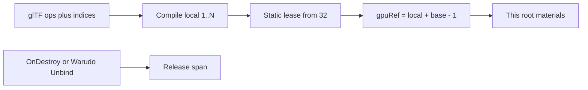

# Unity MToonXT stencil Ref offset

Non-normative. Unity 8-bit stencil occupancy for the GPU mapping on
[stencil](../../specs/extensions/materials/vrmc-materials-mtoonxt/stencil.md).
Not a glTF field. Files still MUST NOT serialize `ref` / `comp` / `pass`.

UniVRMXT (`com.vrmxt.univrmxt`) implements this at Apply as
`VrmcMaterialsMtoonxtStencilRefs` (2026-08-20). Warudo vendors the same type and
releases the lease on character unbind.

## Collision

Compile maps unique writer-index sets to file-local `Ref` 1, 2, … . Two loaded
avatars that each have one writer both stamp **1** into the **same** camera stencil
buffer. `inside` Equal on either avatar then matches the other avatar's coverage.

## Load-time lease

After compile, if any compiled stencil is enabled, `span` is that avatar's max
compiled `Ref`. First-fit from **32**. `gpuRef = local + base - 1`. Re-Apply on the
same Unity instance id replaces the lease. Destroy / Warudo `UnbindCharacter`
releases it. Disabled clip (`Always` + `Keep`) does not take a span.

If no range in 32–255 fits `span` without overlapping another lease or a skip
value, UniVRMXT keeps file-local 1..N.

`readMask` / `writeMask` stay 255. The allocator does not change them.

## Skip set

Hard skip, including a hole inside a candidate span (the whole span jumps past
it). Example: `span` 20 would cover 51 if started at 32, so the lease starts at
**52**.

Shipped shader **defaults**, not every tutorial Ref:

| Ref | Why |
|-----|-----|
| **0** | Unity stencil clear. lilToon `_StencilRef` default 0, `_StencilComp` Always (8), `_StencilPass` Keep (0) (`lts.shader`). Poiyomi Toon `_StencilRef` 0, `_StencilCompareFunction` Always (8). |
| **1** | UTS `_StencilNo` default 1 on StencilMask variants, e.g. [`ToonColor_DoubleShadeWithFeather_StencilMask.shader`](https://github.com/unity3d-jp/UnityChanToonShaderVer2_Project/blob/release/legacy/2.0/Assets/Toon/Shader/ToonColor_DoubleShadeWithFeather_StencilMask.shader). |
| **51** | Poiyomi Fake Shadow `_StencilRef` default 51 (`PoiyomiFakeShadow.shader`). |
| **255** | UTS manual: Stencil No is 0–255 and “in some cases 255 carries a special significance” ([UTS2 properties](https://github.com/unity3d-jp/UnityChanToonShaderVer2_Project/blob/release/legacy/2.0/Manual/UTS2_Props_en.md)). Easy to mix with mask 255. |

A custom visor that already uses Ref 40 still collides. The skip list is those
four numbers.

## Out of scope

Scanning other materials at runtime. Bit-packing Refs. Editor-only Hierarchy
helpers. VRChat upload C#. Serializing GPU `Ref` in the VRM.

## Related

- [Stencil](../../specs/extensions/materials/vrmc-materials-mtoonxt/stencil.md)
- [MToon10 stencil shader fork](mtoon10-stencil-shader-fork.md)
