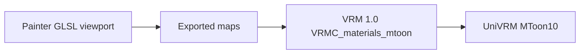

# Substance 3D Painter viewport for VRMC_materials_mtoon

Non-normative research. Lives under `references/research/` only. Does **not** add a
`VRMXT_*` extension, change
[`VRMXT_materials_override`](../../specs/extensions/materials/vrmxt-materials-override.md),
or add Substance 3D Painter to the
[VRMXT Editor](../../implementations/vrmxt-editor.md) host matrix.

**Question:** how can a VRM 1.0 author paint `VRMC_materials_mtoon` maps in Substance 3D
Painter under two-color toon lighting? Painter's default viewport is PBR.

**Short finding:** Painter custom shaders are GLSL fragment surface shaders
(`void shade(V2F inputs)`). There is no public MToon Painter shader. Closest community
work (NyanToon, 2026-07) implements lilToon 1st/2nd/3rd shadow. MToon interpolates one
shade color. A VRM-only viewport should port
[VRMC_materials_mtoon 1.0](https://github.com/vrm-c/vrm-specification/blob/master/specification/VRMC_materials_mtoon-1.0/README.md)
and UniVRM MToon10 HLSL. Vertex-expanded outlines and Unity additional lights have no
Painter equivalent. Export remains texture maps. Authors still check the result in
UniVRM or another stock VRM viewer.

Checked against public Adobe Shader API docs, the MToon 1.0 spec, UniVRM MToon10
sources, and NyanToon documentation as of **2026-08-12**.

## Scope

| In | Out |
|----|-----|
| Viewport preview of stock VRM 1.0 MToon while painting | lilToon, Poiyomi, NyanToon lighting model |
| Channel layout that packs into `VRMC_materials_mtoon` textures | Writing `VRMXT_*` from Painter |
| Uniform names matching VRMC field identifiers | Iray / MDL offline match |
| Documented Painter API limits | Claiming bit-identical Unity MToon10 |

Painter is a texture DCC. It does not import or export `.vrm`. Maps feed Blender /
UniVRM stock MToon I/O. Architecture: [Authoring](../../architecture.md#authoring).



## Sources

| Source | Role |
|--------|------|
| [VRMC_materials_mtoon 1.0](https://github.com/vrm-c/vrm-specification/blob/master/specification/VRMC_materials_mtoon-1.0/README.md) | Lighting, GI, rim, outline, UV anim, packed R/G/B mask note |
| UniVRM `Packages/VRM10/MToon10/Shaders/vrmc_materials_mtoon_lighting_mtoon.hlsl` | Production shade, GI, matcap UV, rim mix, outline mix |
| [Painter Shader API](https://adobedocs.github.io/painter-shader-api/api/) | `shade()`, channel tags, custom params, `toon.glsl` |
| [Official toon.glsl](https://experienceleague.adobe.com/en/docs/substance-3d-painter/using/scripting-and-development/shader-api-reference/shaders-shader-api/toon-shader-api) | Inner outline via N·V / curvature |
| [Adobe: no post-process outline](https://community.adobe.com/questions-59/rendering-toon-outline-with-post-process-or-glsl-628358) | Staff: no neighbor-depth / post-process outline |
| [NyanToon BOOTH](https://nyanneco9.booth.pm/items/8620876) / [manual](https://note.com/nyanneco/n/n5455f2ee139b) | lilToon Painter patterns (User0–7, inner pixel outline). Prior art only. |

## Painter shader surface

Drop a `.glsl` file into the shelf Shaders category. Entry point:

```glsl
void shade(V2F inputs);
```

Outputs used for MToon preview: `diffuseShadingOutput`, `emissiveColorOutput`,
`albedoOutput`, `alphaOutput`. Bind texture-set channels with
`//: param auto channel_*`. Expose VRMC knobs with `//: param custom` JSON.

Engine data that matters here: `channel_basecolor`, `channel_normal`,
`channel_emissive`, `channel_opacity`, `channel_user0`–`channel_user7`,
`texture_curvature`, `main_light`, environment via `lib-env.glsl`
(`envIrradiance`). Metallic and roughness stay unused; MToon lighting ignores them.

Iray uses a separate MDL material (`//: metadata { "mdl": ... }`). Skip MDL until
someone needs stills. This note covers the raster viewport.

Adobe `toon.glsl` quantizes N·L into four bands. Keep it as an inner-outline sample.
MToon interpolates two colors with `linearstep`.

## Feature vs Painter

| Feature | VRMC / UniVRM | Painter | Notes |
|---------|---------------|---------|-------|
| Lit / shade lerp | `lerp(shadeColor × shadeTex, baseColor, shading) × lightColor` | Full | Port spec `linearstep` |
| `shadingToonyFactor` / `shadingShiftFactor` | Uniforms + `shadingShiftTexture.r` × `scale` | Full | Match MToon10 including texture scale |
| Normal map | glTF `normalTexture` | Full | `channel_normal` + `lib-normal.glsl` |
| Emission | `emissiveFactor` × `emissiveTexture` | Full | `channel_emissive` |
| MatCap | View-space N → sphere UV; additive; not UV-animated | Full | Custom `sampler2D`, not a mesh UV channel |
| Parametric rim | `pow(sat(1 − N·V + lift), fresnel)` × color × `rimMultiplyTexture` | Full | Same formula as spec |
| GI equalization | `lerp(rawGi(N), uniformGi, giEqualizationFactor)` | Approx | `envIrradiance()` + up/down sample. Not Unity SH |
| Outline | Second pass, vertex expand (`worldCoordinates` / `screenCoordinates`) | Approx | Fragment-only inner N·V / curvature. No hull |
| UV animation | Scroll + rotate around (0.5, 0.5); seconds | Partial | No documented engine time uniform. Slider or skip |
| Alpha / ZWrite / queue | OPAQUE / MASK / BLEND + `transparentWithZWrite` + `renderQueueOffsetNumber` | Partial | Opacity + cutoff yes. Unity queue no |
| Additional lights | UniVRM forward additional-light pass | No | One `main_light` + env |
| Iray / MDL | n/a | Skip | Second renderer |

NyanToon already dropped lilToon multi-light specular and SDF face shadows because
Painter exposes one environment light. MToon additional-light contribution will also
be missing.

## Lighting to copy

From VRMC_materials_mtoon 1.0 (implementation example). UniVRM MToon10 is the working
reference, including forward-base attenuation.

```
shading = dot(N, L) + shadingShiftFactor
        + tex(shadingShiftTexture).r * scale
shading = linearstep(-1 + toony, 1 - toony, shading)
color   = lerp(shadeColor * shadeTex, baseColor, shading) * lightColor
color  += lerp(rawGi(N), uniformGi, giEqualization) * litColor
color  += emission + rim
```

MatCap UV (spec):

```
worldViewX = normalize(vec3(V.z, 0, -V.x))
worldViewY = cross(V, worldViewX)
matcapUv   = vec2(dot(worldViewX, N), dot(worldViewY, N)) * 0.495 + 0.5
```

Rim then multiplies `lerp(white, lighting, rimLightingMixFactor)`. Outline color
(when previewed) multiplies `lerp(white, litResult, outlineLightingMixFactor)` the
same way UniVRM's outline pass does.

## Recommended texture-set map

Pack the three linear masks the MToon spec already documents as one RGB User channel
so VRM export is one texture.

| Painter channel | API tag | VRMC field | Role |
|-----------------|---------|------------|------|
| Base Color | `channel_basecolor` | `baseColorTexture` × `baseColorFactor` | Lit color |
| Normal | `channel_normal` | `normalTexture` | N for shade, rim, matcap |
| Emissive | `channel_emissive` | `emissiveTexture` | Additive glow |
| Opacity | `channel_opacity` | baseColor.a / `alphaCutoff` | Cutout / blend preview |
| AO | `channel_ambientocclusion` | (not in MToon) | Optional; keep weak if used |
| Curvature | `texture_curvature` | outline approx only | Inner crease lines |
| User0 RGB | `channel_user0` | `shadeMultiplyTexture` | Painted shade color |
| User1 packed | `channel_user1` | R `shadingShiftTexture` · G `outlineWidthMultiplyTexture` · B `uvAnimationMaskTexture` | Spec packed-mask note |
| User2 RGB | `channel_user2` | `rimMultiplyTexture` | Rim / matcap mask |
| Shader texture | `param custom sampler2D` | `matcapTexture` | View-space; not painted on mesh UV |

Spec packed-mask note: `shadingShiftTexture` reads **R**, `outlineWidthMultiplyTexture`
reads **G**, `uvAnimationMaskTexture` reads **B**.

## Uniforms (match VRMC names)

| Uniform | Type | Spec default | Painter note |
|---------|------|--------------|--------------|
| `shadeColorFactor` | color | `[0, 0, 0]` | Multiplies User0. Preview default MAY be lighter than spec zero so an empty shade map is visible |
| `shadingToonyFactor` | float 0–1 | `0.9` | 1 = hard cel |
| `shadingShiftFactor` | float | `0.0` | Positive expands lit area |
| `giEqualizationFactor` | float 0–1 | `0.9` | Flatten env lighting |
| `matcapFactor` | color | `[1, 1, 1]` | Tint sphere map |
| `parametricRimColorFactor` | color | `[0, 0, 0]` | Off until set |
| `parametricRimFresnelPowerFactor` | float | `5.0` | Guard with epsilon |
| `parametricRimLiftFactor` | float | `0.0` | Widen rim |
| `rimLightingMixFactor` | float 0–1 | `1.0` | 0 = emissive rim |
| `outlineWidthFactor` | float | `0.0` | Preview pixels. Label as preview-only; Unity uses meters or screen-height ratio |
| `outlineColorFactor` | color | `[0, 0, 0]` | Mix with lighting |
| `outlineLightingMixFactor` | float 0–1 | `1.0` | Same as UniVRM outline pass |

## Prior art: NyanToon (lilToon)

NyanToon (nyanneco9, 2026-07-16, Painter latest / 9.x Steam zip) is a lilToon
viewport: 1st/2nd/3rd shadow, shadow border color, toon vs PBR reflection, User0–7
effect masks, pixel-width inner outline.

Reuse from NyanToon: shelf install, User-channel masks, and the inner-outline
approximation. Port VRMC `linearstep` for lighting. Forking NyanToon would bake
lilToon knobs that have no VRMC field.

## Suggested implementation order

Research recommendation. No shipping repo or `specVersion` is implied.

| Phase | Work | Exit |
|-------|------|------|
| 1 | Lit/shade `linearstep`, `shadeColorFactor`, toony, shift; Base Color, User0, User1.r, Normal; one `main_light` | Side-by-side vs UniVRM on a known VRM body (toony 0.9, shift 0, no rim) |
| 2 | MatCap `sampler2D`, parametric rim, User2, emission, GI equalization | Rim/matcap maps paint in the right places |
| 3 | Inner outline (N·V + curvature); width from User1.g; UI label that Unity uses vertex expand | Artists can mask outline width; no claim of world/screen meter match |
| 4 | Optional: JS plugin dumps uniforms + channel assignment for UniVRM / Blender | **TBD** schema |
| n/a | UV scroll | Only if a time source exists; else a static offset slider |

First file name: `mtoon.glsl` in a user shelf. No MDL metadata. No custom QML until
uniforms stabilize.

## Open questions

- [ ] Whether Painter exposes a frame time uniform (UV anim). Engine-params list as of
      2026-08-12 has `main_light`, camera matrices, env, no time tag.
- [ ] Where the `.glsl` lives (separate Painter shelf pack vs a specs `samples/` dump).
- [ ] Param-dump JSON for UniVRM / Blender (phase 4). No schema yet.
- [ ] Preview default for `shadeColorFactor` when User0 is empty (spec default is black).
- [ ] Whether AO should be wired at all (not an MToon field).

## Related

- [VRMC_materials_mtoon 1.0](https://github.com/vrm-c/vrm-specification/blob/master/specification/VRMC_materials_mtoon-1.0/README.md)
- [VRMXT_materials_override](../../specs/extensions/materials/vrmxt-materials-override.md) (sibling engine override; Painter does not author it)
- [Architecture → Authoring](../../architecture.md#authoring)
- [lilToon ↔ MToon conversion](../catalogs/unity-liltoon.md#liltoon--mtoon-conversion-upstream) (lilToon field map; NyanToon follows lilToon)
