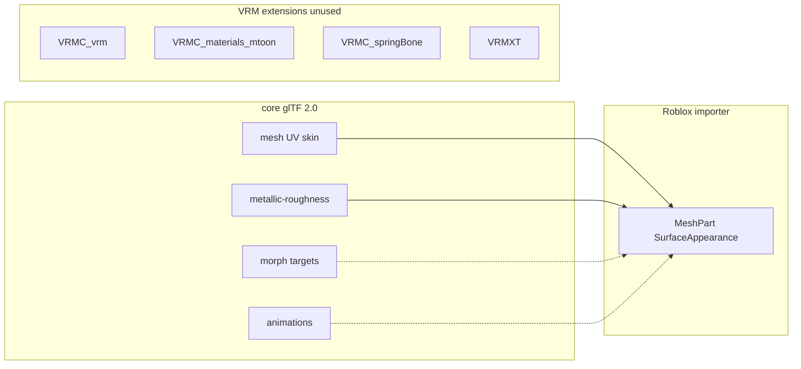

# VRM to Roblox (loss inventory)

Non-normative research. Lives under `references/research/` only. Does **not** add a
Roblox consumer, a `VRMXT_*` field, or a planned product row in [README](../../README.md).
No VRMXT→Roblox converter is in scope here.

**Question:** can a VRM 0.x / 1.0 (plus optional `VRMXT_*`) avatar become a Roblox
character, and what is discarded?

**Short finding:** Studio has no VRM loader and no author GPU shaders. The 3D Importer
takes `.fbx` / `.gltf` into `MeshPart` + `SurfaceAppearance` PBR. Those **types** are
core glTF (mesh, skin, PBR maps). A Marketplace **character body** is a second
contract: 15 named limb meshes, a named humanoid hierarchy, cages, `*_Att` points,
studs-scale, and Dynamic Head FACS. VRM does not ship that layout. `VRMC_*` /
`VRM 0.x` / `VRMXT_*` are unused. Roblox never executes them.

Checked against public Roblox Creator Hub docs and VRM 1.0 specs as of **2026-08-20**,
including
[Character body specifications](https://create.roblox.com/docs/avatar/character-bodies/specifications).
Studio APIs and Avatar Setup change; re-check importer rig options before relying on
a named setting.

## Sources

| Source | Role |
|--------|------|
| [PBR textures / `SurfaceAppearance`](https://create.roblox.com/docs/art/modeling/surface-appearance) | Color, normal, roughness, metalness, emissive maps; engine-owned shading |
| [Materials / `MaterialVariant`](https://create.roblox.com/docs/parts/materials) | “Custom material” = PBR texture variant on Roblox’s shader |
| [`SurfaceAppearance` class](https://create.roblox.com/docs/reference/engine/classes/SurfaceAppearance) | MeshPart PBR override; `EditableImage` still feeds that path |
| [3D Importer](https://create.roblox.com/docs/studio/importer) | `.fbx` / `.gltf` / `.obj`; PBR, skin, animation; Rig Type R15 / Custom / No Rig |
| [Character body specifications](https://create.roblox.com/docs/avatar/character-bodies/specifications) | 15 `_Geo` meshes, R15-style hierarchy, cages, attachments, tri caps, skinning (4 influences) |
| [Dynamic head specifications](https://create.roblox.com/docs/avatar/dynamic-heads/specifications) | Head cage landmarks; min 17 FACS poses for Marketplace chat |
| [Import character bodies](https://create.roblox.com/docs/art/characters/import) | Character import → `Model`; textures as `SurfaceAppearance` or `TextureID` |
| [Avatar Setup](https://create.roblox.com/docs/avatar-setup) | Marketplace components; `FaceControls`; optional extra joints |
| [Material graph feature request](https://devforum.roblox.com/t/material-graph-based-custom-shaders/236718) | No shipped author shader graph (thread still a request as of this note) |
| [`VRMC_vrm` 1.0](https://github.com/vrm-c/vrm-specification/blob/master/specification/VRMC_vrm-1.0/README.md) | Humanoid, meta, expressions, lookAt, firstPerson |
| [`VRMC_materials_mtoon` 1.0](https://github.com/vrm-c/vrm-specification/blob/master/specification/VRMC_materials_mtoon-1.0/README.md) | Toon material |
| [`VRMC_springBone` 1.0](https://github.com/vrm-c/vrm-specification/blob/master/specification/VRMC_springBone-1.0/README.md) | Secondary physics |
| [`VRMC_node_constraint` 1.0](https://github.com/vrm-c/vrm-specification/blob/master/specification/VRMC_node_constraint-1.0/README.md) | Aim / roll / rotation constraints |
| [glTF 2.0 specification](https://registry.khronos.org/glTF/specs/2.0/glTF-2.0.html) | Core mesh, skin, morph targets, PBR, animation |
| [Face / expression systems](../face-expression-systems.md) | VRM presets vs other face catalogs |
| [glTF morph targets](../gltf-morph-targets.md) | Morph geometry vs animation `weights` |

## Core glTF vs VRM vs Roblox

A `.vrm` is a glTF 2.0 / GLB with VRM extensions. Stock VRM 1.0 still carries core
`materials[]` (metallic-roughness, often plus `KHR_materials_unlit`) beside
`VRMC_materials_mtoon`. Ignorant loaders are supposed to render the core material.

Roblox’s importer is that kind of loader for geometry. It does not implement
`VRMC_*`.

| Layer | In the file | Roblox 3D Importer |
|-------|-------------|-------------------|
| Core glTF mesh, UV, vertex color | Yes | Used (limits and validation still apply) |
| Core glTF skin + inverse bind | Yes | Used if rig settings match |
| Core glTF metallic-roughness / emissive maps | Yes (VRM 1.0 fallback) | Maps onto `SurfaceAppearance` when present |
| Core glTF morph targets | Yes if authored | Partial: importer/Avatar Setup / `FaceControls`; names rarely match VRM |
| Core glTF `animations[]` | Sometimes | Possible clip import; VRM clip semantics gone |
| `VRMC_vrm` humanoid JSON | Yes | Unused. Joint **nodes** remain; names are VRM/VRoid, not `LowerTorso` / `HumanoidRootNode` |
| `VRMC_vrm` meta / license | Yes | Unused. Author license still binds outside the file |
| `VRMC_vrm` expressions / lookAt / firstPerson | Yes | Unused. Morph verts may remain |
| `VRMC_materials_mtoon` | Yes | Unused. Outline, rim, shadeToony, matcap, UV anim dropped |
| `VRMC_springBone` | Yes | Unused |
| `VRMC_node_constraint` | Yes | Unused |
| VRM 0.x `VRM` extension | If 0.x | Unused |
| `VRMXT_*` (materials override, sprite particle, lattice, MToonXT, …) | If authored | Unused |

**Types** Roblox can keep are already in base glTF. The **character-body layout** is
not. A typical VRM is a few skinned meshes (body, face, hair, clothes) on a VRM
humanoid. Marketplace bodies are 15 watertight `_Geo` meshes plus cages and
attachments. See [Character body contract](#character-body-contract-marketplace).

`KHR_materials_unlit` is an extension, not core. Roblox shading is still their PBR /
built-in `Material` list, not unlit-as-specified.

## Character body contract (Marketplace)

Source:
[Character body specifications](https://create.roblox.com/docs/avatar/character-bodies/specifications)
and
[Dynamic head specifications](https://create.roblox.com/docs/avatar/dynamic-heads/specifications)
(2026-08-20). This is the Roblox avatar product, not a generic mesh import.

Experience-only `Model` import can be looser. Selling or using Marketplace avatar
features (layered clothing, Dynamic Head chat) hits this list.

### Geometry

- **15 mesh objects**, named: `Head_Geo`, `UpperTorso_Geo`, `LowerTorso_Geo`,
  `LeftUpperArm_Geo`, `LeftLowerArm_Geo`, `LeftHand_Geo`, `RightUpperArm_Geo`,
  `RightLowerArm_Geo`, `RightHand_Geo`, `LeftUpperLeg_Geo`, `LeftLowerLeg_Geo`,
  `LeftFoot_Geo`, `RightUpperLeg_Geo`, `RightLowerLeg_Geo`, `RightFoot_Geo`.
- Watertight limbs (capped when split). No N-gons (quads preferred). Freeze TRS;
  pivots `0,0,0`.
- Face **+Z**, up **+Y**. Export I-pose, A-pose, or T-pose.
- Marketplace upload splits into 6 assets. Triangle caps: DynamicHead 4000; Torso
  1750; each arm/leg group 1248; **total 10,742**. A fused VRM body usually fails
  both the 15-way split and these caps until retopo.

Body scale on import: **Normal** (Rig Type Rthro), **Slender** (Rthro Narrow),
**Classic** (Default). Min/max bounding boxes are in **studs** (see the spec
tables). VRM is meters.

### Rigging and skinning

Standard hierarchy (docs): `Root` → `HumanoidRootNode` → `LowerTorso` →
`UpperTorso` → `Head`, plus limb chains from torso. `LowerTorso` and `Root` at
`0,0,0`.

Higher-fidelity: up to **37 extra** joints (clavicles, `UpperTorsoSpine`,
`HeadBase`, fingers `LeftHandThumb1`…, `LeftToeBase` / `RightToeBase`). After
import, Marketplace sale/anim needs `HumanoidRigDescription` and per-hand
`DigitsRigDescription` when those joints exist.

Skinning: **max 4** influences per vertex; **no** weights on `Root`.

VRM humanoid bones (`hips`, `spine`, `leftUpperArm`, VRoid extras, spring
chains) do not match this tree. Extra bones must merge, become accessories, or
drop.

### Attachments, cages, textures

Importer maps meshes named `*_Att` to `Attachment` (bodies with cage data).
Required set includes `FaceCenter_Att`, `Hat_Att`, `Hair_Att`, collars, waist,
grips, feet (full table in the spec).

**Outer cages** `LeftUpperArm_OuterCage` (and siblings) for layered clothing.
VRM has none. Avatar Setup can generate cages; templates exist. Accessories need
inner+outer cages; the body needs outer only.

Textures: Marketplace **2048×2048** max. Custom skin tone uses **alpha** on
exposed skin so users pick a color. Opaque baked MToon albedo blocks that.
Marketplace also wants `Material` Plastic, `Transparency` 0, `VertexColor` 1,1,1.

Hair, clothes, brow/lash as extra VRM meshes → rigid/layered **accessories**,
not extra body `_Geo` parts. Brows/lashes cannot upload standalone; bundle with
the body as `Accessory`.

### Dynamic Head / FACS

VRM morphs / `VRMC_vrm` expressions are not FACS. Marketplace heads need a head
**outer cage** (eye/mouth landmarks) and at least **17** FACS poses
(`LeftEyeClosed`, `JawDrop`, `Pucker`, …). Validation checks blink, jaw open,
happy, sad on cage landmarks. Avatar Setup can author FACS/cages; download as
`.gltf` for DCC edit.

`FaceControls` in Studio drives that mapping. VRoid `Fcl_*` / VRM presets need a
pose remap or a new FACS rig.

## Always discarded

- VRM container identity (`VRMC_vrm` / `VRM` 0.x, `specVersion`, thumbnail as VRM meta).
- MToon and every author shader: lilToon, Poiyomi, `VRMXT_materials_override` catalogs,
  `VRMC_materials_mtoonxt` (stencil, Face SDF, experimental zTest/zWrite).
- LookAt, firstPerson mesh annotations, VRM expression **graph** (preset combine,
  binary, overrideMouth).
- SpringBone joints/colliders, node constraints.
- `VRMXT_sprite_particle`, `VRMXT_lattice`, animation-controller extensions.

## Partial (rebuild in Roblox)

| Source | Typical leftover |
|--------|------------------|
| Skinned meshes | Split/cap into 15 `_Geo` `MeshPart`s; tri caps if Marketplace |
| Humanoid bones | Rename to `HumanoidRootNode` / `LowerTorso` / …; drop or accessory extra bones |
| Morph targets | `FaceControls` / Dynamic Head FACS if remapped; VRoid `Fcl_*` is not FACS |
| Albedo / normal | `SurfaceAppearance` ColorMap / NormalMap |
| Packed ORM / MToon shade tex | Split or bake into roughness / metalness / color |
| Extra clothing meshes | Accessories or layered clothing cages; else fuse |
| FBX/glTF animation | Roblox clips after retarget |

## Shaders

Roblox does not accept uploaded HLSL / ShaderLab / GLSL for experiences.

“Custom material” in Creator Hub means `MaterialVariant`: tileable PBR maps on the
engine shader. `SurfaceAppearance` is the per-mesh version. Base `Material` enum
values (Plastic, Neon, Glass, ForceField, …) are other engine shaders. Post effects
(`Bloom`, `ColorCorrection`, `Highlight`, …) are scene instances.

There is no public material graph. Luau/`EditableImage` can change **pixels**, not
the lighting model.

Implication for VRM: outline, rim, toon ramp, matcap-as-shader, stencil clip cannot
port. Practical fakes: bake lighting into ColorMap; extra mesh for outline (costly,
usually poor).

## Practical pipeline (non-normative)

VRM → Blender or Unity → split/cap 15 `_Geo` meshes → remap to the documented
humanoid tree → cages + `*_Att` (or Avatar Setup) → bake or flatten maps →
meters to studs → export FBX or glTF → Studio 3D Importer → Avatar Setup /
FACS if Marketplace.

That is the same class of work as any glTF humanoid → Roblox. VRM adds the cut list
above and the usual VRoid extra bones.

## License

VRM meta usage flags are stripped. They do not grant Roblox redistribution. Check
the author’s VRM license before shipping a converted avatar.

## Related

- [Face / expression systems](../face-expression-systems.md)
- [glTF morph targets](../gltf-morph-targets.md)
- [Spring bone / secondary physics](../spring-bone-physics-systems.md)
- [Engine material override glTF history](engine-material-override-gltf-history.md)
- [Architecture](../../architecture.md) (converters vs in-file schema)
