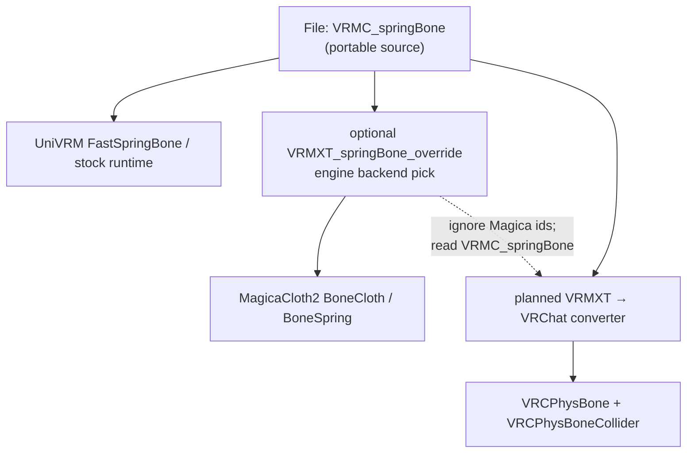

# Spring bone / secondary physics systems

Non-normative research note. Avatar pipelines that touch VRM secondary motion,
Unity cloth solvers, or VRChat usually hit three bone-chain systems (plus
VRChat's retired Dynamic Bones path):

| System | What it drives | Typical host |
|--------|----------------|--------------|
| VRM 1.0 spring bone (`VRMC_springBone`) | Joint chains on nodes; portable in `.vrm` | UniVRM, three-vrm, Blender VRM, VRM4U, … |
| MagicaCloth2 | BoneCloth / BoneSpring / MeshCloth Unity components | Unity apps outside VRChat (Warudo, VMC, custom players) |
| VRChat PhysBones (`VRCPhysBone`) | Avatar / world secondary motion + grab / pose | VRChat client + Avatar SDK |
| Dynamic Bones (legacy) | Older Unity secondary bones | Auto-converted to PhysBones on VRC avatars |

Solvers differ. Parameter names that look related are **not** interchangeable.
Numeric conversion formulas stay product policy until specified and tested.

Stock VRM owns portable spring data. Extended VRM
[`VRMXT_springBone_override`](../specs/extensions/physics/vrmxt-spring-bone-override.md)
only selects an optional engine backend (first target: MagicaCloth2). It does
**not** put Magica or VRC SDK types in the file schema. The planned
VRMXT→VRChat converter ([README](../README.md)) is the expected place for
`VRMC_springBone` → PhysBones emission.

## Sources

| Source | Role |
|--------|------|
| [`VRMC_springBone` 1.0](https://github.com/vrm-c/vrm-specification/tree/master/specification/VRMC_springBone-1.0) | Portable springs, joints, colliders, collider groups |
| [MagicaCloth2 cloth types](https://magicasoft.jp/en/mc2_magicacloth_basic/) | BoneCloth / MeshCloth / BoneSpring roles |
| [MagicaCloth2 BoneCloth start](https://magicasoft.jp/en/bonecloth-start-2/) | Transform cloth setup + Magica colliders |
| [MagicaCloth2 BoneSpring guide](https://magicasoft.jp/en/mc2_bonespring_startguide/) | Translation spring; collision registration rules |
| [MagicaCloth2 MeshCloth start](https://magicasoft.jp/en/magicaclothmeshclothstart-2/) | Vertex cloth (no VRM spring equivalent) |
| [MagicaCloth2 runtime construction](https://magicasoft.jp/en/mc2_runtime_build/) | Build components at runtime |
| [MagicaCloth2 collision setup](https://magicasoft.jp/en/mc2_collision_setup/) | Sphere / capsule / plane; backstop / self / mutual |
| [VRChat PhysBones](https://creators.vrchat.com/common-components/physbones/) | `VRCPhysBone`, colliders, versions, grab / pose |
| [VRChat PhysBones wiki](https://wiki.vrchat.com/wiki/Physbones) | Parameter summary; performance categories |
| [VRChat Avatar Components](https://creators.vrchat.com/avatars/avatar-components/) | PhysBones among Avatar Dynamics |

Community converters (research only; not normative):

| Tool | Direction |
|------|-----------|
| [Snow1226/PhysicsConverter](https://github.com/Snow1226/PhysicsConverter) | PhysBones → MagicaCloth2 (VMC export path) |
| Lilium / similar transfer packages | PhysBones → VRM SpringBone for non-VRC hosts |

## Layering

Portable truth stays in `VRMC_springBone`. Magica override is a Unity consumer
choice. PhysBones are a **host SDK** target for the converter, not a glTF
extension.

## VRMC_springBone (portable)

Location: root `extensions.VRMC_springBone`.

| Block | Role |
|-------|------|
| `colliders[]` | Sphere or capsule (incl. inside variants per spec) on nodes |
| `colliderGroups[]` | Named groups of collider indices |
| `springs[]` | Named chains: `joints[]`, optional `colliderGroups`, optional `center` |

Per-joint fields (conceptually): `node`, `stiffness`, `gravityPower`,
`gravityDir`, `dragForce`, `hitRadius`, plus optional joint-limit extension
data where present.

Runtime behavior is host-owned (UniVRM FastSpringBone, three-vrm spring bone,
etc.). Extended override MAY replace that backend for listed springs only.

## MagicaCloth2

One `MagicaCloth` component; inspector changes with **ClothType**:

| ClothType | Drives | Closest VRM / VRC analogy |
|-----------|--------|---------------------------|
| `BoneCloth` | Transform chain cloth | VRM spring chains; PhysBone hair / skirt / accessory chains |
| `BoneSpring` | Transform spring (translation-style) | Soft local jiggle (chest); **not** inferred from VRM alone |
| `MeshCloth` | Mesh vertices | No `VRMC_springBone` equivalent; skirt cloth without bones |

Magica colliders (`MagicaSphereCollider`, `MagicaCapsuleCollider`,
`MagicaPlaneCollider`) are **not** Unity physics colliders. Register them on
each cloth team. BoneSpring needs explicit **Collision Bones** registration;
collision is off for transforms by default.

Features Magica has that VRM springs do not: MeshCloth, backstop, self /
mutual collision, rich constraint sets, paint / vertex attribute workflows.

Features VRM / PhysBones may have that Magica maps poorly: PhysBone Hinge /
Polar limits (PhysicsConverter notes Magica lacks those limit types; skirt
penetration behavior changes).

## VRChat PhysBones

SDK components (avatars and worlds):

| Component | Role |
|-----------|------|
| `VRCPhysBone` | Chain from `Root Transform`; forces, limits, collision, stretch / squish, grab / pose |
| `VRCPhysBoneCollider` | Sphere / capsule / plane; optional `Inside Bounds`; optional global collision |
| `VRCPhysBoneRoot` | World-only timing / movement root |

### Versions

| Version | Notes |
|---------|-------|
| 1.0 | Base PhysBone; still supported / feature-locked for new breaking features |
| 1.1 | Squishy bones; **Gravity** and **Stiffness** reinterpreted as ratios; Stretch Motion |

Do not assume 1.0 and 1.1 numeric values mean the same thing.

### Forces (high level)

| Integration | Force knobs |
|-------------|-------------|
| Simplified | Pull, Spring, Gravity, Gravity Falloff, Immobile, … |
| Advanced | Pull, Momentum, Stiffness, Gravity, Gravity Falloff, Immobile, … |

Most force fields support **curves** along the chain. VRM joints are per-node
scalars, not curve assets.

### Limits

`None` / `Angle` (cone) / `Hinge` / `Polar`. Prefer limits over colliders for
cheap anti-clip (VRC docs). Polar has a non-trivial cost at high counts.

### Collision, stretch, interaction

- Per-chain `Radius` (meters) for collision **and** grabbing.
- Explicit collider list + `Allow Collision` filters (incl. other players'
  hand / finger global colliders via Avatar Descriptor standard colliders).
- Stretch / Squish (1.1): `Max Stretch`, `Max Squish`, `Stretch Motion`.
- Grab / Pose + optional Animator params (`{prefix}_IsGrabbed`, `_IsPosed`,
  `_Angle`, `_Stretch`, `_Squish`). No VRM / Magica portable equivalent.
- Do **not** put PhysBone roots on humanoid bones (Hips, Spine, Head, limbs);
  duplicate roots in DCC first.
- Quest / performance ranks cap components, affected transforms, colliders,
  and collision-check counts.

### Legacy Dynamic Bones

Avatar Dynamic Bones are removed / auto-converted to PhysBones at load.
Conversion is best-effort, not identity. New VRC avatars should author
PhysBones directly.

## Concept map (related ≠ equal)

| Concept | VRMC_springBone | MagicaCloth2 | VRC PhysBones |
|---------|-----------------|--------------|---------------|
| Chain definition | `springs[].joints[].node` | Root / bone list + attributes | `Root Transform` + hierarchy; Ignore Transforms |
| Multi-chain under one root | Separate springs or shared parent | Multiple roots / connection mode | `Multi-Child Type` Ignore / First / Average |
| Return / restore | `stiffness` | Angle-restoration / spring params | Pull (+ Stiffness Advanced / Spring Simplified) |
| Oscillation / lag | (solver-internal) | Cloth / spring damping family | Spring (Simplified) / Momentum (Advanced) |
| Damping | `dragForce` | Damping / air resistance family | Immobile (+ integration damping) |
| Gravity | `gravityPower`, `gravityDir` | Gravity (BoneSpring auto-disables) | Gravity (+ Gravity Falloff); 1.1 = ratio |
| Hit / particle radius | `hitRadius` | Particle radius / collision radius | Collision `Radius` |
| Angle limits | Joint limit extension (where present) | Angle limit constraints | Limit Type Angle / Hinge / Polar |
| Inertia / reference | `center` | Inertia / blend options | Immobile Type (All Motion / World) |
| Colliders | Sphere / capsule (+ inside) groups | Magica sphere / capsule / plane | Sphere / capsule / plane; Inside Bounds |
| Soft length change | — | Limited / type-dependent | Stretch & Squish (1.1) |
| Player grab / pose | — | — | First-class; avatar permissions |
| Mesh vertex cloth | — | MeshCloth | Docs: PhysBones as interim cloth stand-in |

## Collider shape map

| Shape | VRM | Magica | VRC |
|-------|-----|--------|-----|
| Sphere | yes | MagicaSphereCollider | Shape Type Sphere |
| Capsule | yes | MagicaCapsuleCollider | Shape Type Capsule |
| Plane | no (stock) | MagicaPlaneCollider | Shape Type Plane |
| Inside / contain | yes (inside variants) | limited / different | `Inside Bounds` |
| Global / other-player | no | AvatarParts merge options | Global Collision + standard hand/finger colliders |

PhysicsConverter drops PhysBone Inside Bound colliders when targeting Magica
(no equivalent). Treat inside / plane handling as converter TBD for
VRM ↔ Magica ↔ VRC alike.

## Suggested conversion intents

Non-normative product guidance for tools (not schema):

| Intent | Source | Target | Notes |
|--------|--------|--------|-------|
| Magica preview / VTubing | `VRMC_springBone` (+ optional override) | BoneCloth default; BoneSpring only if marked | Matches `VRMXT_springBone_override` Magica profile |
| VRC upload | `VRMC_springBone` | One or more `VRCPhysBone` + colliders | Drop Magica-only modes; invent Pull/Spring curves; no grab unless product adds it |
| VRC → portable | PhysBones | `VRMC_springBone` | Lossy: drop grab/pose params, stretch/squish, Polar/Hinge as needed |
| VRC → Magica | PhysBones | BoneCloth / BoneSpring | Existing community tools; tune after convert |

Never claim physical equivalence without documented numeric curves and golden
tests.

## Relation to Extended VRM

| Topic | Status |
|-------|--------|
| Portable springs | Stay in `VRMC_springBone` |
| `VRMXT_springBone_override` | Optional Unity Magica (and future engine) backend select; fallback to stock VRM |
| Magica / VRC types in `.vrm` | **Out of scope** for schema; converter / runtime only |
| VRMXT→VRChat converter | Planned; emit PhysBones from portable springs (+ ignore or strip Magica override ids) |

## Open questions

| Question | Notes |
|----------|-------|
| Canonical VRM ↔ PhysBone numeric curves? | TBD; product / converter; version 1.0 vs 1.1 Gravity/Stiffness |
| One VRM spring → one PhysBone, or multi-child collapse? | TBD; Multi-Child Type policy |
| BoneSpring / chest authoring in file? | Today: Magica `mode` on override only; no PhysBone stretch/squish encoding |
| Plane / inside collider round-trip? | TBD across all three systems |
| Should converter preserve grab/pose defaults? | Product UX; not portable |
| MeshCloth / true cloth in VRMXT? | Out of spring-bone override scope; separate capability if ever |
