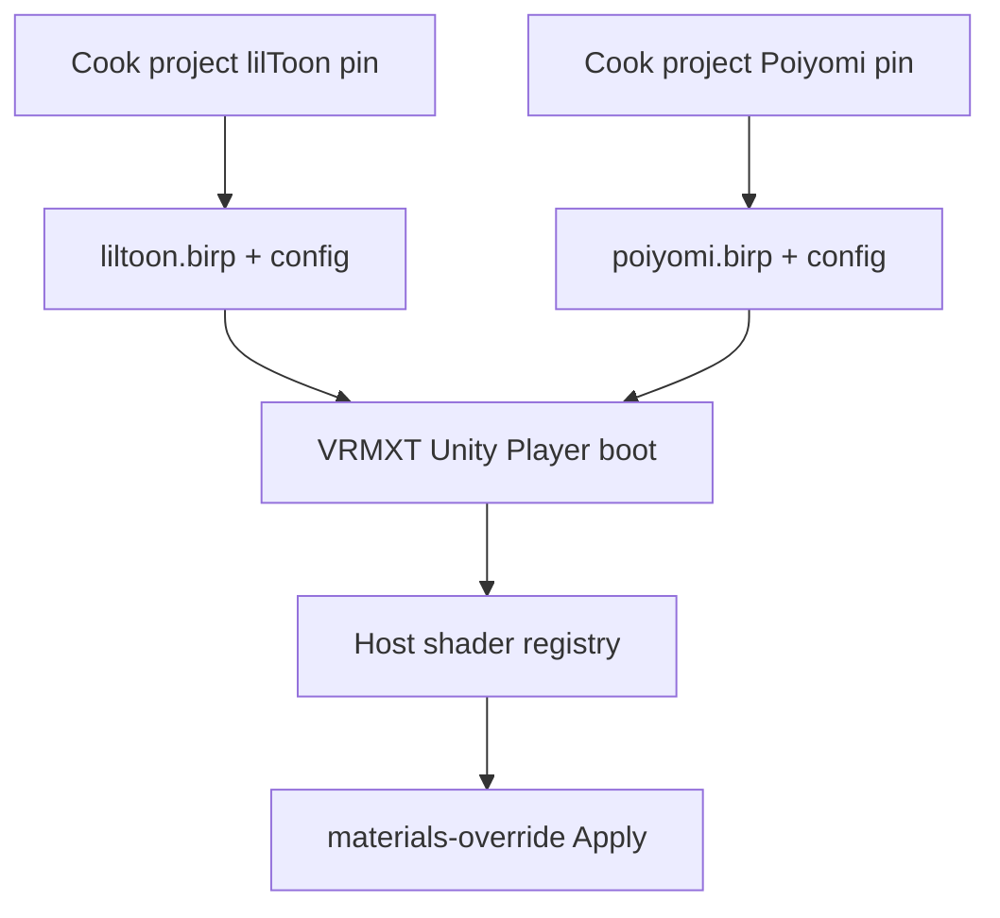

# VRMXT Player Shader AssetBundles

Non-normative research note: ship lilToon and Poiyomi for
[VRMXT Unity Player](../implementations/vrmxt-unity-player.md) as **runtime
AssetBundles**, so the desktop app build does not cook those megashader trees.

Supported ShaderLab names and warm assets come from **in-pack config** (JSON,
ScriptableObject, or equivalent), read at boot after `AssetBundle.LoadFromFile`.
That config is the Player ship surface. It replaces hardcoded C# claim lists in
`com.miramocha.vrmxt.unity.shader-plugins` (deprecated transitional package;
[VRMXT Unity Shader Plugins](../implementations/vrmxt-unity-shader-plugins.md)).

Warudo keeps UMod + `ModHost.Assets.Load` and does not consume shader-plugins
([Warudo-Shader-Plugins#7](https://github.com/miramocha/Warudo-Shader-Plugins/issues/7)
won’t-do). See [Warudo Material Warm-Up](warudo-material-warmup.md).

## Goal

Move lilToon / Poiyomi ShaderLab cook out of the Player Standalone build. Player
loads two packs at boot (same split as Warudo’s two shader UMods). Apply behavior:
missing or unresolved name → stock VRM material; no network shader fetch.

## Current vs proposed

| | Today (Player) | Proposed |
|--|----------------|----------|
| Vendor trees | UPM `jp.lilxyzw.liltoon`, `com.poiyomi.toon` in Player `Packages/manifest.json` | Cooked into AssetBundles; **not** release deps of the app project |
| Ship surface | C# inventory in shader-plugins | In-pack config lists load / warm / Apply names |
| Layer A | `Resources.LoadAll` under `PlayerShaderWarm` → registry | Load shaders / mats named in pack config → host registry |
| Layer B | SVC in Resources + `PoiyomiBirpWarm` | SVC asset inside Poiyomi pack; prefer baked `WarmUp` (Blit / `SetPass` only if still needed) |
| Resolve | `ClaimedShaderResolver` (registry, then `Shader.Find`) | Registry first; do not rely on `Shader.Find` for pack shaders |

Operational today: Player repo `Assets/VRMXTPlayer/SHADERS.md`,
`ResourcesBirpShaderWarmHost`, `ClaimedShaderResolver` (interim).

## Architecture

Host binds UniVRMXT `ShaderResolveProvider` to the registry after load.

## Pack contract

### Layout

Suggested paths under the Standalone data `StreamingAssets` folder
(`*_Data/StreamingAssets/…` on Windows builds):

| Pack | Path relative to `StreamingAssets` |
|------|-------------------------------------|
| lilToon | `ShaderMods/liltoon.birp` |
| Poiyomi | `ShaderMods/poiyomi.birp` |

Extension `.birp` is a product label (Built-in RP). Unity still treats the file as
an AssetBundle (`AssetBundle.LoadFromFile`).

### Build pin

| Item | Value |
|------|-------|
| Unity | `2021.3.45f2` (same as Player / Warudo) |
| Platform | Standalone (desktop) |
| Pipeline | Built-in (BIRP) |
| lilToon source pin | **1.10.3** |
| Poiyomi source pin | **9.3.64** |

Packs are Unity-version and platform sticky. Bump Player Unity → re-export packs.

### Content policy

Put **full official-sourced** vendor trees into each pack (git/UPM pin above).
Runtime config chooses what to load. lil / Poiyomi do not publish official
AssetBundles; cook projects export them.

| Pack | Include | Typical config omit |
|------|---------|---------------------|
| `liltoon.birp` | lil ShaderLab + includes; warm mats | Poiyomi |
| `poiyomi.birp` | Poiyomi Toon tree + includes; warm mats; `ShaderVariantCollection`; textures for alts you load (e.g. Lil Fur) | World / Pro World / Two Pass from load + warm (may still sit on disk unused) |

Player load config for Two Pass need not match the Warudo Toon UMod ship set: Warudo
may still ModHost-load Two Pass alts. See
[Warudo Poiyomi Exclusions](warudo-poiyomi-exclusions.md) and
[Warudo Poiyomi BIRP Variants](warudo-poiyomi-birp-variants.md).

### In-pack config

Each pack (or a small sidecar cooked into the same bundle) should describe at least:

- ShaderLab names (or cooked asset ids) to `LoadAsset` for Apply
- Warm materials / Layer A keep-alive assets
- Optional Layer B: `ShaderVariantCollection` asset path; keyword / pass hints only if
  bake is incomplete

Cook should generate or validate this config so it stays in sync with what the pack
contains. Prefer generating the list at cook time over hand-maintaining a second
manifest in Player C#.

### Not in either pack

| Piece | Where it lives |
|-------|----------------|
| UniVRMXT / Apply / VFX particle mat | Player UPM deps / first-party app assets |
| Host registry + `ShaderResolveProvider` bind | Player app code |
| Test override `VRMXT/Samples/TestOverrideBuiltin` | Player app assets (tiny) |
| Player scenes, UI, exe | Main Player build |
| Interim inventory / warm C# | Deprecated `shader-plugins` until packs ship |

## Load and warm contract

### Boot

1. Discover packs under `StreamingAssets/ShaderMods/` (or configured dir).
2. Load `liltoon.birp` if present.
3. Load `poiyomi.birp` if present.
4. Read each pack’s config.
5. For each listed ShaderLab name (and warm-mat / SVC assets), `LoadAsset` /
   `LoadAssetAsync` by cooked AssetBundle asset name (or a documented address map).
   Avoid `LoadAllAssets` on the whole Poiyomi tree.
6. Register loaded `Shader` instances in the host registry; keep material refs alive
   for Layer A.
7. If Poiyomi pack loaded and config points at an SVC: `ShaderVariantCollection.WarmUp`
   (plus Blit / `SetPass` only if still required).
8. Install `ShaderResolveProvider` from the registry.

Missing pack → that family absent at runtime → Apply falls through to stock for those
names. Config membership alone does not create a Shader.

### Resolve

Same discipline as Warudo ModHost shaders: name → registry map. `Shader.Find` may
return null for assets that only exist inside a loaded bundle.

## Size reality

Measured against Player `Library/PackageCache` and upstream release assets
(pin **9.3.64** / lil **1.10.3**):

| Source | Approx size | Notes |
|--------|-------------|-------|
| Poiyomi `com.poiyomi.toon-9.3.64.zip` (GitHub release) | ~69 MB (70,388 KB) | Upstream release asset listing |
| Poiyomi `.unitypackage` (same release) | ~74 MB | Upstream release asset listing |
| Poiyomi PackageCache tree (expanded) | ~168 MB | Local Player `Library/PackageCache` measure (2026-07-29) |
| lilToon PackageCache tree | ~6 MB | Same local measure |

AssetBundle ship size is not identical to PackageCache; expect **tens of MB** for a
full Poiyomi pack, small for lil. Selective load saves RAM, not ship size, unless
cook strips unused textures / alts.

## Warudo comparison

| | Warudo shader mods | Player (this note) |
|--|--------------------|--------------------|
| Pack format | UMod (assets bundled inside the mod package) | Unity AssetBundle files |
| Runtime API | `ModHost.Assets.Load` | `AssetBundle.LoadFromFile` + selective load |
| Ship surface | UMod warm code + ModHost paths | In-pack config |
| Raw AssetBundle as plugin | Not the Warudo plugin format; ModHost is the supported load API | First-class |
| Split | lil UMod + Poiyomi UMod | `liltoon.birp` + `poiyomi.birp` |

Same vendor source trees can feed **two export pipelines** (UMod + AssetBundle).
Do not expect one raw Player AssetBundle file to mount as a Warudo plugin.

## Editor authoring

Prefer: Editor Play / Apply preview loads the **same** `StreamingAssets/ShaderMods`
packs. Keep lil / Poiyomi out of release Player `Packages/manifest.json` so app
cooks stay light.

Dev-only UPM pins for authoring are fine locally; document them as non-shipping if
used.

## Non-goals

- Addressables (this note targets raw AssetBundles only)
- Network fetch of shaders
- Poiyomi on Always Included Shaders
- Optimizer lock copies (`Hidden/Locked/…`) as Apply identities
- WebGL megashader ship for these packs
- Keeping long-term hardcoded claim / Poiyomi warm tables in `shader-plugins`

## Open questions

| Topic | Status |
|-------|--------|
| Cook project ownership (reuse Warudo Shader Plugins trees vs dedicated Player cook) | Open |
| Bundle file naming / versioning under `StreamingAssets` | Open |
| In-pack config format (JSON vs ScriptableObject) and cook generation | Open |
| Thry unlocked-shader strip policy in cook project vs Player | Open |
| Leave deferred Poiyomi alts on disk unused vs strip at cook | Open |
| AB loader location | Player-only (not a new host type in shader-plugins) |

## Related

- [VRMXT Unity Player](../implementations/vrmxt-unity-player.md)
- [VRMXT Unity Shader Plugins](../implementations/vrmxt-unity-shader-plugins.md) (deprecated)
- [VRMXT Unity packages](../implementations/vrmxt-unity-packages.md)
- [Warudo Material Warm-Up](warudo-material-warmup.md)
- [Warudo Poiyomi BIRP Variants](warudo-poiyomi-birp-variants.md)
- [Warudo Poiyomi Exclusions](warudo-poiyomi-exclusions.md)
- [VRMXT desktop Player primary](../decisions/vrmxt-desktop-player-primary.md)
