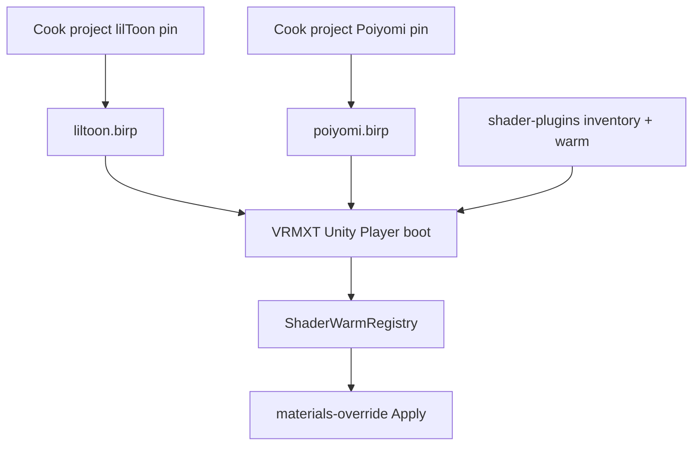

# VRMXT Player Shader AssetBundles

Non-normative research note: ship lilToon and Poiyomi for
[VRMXT Unity Player](../implementations/vrmxt-unity-player.md) as **runtime
AssetBundles**, so the desktop app build does not cook those megashader trees.

Claim gates and warm APIs stay in
[VRMXT Unity Shader Plugins](../implementations/vrmxt-unity-shader-plugins.md)
(`com.miramocha.vrmxt.unity.shader-plugins`). Warudo keeps UMod +
`ModHost.Assets.Load`. See [Warudo Material Warm-Up](warudo-material-warmup.md).

## Goal

Move lilToon / Poiyomi ShaderLab cook out of the Player Standalone build. Player
loads two packs at boot (Warudo’s two shader UMods, same split). Claimed-name
Apply behavior unchanged: missing or unresolved name → stock VRM material; no
network shader fetch.

## Current vs proposed

| | Today (Player) | Proposed |
|--|----------------|----------|
| Vendor trees | UPM `jp.lilxyzw.liltoon`, `com.poiyomi.toon` in Player `Packages/manifest.json` | Cooked into AssetBundles; **not** release deps of the app project |
| Layer A | `Resources.LoadAll` under `PlayerShaderWarm` → `ShaderWarmRegistry` | Load shaders/mats from packs → same registry |
| Layer B | SVC in Resources + `PoiyomiBirpWarm` | SVC inside Poiyomi pack + same warm API |
| Resolve | `ClaimedShaderResolver` (registry, then `Shader.Find`) | Registry first; do not rely on `Shader.Find` for pack shaders |

Operational today: Player repo `Assets/VRMXTPlayer/SHADERS.md`,
`ResourcesBirpShaderWarmHost`, `ClaimedShaderResolver`.

## Architecture

## Pack contract

### Layout

Suggested paths under the Standalone data `StreamingAssets` folder
(`*_Data/StreamingAssets/…` on Windows builds):

| Pack | Path relative to `StreamingAssets` |
|------|-------------------------------------|
| lilToon | `ShaderMods/liltoon.birp` |
| Poiyomi | `ShaderMods/poiyomi.birp` |

Extension `.birp` is a product label (Built-in RP). Unity still treats the file as
an AssetBundle (`AssetBundle.LoadFromFile`).

### Build pin

| Item | Value |
|------|-------|
| Unity | `2021.3.45f2` (same as Player / Warudo) |
| Platform | Standalone (desktop) |
| Pipeline | Built-in (BIRP) |
| lilToon source pin | **1.10.3** (claimed) |
| Poiyomi source pin | **9.3.64** (claimed) |

Packs are Unity-version and platform sticky. Bump Player Unity → re-export packs.

### Content policy

Put **full official-sourced** vendor trees into each pack (git/UPM pin above).
Runtime code chooses what to load. lil / Poiyomi do not publish official
AssetBundles; cook projects export them.

| Pack | Include | Skip in load list |
|------|---------|-------------------|
| `liltoon.birp` | lil ShaderLab + includes; warm mats for claimed lil names | Poiyomi |
| `poiyomi.birp` | Poiyomi Toon tree + includes; warm mats; `ShaderVariantCollection`; textures needed by claimed alts (e.g. Lil Fur) | World / Pro World / Two Pass from **warm and claim** (may still sit on disk unused) |

Player deferred warm/claim for Two Pass is not the same as the Warudo Toon UMod ship
set: Warudo still ships and ModHost-loads Two Pass alts; Player keeps them out of
`SvcWarmShaderNames` / claim warm. See
[Warudo Poiyomi Exclusions](warudo-poiyomi-exclusions.md) and
[Warudo Poiyomi BIRP Variants](warudo-poiyomi-birp-variants.md).

### Not in either pack

| Piece | Where it lives |
|-------|----------------|
| Claim inventory, `ShaderWarmRegistry`, `PoiyomiBirpWarm` | `com.miramocha.vrmxt.unity.shader-plugins` |
| UniVRMXT / Apply | Player UPM deps |
| Test override `VRMXT/Samples/TestOverrideBuiltin` | Player app assets (tiny) |
| Player scenes, UI, exe | Main Player build |

## Load and warm contract

### Boot

1. Discover packs under `StreamingAssets/ShaderMods/` (or configured dir).
2. Load `liltoon.birp` if present.
3. Load `poiyomi.birp` if present.
4. For each **claimed** ShaderLab name (and known warm-mat / SVC assets),
   `LoadAsset` / `LoadAssetAsync` by **cooked AssetBundle asset name** (or a
   documented address map from the cook project). Avoid `LoadAllAssets` on the
   whole Poiyomi tree.
5. Register loaded `Shader` instances in `ShaderWarmRegistry`; keep material refs
   alive for Layer A.
6. If Poiyomi pack loaded: run Layer B (`ShaderVariantCollection.WarmUp` + existing
   Blit / `SetPass` path via `PoiyomiBirpWarm`).
7. Install `ShaderResolveProvider` (Player `ClaimedShaderResolver` or equivalent).

Missing pack → that family is absent at runtime → Apply falls through to stock for
those names. Inventory membership alone does not create a Shader.

### Selective load sources

Reuse package lists (do not fork a second manifest in Player):

- `BirpClaimedShaderInventory`: which names may Apply
- `PoiyomiBirpWarmKeywords.SvcWarmShaderNames`: Layer B targets
- Deferred alts: `IsDeferredPoiyomiAlt` (World / Pro World / Two Pass) stay unloaded

### Resolve

Same discipline as Warudo ModHost shaders: name → registry map. `Shader.Find` may
return null for assets that only exist inside a loaded bundle. Player resolve
already prefers `ShaderWarmRegistry` before Find.

## Size reality

Measured against Player `Library/PackageCache` and upstream release assets
(pin **9.3.64** / lil **1.10.3**):

| Source | Approx size | Notes |
|--------|-------------|-------|
| Poiyomi `com.poiyomi.toon-9.3.64.zip` (GitHub release) | ~69 MB (70,388 KB) | Upstream release asset listing |
| Poiyomi `.unitypackage` (same release) | ~74 MB | Upstream release asset listing |
| Poiyomi PackageCache tree (expanded) | ~168 MB | Local Player `Library/PackageCache` measure (2026-07-29) |
| lilToon PackageCache tree | ~6 MB | Same local measure |

AssetBundle ship size is not identical to PackageCache; expect **tens of MB** for a
full Poiyomi pack, small for lil. Selective load saves RAM, not ship size, unless
cook strips unused textures / alts.

## Warudo comparison

| | Warudo shader mods | Player (this note) |
|--|--------------------|--------------------|
| Pack format | UMod (assets bundled inside the mod package) | Unity AssetBundle files |
| Runtime API | `ModHost.Assets.Load` | `AssetBundle.LoadFromFile` + selective load |
| Raw AssetBundle as plugin | Not the Warudo plugin format; ModHost is the supported load API | First-class |
| Split | lil UMod + Poiyomi UMod | `liltoon.birp` + `poiyomi.birp` |

Same vendor source trees can feed **two export pipelines** (UMod + AssetBundle).
Do not expect one raw Player AssetBundle file to mount as a Warudo plugin.

## Editor authoring

Prefer: Editor Play / Apply preview loads the **same** `StreamingAssets/ShaderMods`
packs. Keep lil / Poiyomi out of release Player `Packages/manifest.json` so app
cooks stay light.

Dev-only UPM pins for authoring are fine locally; document them as non-shipping if
used.

## Non-goals

- Addressables (this note targets raw AssetBundles only)
- Network fetch of shaders
- Poiyomi on Always Included Shaders
- Optimizer lock copies (`Hidden/Locked/…`) as Apply identities
- WebGL megashader claim for these packs
- Replacing `shader-plugins` with pack-only logic

## Open questions

| Topic | Status |
|-------|--------|
| Cook project ownership (reuse Warudo Shader Plugins trees vs dedicated Player cook) | Open |
| Bundle file naming / versioning under `StreamingAssets` | Open |
| Thry unlocked-shader strip policy in cook project vs Player | Open |
| Leave deferred Poiyomi alts on disk unused vs strip at cook | Open |
| `AssetBundleBirpShaderWarmHost` in shader-plugins vs Player-only loader | Open |

## Related

- [VRMXT Unity Player](../implementations/vrmxt-unity-player.md)
- [VRMXT Unity Shader Plugins](../implementations/vrmxt-unity-shader-plugins.md)
- [VRMXT Unity packages](../implementations/vrmxt-unity-packages.md)
- [Warudo Material Warm-Up](warudo-material-warmup.md)
- [Warudo Poiyomi BIRP Variants](warudo-poiyomi-birp-variants.md)
- [Warudo Poiyomi Exclusions](warudo-poiyomi-exclusions.md)
- [VRMXT desktop Player primary](../decisions/vrmxt-desktop-player-primary.md)
