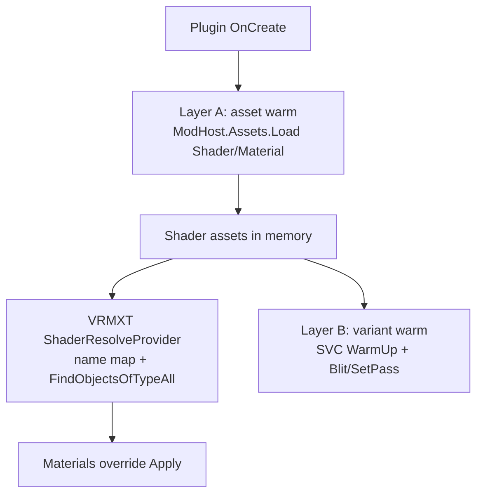

# Warudo Material Warm-Up

Non-normative reference for how Warudo UMod plugins load ShaderLab and force GPU
variants so `VRMXT_materials_override` Apply can bind live Character materials.

Companion notes:

- Host apply path: [Warudo VRMXT](../implementations/warudo-vrmxt.md)
- Poiyomi keyword / SVC detail: [Warudo Poiyomi BIRP Variants](warudo-poiyomi-birp-variants.md)
- Poiyomi exclusion inventory: [Warudo Poiyomi Exclusions](warudo-poiyomi-exclusions.md)

Repos: [VRMXT Plugin for Warudo](https://github.com/miramocha/VRMXT-Plugin-for-Warudo)
(`Assets/Vrmxt/Scripts/VrmxtPlugin.cs`) and
[Warudo Shader Plugins](https://github.com/miramocha/Warudo-Shader-Plugins)
(lilToon / Poiyomi / Sample). Warudo does **not** consume
`com.vrmxt.unity.shader-plugins`; warm stays UMod-local
([Warudo-Shader-Plugins#7](https://github.com/miramocha/Warudo-Shader-Plugins/issues/7)
won’t-do). Player AssetBundle packs are a separate path:
[VRMXT Player Shader AssetBundles](vrmxt-player-shader-assetbundles.md).

## Why warm is required

Warudo ships mods as UMod packages. Two host behaviors break naive Unity patterns:

| Behavior | Consequence |
|----------|-------------|
| `ModHost.Assets.Load` is the supported load path | `Resources.Load` does not see mod assets |
| `Shader.Find(name)` returns null for mod ShaderLab | Override Apply cannot resolve by name alone |

Loading a shader into memory is enough for Unity to keep the asset alive and for
renderers that already hold a Shader reference. Materials-override Apply needs a
name → Shader map because the glTF slot stores a ShaderLab string, not a Unity
asset GUID.

A second problem is keyword variants. Shaders that use `#pragma shader_feature`
can strip unused permutations at cook time, or compile them on first draw. First
frame hitch or missing look (e.g. glitter / emission off when keywords never
warmed) is the failure mode Poiyomi plugins address with
`ShaderVariantCollection.WarmUp`.

## Two layers

| Layer | What it does | Who |
|-------|----------------|-----|
| **A — asset warm** | `ModHost.Assets.Load<Shader>` / `<Material>` so ShaderLab exists in the player | Every shader mod; VRMXT for packaged samples + particles |
| **B — variant warm** | Build `ShaderVariantCollection`, call `WarmUp()`, then `Material.SetPass` + `Graphics.Blit` | Poiyomi BIRP only (today) |

lilToon BIRP stops at layer A. Poiyomi runs A then B. VRMXT runs A for its own
packaged assets and installs the resolve provider that consumes A from any mod.

## Layer A: ModHost asset warm

### Pattern

On `Plugin.OnCreate`:

1. Call `ModHost.Assets.Load<Shader>(assetPath)` (and optionally `.Load<Material>`).
2. Path is the mod-folder Unity path, e.g.
   `Assets/LilToonShaderPluginBirp/lilToon/Shader/lts.shader`.
3. Null / exception → `Debug.LogWarning`; do not fall back to `Resources.Load`.
4. Keep a reference (list or field) for the plugin lifetime so the asset is not GC'd
   from the mod’s point of view.

Scaffold: Warudo Shader Plugins skill `create-shader-plugin` and
`Assets/SampleShaderPlugin/SampleShaderPlugin.cs`.

### Pipeline gate (BIRP packs)

lilToon and Poiyomi BIRP mods skip warm when
`GraphicsSettings.currentRenderPipeline != null` (treat as URP / other SRP). Same
rule as `VrmxtCharacterApply.DetectActivePipelineForWarudo` (null → Builtin, else
Urp). Goal: dual-enabled BIRP+URP mods must not register the same ShaderLab name
twice.

### Who warms what

| Plugin | Id (examples) | Layer A loads |
|--------|---------------|---------------|
| Sample Shader | `mira.shaders.sampleshader` | One sample ShaderLab |
| lilToon BIRP | `mira.shaders.liltoon.birp` | Main `lts.shader` + known lilToon Shader folder files |
| Poiyomi BIRP | `mira.shaders.poiyomi.birp` | Main Toon + known Poiyomi shader files + warm `.mat`; expanded SVC keyword sets |
| VRMXT | `mira.vrmxt` | Particle Unlit + sample `TestOverrideBuiltin` / `TestOverrideURP` shaders and mats |

Documented Poiyomi path is `mira.shaders.poiyomi.birp` (`PoiyomiShaderPluginBirp`),
ShaderLab `.poiyomi/Poiyomi Toon`.

## VRMXT resolve after warm

`VrmxtPlugin.OnCreate`:

1. `WarmPackagedMaterialsOverrideShaders()` — ModHost-load sample override shaders/mats;
   stash Shader names in `_modShaders`.
2. `BindMaterialsOverrideShaderResolve()` — set
   `VrmxtMaterialsOverrideApplier.ShaderResolveProvider`.
3. Provider lookup order:
   1. `_modShaders` cache (this mod’s warm),
   2. else `Resources.FindObjectsOfTypeAll<Shader>()` by exact name (cross-mod warm
      from lilToon / Poiyomi / Sample),
   3. cache hit for later Applies.

`Shader.Find` is still probed in `LogAvailableShaders` for diagnostics; success is
not required for Apply.

Scene load re-logs inventory (`OnSceneLoaded`) because other mods may finish
`OnCreate` after VRMXT.

Without layer A in the shader mod, FindObjectsOfTypeAll never sees that ShaderLab
name and Apply leaves the stock material.

## Layer B: variant warm (Poiyomi)

Only Poiyomi BIRP (`mira.shaders.poiyomi.birp`) implements this today. Outline:

1. After layer A, resolve main shader by name `.poiyomi/Poiyomi Toon`.
2. Load packaged warm material
   (`…/Resources/PoiyomiWarmGlitterEmission.mat`), or `new Material(main)` if load
   fails.
3. Enable glitter / emission keywords and transparent/additive render state on that mat.
4. Build keyword **subsets** (not full cartesian product): empty + glitter/emission base,
   lil-parity singles, demoted `shader_feature` extras, lighting modes, avatar /
   preset bundles.
5. For each `PassType` in `{ ForwardBase, ForwardAdd, ShadowCaster }` × each
   keyword set, `ShaderVariantCollection.Add`; skip invalid combinations.
6. `_warmVariants.WarmUp()`.
7. Always run `ForceCompileWarmMaterialPasses`: `SetPass` every material pass, then
   `Graphics.Blit` to an 8×8 temporary RT (covers transparent queue path SVC may miss).
8. On `OnDestroy`, destroy owned warm material and the SVC.

PassType list matches Warudo BIRP Forward + shadows. Deferred / Meta / MotionVectors
are omitted. Keyword lists, cook-size math, and `multi_compile` cuts live in
[Warudo Poiyomi BIRP Variants](warudo-poiyomi-birp-variants.md).

## Failure modes

| Symptom | Likely cause |
|---------|--------------|
| Pink / stock MToon after Apply; log shows unresolved shader | Shader mod not enabled, wrong RP mod, or warm skipped (SRP host + BIRP mod) |
| `Shader.Find` null but Apply works | Expected for UMod; resolve uses ModHost warm + FindObjectsOfTypeAll |
| Apply works, glitter/emission missing until later | Layer B miss or `shader_feature` never referenced at cook; check Poiyomi SVC logs (`added=` / `skippedInvalid=`) |
| Two mods, broken / colliding looks | BIRP + URP packs both warming same ShaderLab name |
| First hitch on Character with rich keywords | Layer B incomplete for that keyword set; expand warm subsets or promote axis to `multi_compile` + re-export UMod |

## Debug hooks

| Log / tool | Source |
|------------|--------|
| `VRMXT: shader inventory (OnCreate\|OnSceneLoaded)` | `VrmxtPlugin.LogAvailableShaders` |
| `… warmed N shader(s). names=[…]` | lilToon / Poiyomi `OnCreate` |
| `ShaderVariantCollection WarmUp added=…` | Poiyomi layer B |
| `ForceCompile Blit+SetPass …` | Poiyomi after SVC |
| Playground `PoiyomiPassProbeAsset` | Pass / LightMode probe (copy under VRMXT TestPlugin) |

## Related code map

| Concern | Location |
|---------|----------|
| VRMXT asset warm + resolve | `VRMXT Plugin for Warudo/Assets/Vrmxt/Scripts/VrmxtPlugin.cs` |
| Apply consumer of resolve | `…/UniVRMXT/MaterialsOverride/VrmxtMaterialsOverrideApplier.cs` |
| lilToon layer A | `Warudo Shader Plugins/Assets/LilToonShaderPluginBirp/LilToonShaderPluginBirp.cs` |
| Poiyomi BIRP A+B | `…/PoiyomiShaderPluginBirp/PoiyomiShaderPluginBirp.cs` |
| Minimal template | `…/SampleShaderPlugin/SampleShaderPlugin.cs` |
