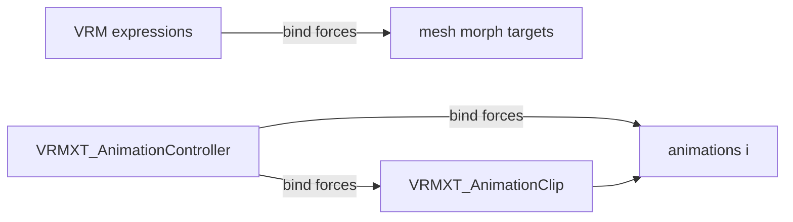

# VRMXT_AnimationClip

Per-animation glTF extension for clip metadata on VRM 1.0 assets. Keyframes stay in core
glTF `animations[i]` (channels / samplers). This extension does not define a state
machine.

Parallel to VRM 1.0 expressions → morph targets: a
[VRMXT_AnimationController](vrmxt-animation-controller.md) bind forces both the
`animations[i]` keyframe object and this metadata block. Animations that are never
referenced by a controller MAY omit the extension (preview / library packs).

`loop` / `speed` / `offset` / `reverse` reuse concepts from the closed Khronos
[`KHR_animation_clip` draft](https://github.com/KhronosGroup/glTF/pull/2080). This
extension is not that KHR and MUST NOT require it.

Decision context:
[animation-controller-standardization](../../../decisions/animation-controller-standardization.md).
Khronos overlap (non-normative):
[KHR / glTF overlap](../../../references/khr-gltf-overlap.md).

## Scope

| Item | Value |
|------|-------|
| Extension name | `VRMXT_AnimationClip` |
| Target | VRM 1.0 (`VRMC_vrm` 1.0) only |
| Attachment | `animations[i].extensions.VRMXT_AnimationClip` |
| Owns | Clip-side metadata (playback hints, role, tags) |
| Required when controller-bound | Yes — see controller rules |
| Required for bare glTF playback | No |
| Stock importer | no required change |
| Consumer package | optional |

### Out of scope

| Item | Notes |
|------|-------|
| FSM / transitions / parameters | [VRMXT_AnimationController](vrmxt-animation-controller.md) |
| Keyframe data | Core `animations[i]` (this extension attaches to that object) |
| `KHR_animation_pointer` channel retargeting | Optional later; not required here |
| `VRMC_vrm_animation` (VRMA) retarget maps | Complementary upstream; separate files |

## Normative requirements

1. Files that use this extension on any animation MUST list `VRMXT_AnimationClip` in
   `extensionsUsed`.
2. The extension object MUST appear under
   `animations[i].extensions.VRMXT_AnimationClip` for each annotated clip.
3. The extension object MUST contain `specVersion` with value `"1.0"` for this draft.
4. All properties other than `specVersion` are optional. Omitted properties use the
   defaults in [Extension properties](#extension-properties).
5. Presence of this extension asserts that `animations[i]` is the keyframe carrier
   (channels / samplers). Authors MUST NOT emit `VRMXT_AnimationClip` on a missing or
   non-animation index.
6. When [VRMXT_AnimationController](vrmxt-animation-controller.md) references
   `animations[i]` (state or blend-space entry), that animation MUST include this
   extension. A controller bind without it is unresolved.
7. Stock / non-VRMXT consumers MUST be able to play `animations[i]` when this extension
   is ignored (core glTF animation still loads).
8. Consumers MUST ignore unknown properties.
9. Invalid numeric fields (non-finite `speed` or `offset`, or `speed` less than or equal
   to `0`) MUST cause the consumer to ignore those fields and keep defaults; the
   underlying animation remains playable.
10. Files MUST NOT list `VRMXT_AnimationClip` in `extensionsRequired`.

## Extension properties

| Property | Type | Required | Default | Meaning |
|----------|------|----------|---------|---------|
| `specVersion` | string | yes | — | Extension version; currently `"1.0"` |
| `displayName` | string | no | none | UI label; does not replace `animations[i].name` for binding |
| `role` | string | no | none | Coarse purpose hint (see roles) |
| `tags` | string[] | no | `[]` | Extra authoring / filter labels |
| `loop` | boolean | no | `false` | Prefer looping playback when the consumer supports it |
| `speed` | number | no | `1` | Playback rate multiplier; MUST be finite and greater than `0` |
| `offset` | number | no | `0` | Start offset in seconds from the clip's local time `0`; MUST be finite and greater than or equal to `0` |
| `reverse` | boolean | no | `false` | Play from end toward start when supported |
| `rootMotion` | boolean | no | `false` | Hint that translation in the clip is intended as root motion |

### Roles

`role` is a soft hint for UI and converters. Known values for this draft:

| `role` | Intended use |
|--------|---------------|
| `locomotion` | Idle / walk / run family |
| `emote` | One-shot gesture / expression body motion |
| `gesture` | Shorter upper-body or prop gesture |
| `custom` | Author-defined |

Unknown `role` strings MUST be preserved on round-trip and MAY be ignored at runtime.

`tags` MAY repeat or refine `role` (for example `tags: ["emote", "greeting"]`).
Vocabulary beyond the table is **TBD**.

### Playback hints

| Field | Behavior when unsupported |
|-------|---------------------------|
| `loop` | Play once |
| `speed` | Play at `1` |
| `offset` | Start at local time `0` |
| `reverse` | Play forward |
| `rootMotion` | Apply channels as ordinary node animation |

Controller runtimes SHOULD apply these hints when entering a state that binds the clip,
unless the implementation profile documents a state-level override (**TBD**).

`offset` is relative to the clip's own time range (glTF sampler input). Behavior when
`offset` is past the clip length is **TBD** (clamp vs wrap when `loop` is true).

Negative playback via `speed` is **not** used; use `reverse` plus positive `speed`.

## Binding vs metadata

| Mechanism | Purpose |
|-----------|---------|
| `animations[i]` index / `.name` | Controller bind target (like morph mesh + index) |
| `VRMXT_AnimationClip` on that index | Required metadata for controller-bound clips (like expression row + binds) |
| `displayName` | Human label only |
| `role` / `tags` | Filtering in authoring UI / bridge helpers |

[VRMXT_AnimationController](vrmxt-animation-controller.md) resolves clips by index and/or
`animations[i].name`, then requires this extension on the resolved animation. Binding does
not use `displayName` as the key.



## Attachment example

Non-normative.

```json
{
  "extensionsUsed": [
    "VRMC_vrm",
    "VRMXT_AnimationClip"
  ],
  "animations": [
    {
      "name": "Wave",
      "channels": [],
      "samplers": [],
      "extensions": {
        "VRMXT_AnimationClip": {
          "specVersion": "1.0",
          "displayName": "Wave Hello",
          "role": "emote",
          "tags": ["greeting"],
          "loop": false,
          "speed": 1.0,
          "offset": 0.0,
          "reverse": false,
          "rootMotion": false
        }
      }
    },
    {
      "name": "Walk",
      "channels": [],
      "samplers": [],
      "extensions": {
        "VRMXT_AnimationClip": {
          "specVersion": "1.0",
          "role": "locomotion",
          "loop": true,
          "speed": 1.0
        }
      }
    }
  ]
}
```

## Compatibility

| Consumer | Expected behavior |
|----------|-------------------|
| Stock VRM 1.0 / glTF importer | Ignore extension; play core animation as usual |
| Authoring tools | MAY use `role` / `tags` / `displayName` for lists |
| Controller consumer | Reject / skip binds whose target lacks this extension |
| Clip-only file (no controller) | Extension optional; playback hints still MAY apply in preview |

## Extensibility

Later drafts MAY:

- Add humanoid / retarget hints that do not duplicate `VRMC_vrm_animation`.
- Add optional events / markers (**TBD**; keep out of FSM).
- Clarify `offset` past end-of-clip.
- Add state-level playback overrides that win over clip hints.

Adding optional fields with defaults does not by itself require a `specVersion` bump.
Removing or redefining an existing field does.

## Related

- [VRMXT_AnimationController](vrmxt-animation-controller.md)
- [Animation controller standardization](../../../decisions/animation-controller-standardization.md)
- [KHR / glTF overlap](../../../references/khr-gltf-overlap.md) (non-normative)
- Closed Khronos draft: [glTF#2080](https://github.com/KhronosGroup/glTF/pull/2080)
- Upstream [VRMC_vrm_animation](https://github.com/vrm-c/vrm-specification/tree/master/specification/VRMC_vrm_animation-1.0)

## Open questions

| Topic | Status |
|-------|--------|
| `offset` past clip length (clamp vs wrap) | TBD |
| Whether `loop` overrides exporter/channel hints | TBD |
| State-level playback override vs clip hints | TBD |
| Root-motion space (model vs Y-up glTF) | TBD |
| Marker / event track on clips | TBD |
| Extra `role` / `tags` registry | TBD |
| Interaction with expression blend shapes in the same clip | TBD |
| Whether unused `animations[]` without clip meta are allowed beside a controller | Allowed (draft); tighten? TBD |
