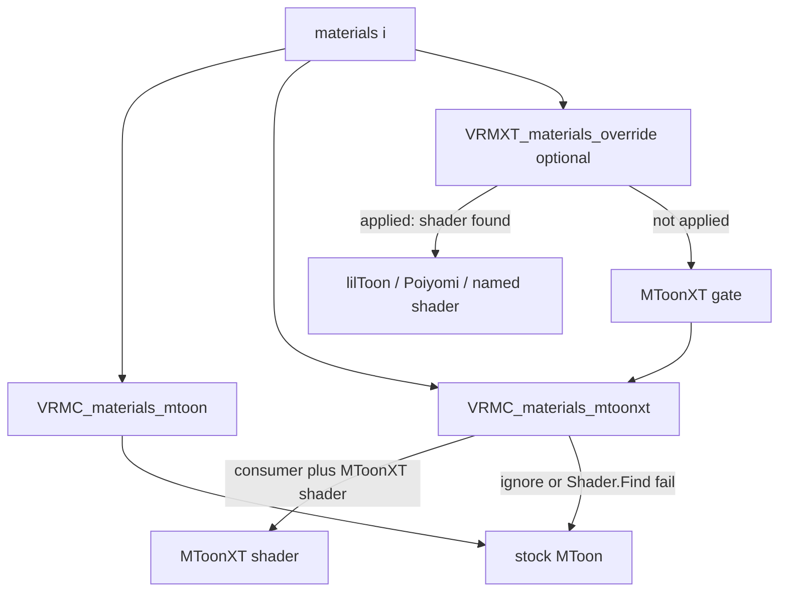

# VRMC_materials_mtoonxt

Per-material glTF extension. Carries extras for a VRM 1.0 MToon material (Face SDF and
stencil in this draft) next to stock `VRMC_materials_mtoon` on the same
`materials[]` entry.

The serialized name uses the `VRMC_` prefix so the two objects sit as a pair. This
document is an Extended VRM draft in this repository. It is not a VRM Consortium
specification.

Stock VRM 1.0 importers ignore unrecognized material extensions and keep ordinary MToon.

## Scope

| Item | Value |
|------|-------|
| Extension name | `VRMC_materials_mtoonxt` |
| Target | VRM 1.0 (`VRMC_vrm` 1.0) only |
| Attachment | `materials[i].extensions.VRMC_materials_mtoonxt` |
| Required sibling | `VRMC_materials_mtoon` on the same material |
| Root `extensions` | not used for this extension |
| Stock importer | no required change |
| Consumer package | optional; swaps to an MToonXT shader when that shader is installed |

Do not add extra keys inside `VRMC_materials_mtoon`. UniVRM export may drop unknown
fields there. Do not attach MToonXT through `VRMXT_materials_override`; that extension
selects an engine shader (lilToon, Poiyomi, and similar).

## Conformance

This specification conforms to [VRMXT Conformance](../../core/vrmxt-conformance.md).

Family rule 6 is written for names matching `VRMXT_*`. This extension uses `VRMC_` and
MUST follow the same fallback: files MUST NOT list `VRMC_materials_mtoonxt` in
`extensionsRequired`.

## Normative requirements

1. Files that use this extension MUST list `VRMC_materials_mtoonxt` in `extensionsUsed`.
2. The extension object MUST appear on a glTF `materials[]` entry under
   `extensions.VRMC_materials_mtoonxt`.
3. The same material MUST also contain `extensions.VRMC_materials_mtoon`. If that sibling
   is missing, a supporting implementation MUST ignore `VRMC_materials_mtoonxt` on that
   material and keep stock VRM 1.0 material import.
4. The extension object MUST contain `specVersion` with value `"1.0"` for this draft.
5. Files MUST NOT list `VRMC_materials_mtoonxt` in `extensionsRequired`.
6. Implementations that do not support the extension MUST ignore it.
7. A supporting implementation MAY swap the material to its MToonXT shader only when all
   of the following hold:
   - the consumer claims this capability;
   - this extension object is valid (`specVersion` and sibling MToon present);
   - the consumer can resolve its MToonXT shader (Unity: `Shader.Find` of the profile
     ShaderLab name after that shader has been loaded or warmed).
8. When rule 7 holds, the implementation MUST:
   - replace the stock MToon shader on that material with MToonXT;
   - apply shade, outline, UV animation, and other stock MToon state from the sibling
     `VRMC_materials_mtoon` using the same mapping it already uses for stock MToon;
   - then apply extras defined by this extension (`faceSdf`, `stencil`,
     `outlineStencil`, `zTest`, `renderQueue`, `zWrite`).
9. When rule 7 does not hold, the implementation MUST keep stock MToon for that material
   and MUST NOT apply extras.
10. The skippable unit is this material's `VRMC_materials_mtoonxt` object. Invalid data
    there MUST NOT make the glTF or VRM 1.0 asset invalid.
11. If an extra object (`faceSdf`, `stencil`, or `outlineStencil`) is missing, unknown,
    or unresolvable, the implementation MUST skip that object only. It MUST still attempt
    the shader swap when rule 7 holds and remaining extras are usable. An unrecognized
    `zTest` string MUST be ignored (shader default `"lessEqual"`). An out-of-range
    `renderQueue` MUST be ignored. A non-boolean `zWrite` MUST be ignored.
12. Unrecognized properties on the extension object MUST be ignored.
13. This extension MUST NOT duplicate `VRMC_materials_mtoon` fields. Shade color, shading
    shift, shading toony, rim, matcap, outline width, UV animation, and related stock
    MToon properties stay in the sibling.
14. When `VRMXT_materials_override` **applies** on the same material (engine selected,
    material definition resolved, required shader or parent present), a supporting
    implementation MUST use that override and MUST NOT swap to MToonXT on that material.
    If the override is absent, is for another engine, or fails to resolve, the
    implementation MUST run rules 7–9.
15. The glTF file MUST NOT embed MToonXT shader source. Resolution is local to the
    consumer (shipped package, UMod, or equivalent).
16. An exporter that emits `faceSdf.sdfTexture` MUST register the referenced image
    through its normal glTF texture export path so the index resolves in the output
    file.

## Load gate



## Extension properties

| Property | Type | Required | Meaning |
|----------|------|----------|---------|
| `specVersion` | string | yes | `"1.0"` for this draft |
| `faceSdf` | object | no | Face SDF extras; omit for off |
| `stencil` | object | no | Body / forward-pass stencil; omit for shader defaults |
| `outlineStencil` | object | no | Outline-pass stencil; omit for shader defaults |
| `zTest` | string | no | Forward-pass depth compare; omit for `"lessEqual"` |
| `renderQueue` | integer | no | Unity render queue after MToon alpha mapping; omit to keep that mapping |
| `zWrite` | boolean | no | Override Unity ZWrite after MToon mapping; omit to keep that mapping |

### `faceSdf`

Omit the object to leave Face SDF off. When the object is present:

| Property | Type | Required | Default | Meaning |
|----------|------|----------|---------|---------|
| `enabled` | boolean | no | `false` | Apply Face SDF |
| `sdfTexture` | textureInfo | no | none | glTF texture info (`index`, optional `texCoord`); R channel |
| `softness` | number | no | `0` | Inclusive `[0,1]`; `0` is a hard edge |
| `flipLuminance` | boolean | no | `false` | Sample `1 - R` |

`sdfTexture.index` MUST be a valid zero-based index into `textures[]` when `enabled` is
true. An out-of-range index, a missing texture, or a `softness` outside `[0,1]` makes
`faceSdf` unresolvable (rule 11). `texCoord` follows glTF textureInfo; default `0`.

When `enabled` is true and `sdfTexture` resolves, the consumer MUST derive a shade
factor from the texture **R** channel using the **main light direction in VRM humanoid
`head` bone object space**. If the humanoid `head` bone is missing, it MUST use the
object space of the node that owns the mesh. If `flipLuminance` is true, it MUST use
`1 - R`. Stock sibling `shadingShiftFactor` and `shadingToonyFactor` MUST still shape
that factor.

How the head-space light direction maps to UV (azimuth-only vs spherical, left/right
bake convention) is **TBD**. The first Unity BIRP fork documents the layout it samples;
other engines MUST NOT assume a layout until this specification locks one.

### `stencil` and `outlineStencil`

Same schema. `stencil` applies to the body / forward pass. `outlineStencil` applies to
the inverse-hull outline pass when the MToonXT shader has one.

| Property | Type | Required | Default | Meaning |
|----------|------|----------|---------|---------|
| `enabled` | boolean | no | `false` | Apply this stencil object; omit or `false` is stencil off |
| `ref` | integer | no | `0` | Stencil reference, inclusive `[0,255]` |
| `readMask` | integer | no | `255` | Inclusive `[0,255]` |
| `writeMask` | integer | no | `255` | Inclusive `[0,255]` |
| `comp` | string | no | `"always"` | Compare function |
| `pass` | string | no | `"keep"` | Op when stencil and depth pass |
| `fail` | string | no | `"keep"` | Op when stencil fails |
| `zfail` | string | no | `"keep"` | Op when stencil passes and depth fails |

`comp` MUST be one of: `never`, `less`, `equal`, `lessEqual`, `greater`, `notEqual`,
`greaterEqual`, `always`.

`pass`, `fail`, and `zfail` MUST each be one of: `keep`, `zero`, `replace`,
`incrementSaturate`, `decrementSaturate`, `invert`, `incrementWrap`, `decrementWrap`.

An out-of-range integer or unrecognized enum makes that stencil object unresolvable
(rule 11). Depth, shadow, and motion-vector passes are **TBD**.

`enabled` default `false`. A missing `enabled` key is `false`. Unity MToonXT inspector
**Enable stencil** / **Enable outline stencil** start off. Off writes Always / Keep and
does not test or write stencil. On applies `ref`, masks, `comp`, and ops.

### `zTest`

Forward / outline / add depth compare. Same enum as stencil `comp`. Omitted or
`"lessEqual"` matches stock MToon. `"always"` ignores all closer depth, including
props in front of the camera.

Unity maps this to `_M_ZTest`. Shader assignment leaves that float at `0`
(Disabled). Consumers MUST write the resolved enum after swap (`lessEqual` = `4`
when the key is omitted).

To draw an eyebrow over hair without covering scene objects and without cutting
hair at the brow’s soft alpha: do **not** stencil-punch the hair (stencil is
binary; fringe texels still write). Keep brow ZTest `"lessEqual"` at queue
`3000`. On the hair cutout set `"zWrite": false` so the brow can depth-test
against the head and props, then alpha-blend over hair that already drew.

### `renderQueue`

Optional integer, inclusive `[0, 5000]`. Applied after stock MToon queue mapping
from `alphaMode` / `transparentWithZWrite`. Omit to keep that mapping.

### `zWrite`

Optional boolean. Applied after stock MToon ZWrite mapping. `false` turns off
depth writes (Unity `_M_ZWrite` = 0). Omit to keep the mapping (cutout stays
ZWrite on).

## Attachment example

Non-normative. Texture `4` is the Face SDF map.

```json
{
  "extensionsUsed": [
    "VRMC_vrm",
    "VRMC_materials_mtoon",
    "VRMC_materials_mtoonxt"
  ],
  "materials": [
    {
      "name": "Face",
      "pbrMetallicRoughness": {
        "baseColorFactor": [1, 1, 1, 1]
      },
      "extensions": {
        "VRMC_materials_mtoon": {
          "specVersion": "1.0",
          "shadeColorFactor": [1, 1, 1],
          "shadingShiftFactor": 0,
          "shadingToonyFactor": 0.9
        },
        "VRMC_materials_mtoonxt": {
          "specVersion": "1.0",
          "faceSdf": {
            "enabled": true,
            "sdfTexture": { "index": 4 },
            "softness": 0.1
          },
          "stencil": {
            "enabled": true,
            "ref": 1,
            "comp": "always",
            "pass": "replace"
          }
        }
      }
    }
  ]
}
```

## Optional consumer interpretation

A supporting Unity consumer that has warmed the pipeline ShaderLab name
(`VRMXT/MToonXT10` Built-in, or `VRMXT/Universal Render Pipeline/MToonXT10` URP)
MAY resolve that shader and run rules 7–8. Missing shader → rule 9 (stock MToon).

On Editor / Player hosts, resolve MAY use `Shader.Find`. Warudo UMod shaders stay
null under `Shader.Find`; the VRMXT plugin uses `ShaderResolveProvider` (ModHost warm
cache, then a scan of already-loaded `Shader` assets).

UniVRMXT (`com.miramocha.univrmxt`) parses, attaches, applies stencil extras, and ships
the Built-in / URP forks (`Runtime/Shaders/MToonxt/`). Warudo UMods
`mira.shaders.mtoonxt.birp` and `mira.shaders.mtoonxt.urp` warm the same ShaderLab names
because UMod `Shader.Find` is null.

Unity maps portable stencil enums onto fork properties `_M_Stencil*` and
`_M_OutlineStencil*` (integer `CompareFunction` / `StencilOp` values). Property table:
[MToon10 stencil shader fork](../../../references/research/mtoon10-stencil-shader-fork.md).

## Relationship to other material extensions

- Core glTF material fields remain the portable base.
- `VRMC_materials_mtoon` remains the VRM 1.0 toon material when present.
- `VRMC_materials_mtoonxt` is a sibling under `materials[i].extensions`. It does not
  replace MToon JSON.
- `VRMXT_materials_override` is a separate sibling. When it applies, it wins (rule 14).
- `KHR_materials_unlit` and core PBR follow existing VRM 1.0 material precedence when
  `VRMC_materials_mtoon` is absent; this extension then does not apply (rule 3).

## Open questions

- [ ] Face SDF UV layout (azimuth vs spherical) and left/right bake convention
- [ ] Whether SDF fully replaces N·L or only remaps it before shift/toony
- [ ] `softness` filter (smoothstep width vs mip)
- [ ] Extra `faceSdf` fields: tint, second UV, blend-with-NdotL
- [x] Depth / shadow / DepthNormals / Built-in ForwardAdd stencil — BIRP ForwardAdd = body; ShadowCaster off. URP DepthOnly / DepthNormals / ShadowCaster off.
- [x] URP `XRMotionVectors` stencil bit 0 — fork omits that pass
- [ ] Extra shade bands, face clip/mask, anisotropic highlight
- [ ] Blender authoring (enums vs ints)
- [ ] Catalog JSON for `VRMXT/MToonXT10`
- [ ] Stable `specVersion` policy after the first accepted property set

## Related

- [VRMXT Conformance](../../core/vrmxt-conformance.md)
- Upstream MToon: [VRMC_materials_mtoon 1.0](https://github.com/vrm-c/vrm-specification/blob/master/specification/VRMC_materials_mtoon-1.0/README.md)
- [VRMXT_materials_override](vrmxt-materials-override.md)
- [MToon10 stencil shader fork](../../../references/research/mtoon10-stencil-shader-fork.md) (non-normative)
- [UniVRMXT](../../../implementations/univrm-vrmxt.md)
- [Warudo VRMXT](../../../implementations/warudo-vrmxt.md)
- [VRMXT Unity packages](../../../implementations/vrmxt-unity-packages.md)
