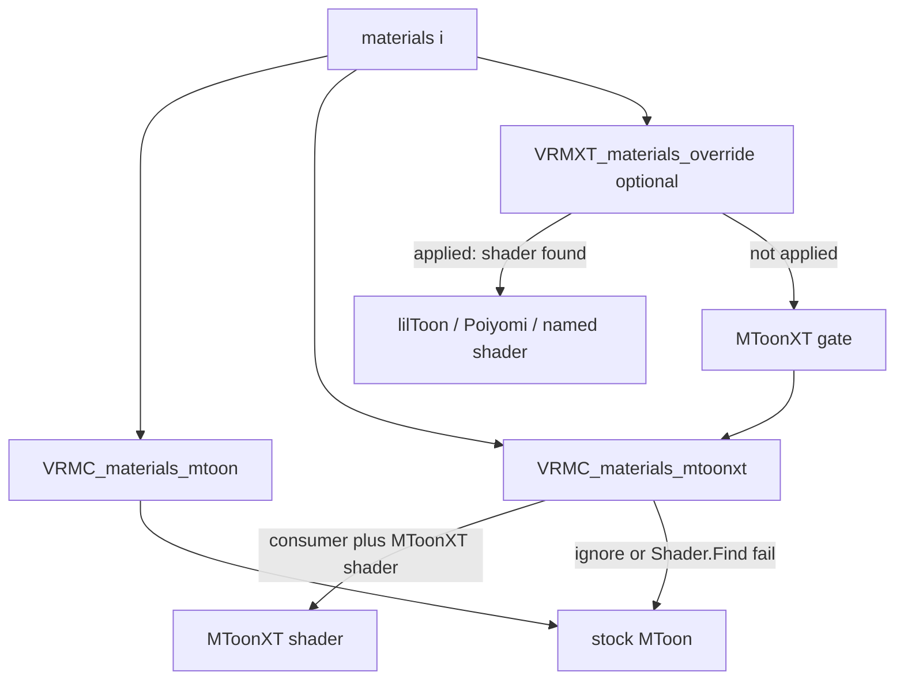

# VRMC_materials_mtoonxt

Per-material glTF extension. Carries extras for a VRM 1.0 MToon material next to stock
`VRMC_materials_mtoon` on the same `materials[]` entry.

The serialized name uses the `VRMC_` prefix so the two objects sit as a pair. This
document is an Extended VRM draft in this repository. It is not a VRM Consortium
specification.

Stock VRM 1.0 importers ignore unrecognized material extensions and keep ordinary MToon.

Field tables for each extra live on the pages in [Extras](#extras). This page is the
extension identity, conformance, and load gate.

## Scope

| Item | Value |
|------|-------|
| Extension name | `VRMC_materials_mtoonxt` |
| Target | VRM 1.0 (`VRMC_vrm` 1.0) only |
| Attachment | `materials[i].extensions.VRMC_materials_mtoonxt` |
| Required sibling | `VRMC_materials_mtoon` on the same material |
| Root `extensions` | not used for this extension |
| Stock importer | no required change |
| Consumer package | optional; swaps to an MToonXT shader when that shader is installed |

Do not add extra keys inside `VRMC_materials_mtoon`. UniVRM export may drop unknown
fields there. Do not attach MToonXT through `VRMXT_materials_override`; that extension
selects an engine shader (lilToon, Poiyomi, and similar).

## Conformance

This specification conforms to [VRMXT Conformance](../../../core/vrmxt-conformance.md).

Family rule 6 is written for names matching `VRMXT_*`. This extension uses `VRMC_` and
MUST follow the same fallback: files MUST NOT list `VRMC_materials_mtoonxt` in
`extensionsRequired`.

## Normative requirements

1. Files that use this extension MUST list `VRMC_materials_mtoonxt` in `extensionsUsed`.
2. The extension object MUST appear on a glTF `materials[]` entry under
   `extensions.VRMC_materials_mtoonxt`.
3. The same material MUST also contain `extensions.VRMC_materials_mtoon`. If that sibling
   is missing, a supporting implementation MUST ignore `VRMC_materials_mtoonxt` on that
   material and keep stock VRM 1.0 material import.
4. The extension object MUST contain `specVersion` with value `"1.0"` for this draft.
5. Files MUST NOT list `VRMC_materials_mtoonxt` in `extensionsRequired`.
6. Implementations that do not support the extension MUST ignore it.
7. A supporting implementation MAY swap the material to its MToonXT shader only when all
   of the following hold:
   - the consumer claims this capability;
   - this extension object is valid (`specVersion` and sibling MToon present);
   - the consumer can resolve its MToonXT shader (Unity: `Shader.Find` of the profile
     ShaderLab name after that shader has been loaded or warmed).
8. When rule 7 holds, the implementation MUST:
   - replace the stock MToon shader on that material with MToonXT;
   - apply shade, outline, UV animation, and other stock MToon state from the sibling
     `VRMC_materials_mtoon` using the same mapping it already uses for stock MToon;
   - then apply extras defined by this extension (`faceSdf`, `stencil`,
     `outlineStencil`).
9. When rule 7 does not hold, the implementation MUST keep stock MToon for that material
   and MUST NOT apply extras.
10. The skippable unit is this material's `VRMC_materials_mtoonxt` object. Invalid data
    there MUST NOT make the glTF or VRM 1.0 asset invalid.
11. If an extra object (`faceSdf`, `stencil`, or `outlineStencil`) is missing, unknown,
    or unresolvable, the implementation MUST skip that object only. It MUST still attempt
    the shader swap when rule 7 holds and remaining extras are usable. Stencil
    `op` / `materials` failure cases are on
    [stencil](stencil.md).
12. Unrecognized properties on the extension object MUST be ignored.
13. This extension MUST NOT duplicate `VRMC_materials_mtoon` fields. Shade color, shading
    shift, shading toony, rim, matcap, outline width, UV animation, and related stock
    MToon properties stay in the sibling.
14. When `VRMXT_materials_override` **applies** on the same material (engine selected,
    material definition resolved, required shader or parent present), a supporting
    implementation MUST use that override and MUST NOT swap to MToonXT on that material.
    If the override is absent, is for another engine, or fails to resolve, the
    implementation MUST run rules 7–9.
15. The glTF file MUST NOT embed MToonXT shader source. Resolution is local to the
    consumer (shipped package, UMod, or equivalent).
16. An exporter that emits `faceSdf.sdfTexture` MUST register the referenced image
    through its normal glTF texture export path so the index resolves in the output
    file.

## Load gate



## Extras

| Property | Type | Required | Page |
|----------|------|----------|------|
| `specVersion` | string | yes | this page; `"1.0"` for this draft |
| `faceSdf` | object | no | [Face SDF](face-sdf.md) |
| `stencil` | object | no | [Stencil](stencil.md) |
| `outlineStencil` | object | no | [Stencil](stencil.md) |

## Attachment example

Non-normative. Writer material with no clip list.

```json
{
  "extensionsUsed": [
    "VRMC_vrm",
    "VRMC_materials_mtoon",
    "VRMC_materials_mtoonxt"
  ],
  "materials": [
    {
      "name": "White",
      "extensions": {
        "VRMC_materials_mtoon": {
          "specVersion": "1.0"
        },
        "VRMC_materials_mtoonxt": {
          "specVersion": "1.0",
          "stencil": { "op": "write" }
        }
      }
    }
  ]
}
```

Clip-inside and Face SDF examples: [stencil](stencil.md),
[Face SDF](face-sdf.md).

## Optional consumer interpretation

A supporting Unity consumer that has warmed the pipeline ShaderLab name
(`VRMXT/MToonXT10` Built-in, or `VRMXT/Universal Render Pipeline/MToonXT10` URP)
MAY resolve that shader and run rules 7–8. Missing shader → rule 9 (stock MToon).

On Editor / Player hosts, resolve MAY use `Shader.Find`. Warudo UMod shaders stay
null under `Shader.Find`; the VRMXT plugin uses `ShaderResolveProvider` (ModHost warm
cache, then a scan of already-loaded `Shader` assets).

UniVRMXT (`com.vrmxt.univrmxt`) parses, attaches, and applies
[stencil](stencil.md) coverage clip extras, and ships the Built-in / URP forks
(`Runtime/Shaders/MToonxt/`). Warudo UMods `mira.shaders.mtoonxt.birp` and
`mira.shaders.mtoonxt.urp` warm the same ShaderLab names because UMod `Shader.Find`
is null.

Unity maps those extras onto fork properties `_M_Stencil*` and `_M_OutlineStencil*`
(GPU stencil `Ref` / compare / op is a consumer mapping). Property table:
[MToon10 stencil shader fork](../../../../references/research/mtoon10-stencil-shader-fork.md).

## Relationship to other material extensions

- Core glTF material fields remain the portable base.
- `VRMC_materials_mtoon` remains the VRM 1.0 toon material when present.
- `VRMC_materials_mtoonxt` is a sibling under `materials[i].extensions`. It does not
  replace MToon JSON.
- `VRMXT_materials_override` is a separate sibling. When it applies, it wins (rule 14).
- `KHR_materials_unlit` and core PBR follow existing VRM 1.0 material precedence when
  `VRMC_materials_mtoon` is absent; this extension then does not apply (rule 3).

## Open questions

- [ ] Face SDF UV layout (azimuth vs spherical) and left/right bake convention
- [ ] Whether SDF fully replaces N·L or only remaps it before shift/toony
- [ ] `softness` filter (smoothstep width vs mip)
- [ ] Extra `faceSdf` fields: tint, second UV, blend-with-NdotL
- [x] Depth / shadow / DepthNormals / Built-in ForwardAdd stencil — BIRP ForwardAdd = body; ShadowCaster off. URP DepthOnly / DepthNormals / ShadowCaster off.
- [x] URP `XRMotionVectors` stencil bit 0 — fork omits that pass
- [ ] Extra shade bands, face clip/mask, anisotropic highlight
- [x] Blender authoring (material pointers → indices) — VRMXT-Extension-for-Blender 0.2.4; [Blender VRMXT](../../../../implementations/blender-vrmxt.md#mtoonxt-stencil)
- [ ] Catalog JSON for `VRMXT/MToonXT10`
- [ ] Stable `specVersion` policy after the first accepted property set

## Related

- [VRMXT Conformance](../../../core/vrmxt-conformance.md)
- Upstream MToon: [VRMC_materials_mtoon 1.0](https://github.com/vrm-c/vrm-specification/blob/master/specification/VRMC_materials_mtoon-1.0/README.md)
- [VRMXT_materials_override](../vrmxt-materials-override.md)
- [Stencil](stencil.md)
- [Face SDF](face-sdf.md)
- [MToonXT renderQueueOffset](../../../../references/research/mtoonxt-render-queue.md) (non-normative)
- [MToonXT zTest](../../../../references/research/mtoonxt-ztest.md) (non-normative)
- [MToonXT zWrite](../../../../references/research/mtoonxt-zwrite.md) (non-normative)
- [MToon10 stencil shader fork](../../../../references/research/mtoon10-stencil-shader-fork.md) (non-normative)
- [UniVRMXT](../../../../implementations/univrm-vrmxt.md)
- [Blender VRMXT](../../../../implementations/blender-vrmxt.md#mtoonxt-stencil)
- [Warudo VRMXT](../../../../implementations/warudo-vrmxt.md)
- [VRMXT Unity packages](../../../../implementations/vrmxt-unity-packages.md)
