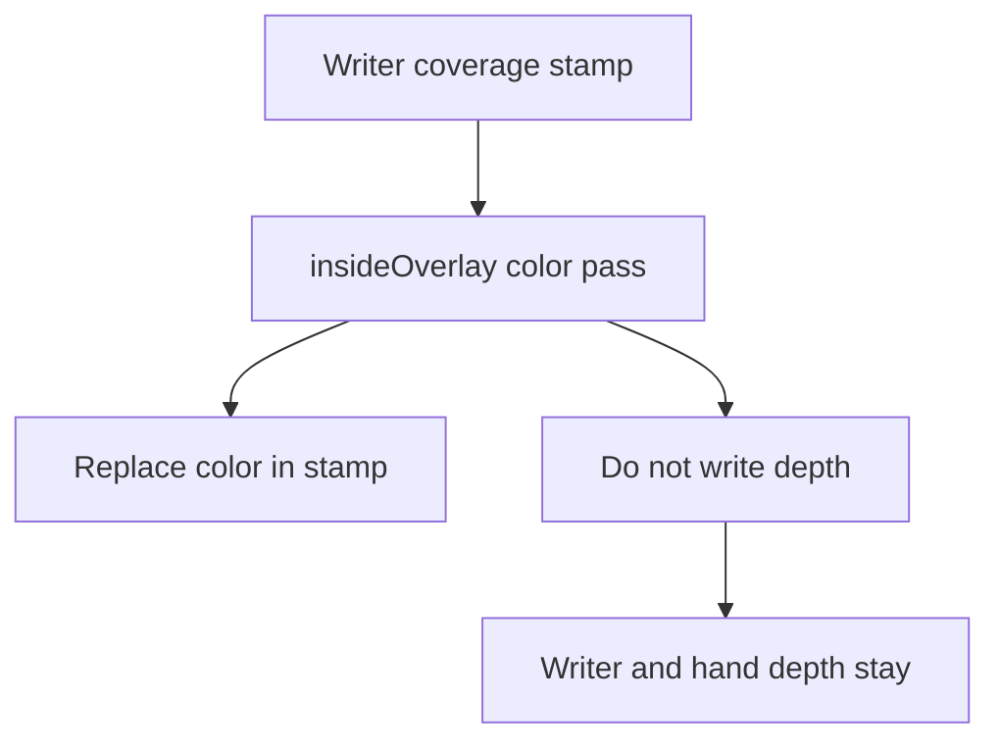

# VRMC_materials_mtoonxt stencil

Coverage clip extras on [VRMC_materials_mtoonxt](README.md). Serialized names stay
`stencil` (body / forward) and `outlineStencil` (inverse-hull outline pass, when the
shader has one). The identifier matches existing VTuber / Unity search. The extra
describes coverage clip.

Stock importers ignore the extra. Supporting consumers MUST produce the coverage
relationship below. How they do it is local (GPU stencil, engine `stencil_mode`,
material stencil state, or another method that keeps the same pixels).

## Intention

A **writer** is a coverage source. A **reader** is clipped against listed writers.

| `op` | Intention |
|------|-----------|
| `write` | This material stamps coverage (Y). |
| `inside` | Draw this material (X) only where a listed writer covered the pixel. Stock depth test. |
| `insideOverlay` | Same clip as `inside`. Still draw in those pixels if closer depth is already in the buffer. |
| `outside` | Draw this material (X) except where a listed writer covered the pixel. |
| `same` | Outline only: use the body's clip relationship on the hull. |

Coverage is **screen coverage after pose and skinning**, in the pass that draws the
material (body vs outline). It is binary: cutout and soft alpha still stamp. Union of
several listed writers is OR. AND of two different writer sets is out of scope.

Writers MUST be presented before `inside` / `insideOverlay` / `outside` readers that
list them, so the coverage exists when the reader clips. Mesh primitive order MAY be
enough. A supporting implementation SHOULD draw body `write` first when it controls
pass order.

On a shared mesh (VRoid Face: iris submesh before sclera), also draw `inside` /
`insideOverlay` before other cutout on that mesh so eyelids can cover iris-card pixels
outside the stamp.

Coverage clip is not:

- deleting or Boolean-cutting triangles in object space
- a shade, rim, or alpha **texture** named mask

Unity render-queue integers are not a stencil field. See
[renderQueueOffset](../../../../references/research/mtoonxt-render-queue.md)
(non-normative).

## Sibling `alphaMode`

`VRMC_materials_mtoon` `alphaMode` is not a stencil property. Consumers that draw
MToon in `alphaMode` buckets still MUST present writers before the `inside` /
`insideOverlay` / `outside` readers that list them.

Typical Unity MToon buckets, earliest first: Opaque, `MASK` (cutout),
`BLEND` (transparent). UniVRMXT only moves body `write` two Unity queue slots
inside the mapped bucket, and `inside` one slot earlier. `insideOverlay` one slot
later in the same bucket so it paints after occluders. That nudge
cannot pull a later bucket in front of an earlier one.

| Writer `alphaMode` | Reader in an earlier bucket | Stamp in time |
|--------------------|-----------------------------|---------------|
| Opaque | none | yes |
| `MASK` | Opaque | late (two-slot `write` nudge stays in the `MASK` bucket) |
| `BLEND` | Opaque or `MASK` | late |

`transparentWithZWrite` on `BLEND` uses the sibling transparent-with-Z path. Unity
MToon draws that after `MASK`. Count it as later than cutout for this table.

Authoring SHOULD:

- Give each writer an `alphaMode` at the same rank or earlier than every reader
  that lists that writer (Opaque, then `MASK`, then `BLEND`).
- Prefer Opaque writers.

Opaque or `MASK` write with a `BLEND` reader is in-order (writer first). That is
the brow-write / hair-clip setup. Soft-alpha `BLEND` coverage stays binary: every
fragment the pass shades stamps, including low alpha.

A writer that misses the rank rule stays a valid extra. Hub rule 11 does not list
`alphaMode`. Exporters SHOULD warn. Clip MAY miss.

## Scope

| Item | Value |
|------|-------|
| Extra names | `stencil`, `outlineStencil` |
| Parent | `materials[i].extensions.VRMC_materials_mtoonxt` |
| Meaning | coverage clip (`write` / `inside` / `insideOverlay` / `outside`) |

`stencil` applies to the body / forward pass. `outlineStencil` applies to the outline
pass when the MToonXT shader has one. Depth-only, shadow, and similar utility passes
have no coverage clip unless a consumer profile says otherwise.

Files MUST NOT serialize GPU stencil or depth state on these objects: `enabled`,
`ref`, `readMask`, `writeMask`, `comp`, `pass`, `fail`, `zfail`, `zTest`,
`zWrite`, or engine compare enums.

## `op` schema

`op` is required when the object is present.

| Property | Type | Required | Meaning |
|----------|------|----------|---------|
| `op` | string | yes | `write`, `inside`, `insideOverlay`, `outside`; outline only: `same` |
| `materials` | integer array | for `inside` / `insideOverlay` / `outside` | zero-based `materials[]` indices to clip against |

### `write`

Stamps coverage. `materials` MUST be absent. The material MUST have this extension so
rule 7 can swap to MToonXT.

### `inside` / `insideOverlay` / `outside`

Clip this material to the union (OR) of listed writers. `materials` MUST be a
non-empty array of in-range indices. Each listed material MUST have body `stencil.op`
`write`. A self-index is unresolvable (rule 11).

`inside` uses the stock MToon depth test: closer fragments in the depth buffer occlude
this reader. Iris on sclera uses `inside`.

`insideOverlay` uses the same clip. This material still draws in its clip region when
closer depth is already in the buffer. Occluders keep their fragments (no screen-space
hole). Supporting consumers MUST map `insideOverlay` with a local depth-ignore on that
color pass (Unity `ZTest Always`, three.js `depthFunc` Always / `depthTest` false, or
equivalent) and MUST NOT write depth for that pass (Unity `ZWrite` off). They MUST NOT
implement it by setting `outside` on the occluder. `outside` on
the body is a framebuffer hole: every body fragment in the writer blob is skipped,
including limbs that share those pixels.

### `insideOverlay` tradeoffs

Bones sit behind swimsuit in camera Z. Stock MToon LessEqual then drops the bone
fragments. Depth-ignore is the map that still paints them in the writer stamp.

One compare on the scene depth buffer cannot do both of:

- ignore writer Z (swimsuit)
- honor closer unrelated Z (hand, mic, hair that already shaded those pixels)

So in the stamp, overlay color MAY replace whatever drew earlier, including meshes
that should stay in front. Depth-ignore has no per-shader block list.
`ZWrite` off leaves writer and hand depth in the buffer. Overlay color already
replaced those pixels.



Use `inside` when the reader is in front of the writer (iris on sclera). Use
`insideOverlay` when the reader is behind the writer and must still show in the stamp.

### `insideOverlay` consumer alleviation

Non-normative except the MUST NOT (`outside` on the body writer). File schema stays
one clip list (OR). AND of two writer sets is still out of scope.

| Approach | Who | Effect |
|----------|-----|--------|
| Author `inside` | file | Stock depth test. Front-of-writer meshes (iris). |
| Draw the blocker after overlay | consumer | Later color overwrites overlay in those pixels. Scene after the avatar, or a second draw of closer opaques. |
| Extra local clip | consumer | Second coverage test (hand as a write) ANDed in the engine. Do not invent a second `materials` list in glTF. |
| Occlusion depth target | consumer | Overlay LessEqual a depth buffer with writer fragments removed or pushed far. Engine RT / blit. |

UniVRMXT: `_M_ZTest` Always, `_M_ZWrite` off, render queue one slot after the mapped
`alphaMode` bucket. Opaque Geometry (hands on the avatar) already ran, so overlay
paints over those pixels in the stamp. Transparent in a later bucket can still cover
the bones. Hosts MAY redraw closer opaques after the overlay pass.

Utility depth (shadow maps, camera depth for AO) is a separate mapping. Color-pass
depth-ignore does not clip those draws unless the consumer profile says so. See
[GPU stencil consumer](#gpu-stencil-consumer-non-normative).

### `same` (outline only)

`outlineStencil.op` `same` uses the body's clip relationship on the outline hull
(same writers, same `op` including `insideOverlay`). `materials` MUST be absent.
`op` `same` on body `stencil` is unresolvable.

### Omit

Missing `outlineStencil` means the outline pass has no coverage clip. The consumer
MUST NOT copy body clip onto the outline hull.

Outline width `none` means the outline pass does not draw; `outlineStencil` then has
no visible effect. Do not set outline `write` on a sclera writer: the hull would grow
the coverage region.

### Unresolvable objects

Skip that extra object only (hub rule 11):

- missing or unrecognized `op`
- two `inside` / `insideOverlay` / `outside` lists share a writer index but the sorted
  lists are not equal
- listed writer without body `op` `write`
- out-of-range index
- `write` with `materials`
- `inside` / `insideOverlay` / `outside` without `materials`
- `same` on body `stencil`

## Examples

Non-normative. Same ops as `mirabunny2026_2.stencil_2.vrm` (White `3`, Iris `1`,
Brow `4`, Hair `16`).

- Iris `inside` White: draw iris only on sclera coverage.
- Hair-Highlight `outside` Brow: skip highlight on brow coverage.
- White and Brow `write`: coverage sources. Brow outline `write` stamps in the outline
  pass. Iris and Hair-Highlight `outlineStencil` `same` follow the body clip.

```json
{
  "materials": [
    {
      "name": "Iris_Eye-NoRim.NoOutline.MatcapTexture",
      "extensions": {
        "VRMC_materials_mtoonxt": {
          "specVersion": "1.0",
          "stencil": { "op": "inside", "materials": [3] },
          "outlineStencil": { "op": "same" }
        }
      }
    },
    {
      "name": "White-NoRim.NoOutline",
      "extensions": {
        "VRMC_materials_mtoonxt": {
          "specVersion": "1.0",
          "stencil": { "op": "write" }
        }
      }
    },
    {
      "name": "Brow_Face-NoRim",
      "extensions": {
        "VRMC_materials_mtoonxt": {
          "specVersion": "1.0",
          "stencil": { "op": "write" },
          "outlineStencil": { "op": "write" }
        }
      }
    },
    {
      "name": "Hair-Highlight",
      "extensions": {
        "VRMC_materials_mtoonxt": {
          "specVersion": "1.0",
          "stencil": { "op": "outside", "materials": [4] },
          "outlineStencil": { "op": "same" }
        }
      }
    }
  ]
}
```

Union (OR) of two sclera writers: Iris `"materials": [3, 7]` and both listed
materials `"op": "write"`.

Skeleton on swimsuit, body unclipped (non-normative). Swimsuit `0` writes. Skeleton
`1` uses `insideOverlay` against that stamp. Body has no stencil extra. From the
camera, bones replace swimsuit pixels; the body mesh still rasterizes (no tunnel
through a leg).

```json
{
  "materials": [
    {
      "name": "Swimsuit",
      "extensions": {
        "VRMC_materials_mtoonxt": {
          "specVersion": "1.0",
          "stencil": { "op": "write" }
        }
      }
    },
    {
      "name": "Skeleton",
      "extensions": {
        "VRMC_materials_mtoonxt": {
          "specVersion": "1.0",
          "stencil": {
            "op": "insideOverlay",
            "materials": [0]
          },
          "outlineStencil": { "op": "same" }
        }
      }
    }
  ]
}
```

## Unity authoring

glTF stores indices. The material ShaderGUI MUST NOT persist a material list (shader
properties cannot). UniVRMXT: `VrmcMaterialsMtoonxtInstance` editor uses `Material`
object fields; export writes indices. Warudo uses JSON only.

UniVRMXT Apply then leases a per-root GPU `Ref` offset so two loaded avatars do not
share file-local 1 on the same camera stencil (`VrmcMaterialsMtoonxtStencilRefs`).
That offset is not serialized. See
[Unity MToonXT stencil Ref offset](../../../../references/research/mtoonxt-stencil-ref-offset.md).

## GPU stencil consumer (non-normative)

Typical mapping when the engine exposes an 8-bit stencil on the toon color pass.
File-local. Unique sorted writer-index sets (from `inside` / `insideOverlay` /
`outside` lists, plus singleton `{i}` for a `write` material that no reader lists)
receive `Ref` 1, 2, … .

| `op` | compare | stencil op | enabled | color-pass depth |
|------|---------|------------|---------|------------------|
| `write` | always | replace | true | stock LessEqual |
| `inside` | equal | keep | true | stock LessEqual |
| `insideOverlay` | equal | keep | true | Always, ZWrite off (Unity `_M_ZTest` = 8, `_M_ZWrite` = 0). Color in the stamp can overwrite earlier draws. See [`insideOverlay` tradeoffs](#insideoverlay-tradeoffs). |
| `outside` | notEqual | keep | true | stock LessEqual |
| omit / off | always | keep | false | stock LessEqual |

`readMask` / `writeMask` 255. `fail` / `zfail` `keep`. Do not store `_M_ZTest` in
glTF.

Unity Comp 0 is Disabled and hides the mesh. After this mapping, write Always (8)
when clip is off.

Unity pass notes: BIRP ForwardAdd uses body clip; ShadowCaster has none. URP
UniversalForward uses body clip; DepthOnly / DepthNormals / ShadowCaster have none.
See [MToon10 stencil shader fork](../../../../references/research/mtoon10-stencil-shader-fork.md).

## Related

- [VRMC_materials_mtoonxt](README.md)
- [MToonXT renderQueueOffset](../../../../references/research/mtoonxt-render-queue.md) (non-normative)
- [MToonXT zTest](../../../../references/research/mtoonxt-ztest.md) (non-normative)
- [MToonXT zWrite](../../../../references/research/mtoonxt-zwrite.md) (non-normative)
- [MToon10 stencil shader fork](../../../../references/research/mtoon10-stencil-shader-fork.md)
- [Unity MToonXT stencil Ref offset](../../../../references/research/mtoonxt-stencil-ref-offset.md) (non-normative)
