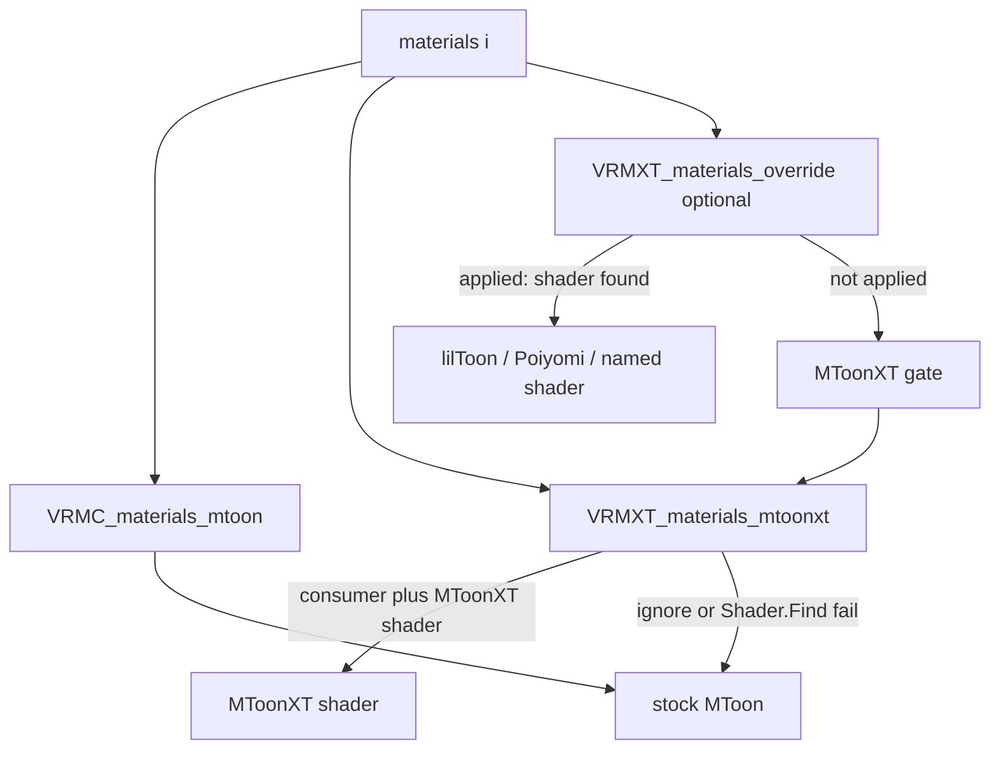

# VRMXT_materials_mtoonxt

Per-material glTF extension. Optional swap from stock VRM 1.0 MToon to an MToonXT
shader on the same `materials[]` entry as `VRMC_materials_mtoon`.

Coverage clip canonical attach is [VRMXT_materials_stencil](../vrmxt-materials-stencil.md).
Face shade lookup is [VRMXT_materials_face_sdf](../vrmxt-materials-face-sdf.md). Those
are separate `extensionsUsed` names. Do not nest new MToon extras on this object.

This document is an Extended VRM draft. It is not a VRM Consortium specification.

Stock VRM 1.0 importers ignore unrecognized material extensions and keep ordinary MToon.

This page is extension identity, conformance, and the shader-swap load gate. Deprecated
nested clip fields are under [Legacy nested stencil](#legacy-nested-stencil).

## Scope

| Item | Value |
|------|-------|
| Extension name | `VRMXT_materials_mtoonxt` |
| Target | VRM 1.0 (`VRMC_vrm` 1.0) only |
| Attachment | `materials[i].extensions.VRMXT_materials_mtoonxt` |
| Required sibling | `VRMC_materials_mtoon` on the same material |
| Root `extensions` | not used for this extension |
| Stock importer | no required change |
| Consumer package | optional; swaps to an MToonXT shader when that shader is installed |

Do not add extra keys inside `VRMC_materials_mtoon`. UniVRM export may drop unknown
fields there. Do not attach MToonXT through `VRMXT_materials_override`; that extension
selects an engine shader (lilToon, Poiyomi, and similar). The `…xt` / `_override` pair
matches spring (`VRMXT_springBonext`, `VRMXT_springBone_override`):
[Architecture Naming](../../../../architecture.md#naming).

A legal object MAY be only `{ "specVersion": "1.0" }` (swap request, no nested clip).

## Conformance

This specification conforms to [VRMXT Conformance](../../../core/vrmxt-conformance.md).

## Normative requirements

1. Files that use this extension MUST list `VRMXT_materials_mtoonxt` in `extensionsUsed`.
2. The extension object MUST appear on a glTF `materials[]` entry under
   `extensions.VRMXT_materials_mtoonxt`.
3. The same material MUST also contain `extensions.VRMC_materials_mtoon`. If that sibling
   is missing, a supporting implementation MUST ignore `VRMXT_materials_mtoonxt` on that
   material and keep stock VRM 1.0 material import.
4. The extension object MUST contain `specVersion` with value `"1.0"` for this draft.
5. Files MUST NOT list `VRMXT_materials_mtoonxt` in `extensionsRequired`.
6. Implementations that do not support the extension MUST ignore it.
7. A supporting implementation MAY swap the material to its MToonXT shader only when all
   of the following hold:
   - the consumer claims this capability;
   - this extension object is valid (`specVersion` and sibling MToon present);
   - the consumer can resolve its MToonXT shader (Unity: `Shader.Find` of the profile
     ShaderLab name after that shader has been loaded or warmed).
8. When rule 7 holds, the implementation MUST:
   - replace the stock MToon shader on that material with MToonXT;
   - apply shade, outline, UV animation, and other stock MToon state from the sibling
     `VRMC_materials_mtoon` using the same mapping it already uses for stock MToon.
   Nested `stencil` / `outlineStencil` follow [Legacy nested stencil](#legacy-nested-stencil).
   Face SDF is not an extra on this object.
9. When rule 7 does not hold, the implementation MUST keep stock MToon for that material
   and MUST NOT apply nested clip extras from this object.
10. The skippable unit is this material's `VRMXT_materials_mtoonxt` object. Invalid data
    there MUST NOT make the glTF or VRM 1.0 asset invalid.
11. If a nested `stencil` or `outlineStencil` object is missing, unknown, or
    unresolvable, the implementation MUST skip that object only. It MUST still attempt
    the shader swap when rule 7 holds. `op` / `materials` failure cases are on
    [VRMXT_materials_stencil](../vrmxt-materials-stencil.md).
12. Unrecognized properties on the extension object MUST be ignored.
13. This extension MUST NOT duplicate `VRMC_materials_mtoon` fields. Shade color, shading
    shift, shading toony, rim, matcap, outline width, UV animation, and related stock
    MToon properties stay in the sibling.
14. When `VRMXT_materials_override` **applies** on the same material (engine selected,
    material definition resolved, required shader or parent present), a supporting
    implementation MUST use that override and MUST NOT swap to MToonXT on that material.
    It MUST NOT apply nested clip on that material. If the override is absent, is for
    another engine, or fails to resolve, the implementation MUST run rules 7–9.
15. The glTF file MUST NOT embed MToonXT shader source. Resolution is local to the
    consumer (shipped package, UMod, or equivalent).

## Load gate



Stencil and Face SDF are sibling extensions on the same material. Override Apply skips
swap, [VRMXT_materials_stencil](../vrmxt-materials-stencil.md), and
[VRMXT_materials_face_sdf](../vrmxt-materials-face-sdf.md) on that material.

## Fields

| Property | Type | Required | Page |
|----------|------|----------|------|
| `specVersion` | string | yes | this page; `"1.0"` for this draft |
| `stencil` | object | no | deprecated; [Legacy nested stencil](#legacy-nested-stencil) |
| `outlineStencil` | object | no | deprecated; [Legacy nested stencil](#legacy-nested-stencil) |

## Attachment example

Non-normative. Swap-only object.

```json
{
  "extensionsUsed": [
    "VRMC_vrm",
    "VRMC_materials_mtoon",
    "VRMXT_materials_mtoonxt"
  ],
  "materials": [
    {
      "name": "White",
      "extensions": {
        "VRMC_materials_mtoon": {
          "specVersion": "1.0"
        },
        "VRMXT_materials_mtoonxt": {
          "specVersion": "1.0"
        }
      }
    }
  ]
}
```

Shipping clip files still nest `stencil` on this object. Canonical clip JSON:
[VRMXT_materials_stencil](../vrmxt-materials-stencil.md).

## Legacy nested stencil

Deprecated. Field tables, `op` values, `materials[]` indices, `insideOverlay`, and
unresolvable cases are [VRMXT_materials_stencil](../vrmxt-materials-stencil.md). Inner
keys stay `stencil` (body / forward) and `outlineStencil` (outline pass).

Shipped UniVRMXT, Blender, three-vrmxt, and Warudo parse, apply, and export these nested
objects. Implementation profiles document that I/O. New MToon clip SHOULD use
`VRMXT_materials_stencil` once a writer claims that extension.

If a material has both `VRMXT_materials_stencil` and nested clip, a reader that
implements the sibling MUST ignore nested clip on that material
([stencil rule 11](../vrmxt-materials-stencil.md)). Dual-read is for future readers.
Current code MAY stay nested-only.

## Optional consumer interpretation

A supporting Unity consumer that has warmed the pipeline ShaderLab name
(`VRMXT/MToonXT10` Built-in, or `VRMXT/Universal Render Pipeline/MToonXT10` URP)
MAY resolve that shader and run rules 7–8. Missing shader → rule 9 (stock MToon).

On Editor / Player hosts, resolve MAY use `Shader.Find`. Warudo UMod shaders stay
null under `Shader.Find`; the VRMXT plugin uses `ShaderResolveProvider` (ModHost warm
cache, then a scan of already-loaded `Shader` assets).

UniVRMXT (`com.vrmxt.univrmxt`) parses, attaches, and applies nested
[stencil](../vrmxt-materials-stencil.md) coverage clip extras, and ships the Built-in /
URP forks (`Runtime/Shaders/MToonxt/`). Warudo UMods `mira.shaders.mtoonxt.birp` and
`mira.shaders.mtoonxt.urp` warm the same ShaderLab names because UMod `Shader.Find`
is null.

Unity maps those nested extras onto fork properties `_M_Stencil*` and
`_M_OutlineStencil*` (GPU stencil `Ref` / compare / op is a consumer mapping).
Property table:
[MToon10 stencil shader fork](../../../../references/research/mtoon10-stencil-shader-fork.md).

A Unity consumer that later applies [VRMXT_materials_stencil](../vrmxt-materials-stencil.md)
without this extension still MUST bind a clip-capable shader (typical: the same fork).
That path is stencil Apply, not this load gate.

## Relationship to other material extensions

- Core glTF material fields remain the portable base.
- `VRMC_materials_mtoon` remains the VRM 1.0 toon material when present.
- `VRMXT_materials_mtoonxt` is a sibling under `materials[i].extensions`. It does not
  replace MToon JSON. It does not carry Face SDF.
- `VRMXT_materials_stencil` and `VRMXT_materials_face_sdf` are separate siblings.
- `VRMXT_materials_override` is a separate sibling. When it applies, it wins (rule 14).
- `KHR_materials_unlit` and core PBR follow existing VRM 1.0 material precedence when
  `VRMC_materials_mtoon` is absent; this extension then does not apply (rule 3).

## Open questions

- [x] Depth / shadow / DepthNormals / Built-in ForwardAdd stencil — BIRP ForwardAdd = body; ShadowCaster off. URP DepthOnly / DepthNormals / ShadowCaster off.
- [x] URP `XRMotionVectors` stencil bit 0 — fork omits that pass
- [ ] Extra shade bands, face clip/mask, anisotropic highlight (own `VRMXT_*` names; do not nest here)
- [x] Blender authoring (material pointers → indices) — VRMXT-Extension-for-Blender 0.2.4; [Blender VRMXT](../../../../implementations/blender-vrmxt.md#mtoonxt-stencil)
- [x] `stencil.op` `insideOverlay` authoring and Apply (UniVRMXT, Blender) — nested attach
- [ ] Catalog JSON for `VRMXT/MToonXT10`
- [ ] Stable `specVersion` policy after the first accepted property set

Face SDF open questions live on [VRMXT_materials_face_sdf](../vrmxt-materials-face-sdf.md).

## Related

- [VRMXT Conformance](../../../core/vrmxt-conformance.md)
- Upstream MToon: [VRMC_materials_mtoon 1.0](https://github.com/vrm-c/vrm-specification/blob/master/specification/VRMC_materials_mtoon-1.0/README.md)
- [VRMXT_materials_override](../vrmxt-materials-override.md)
- [VRMXT_materials_stencil](../vrmxt-materials-stencil.md)
- [VRMXT_materials_face_sdf](../vrmxt-materials-face-sdf.md)
- [Architecture Naming](../../../../architecture.md#naming)
- [VRMXT_springBonext](../../physics/vrmxt-springbonext/README.md) (same `…xt` role)
- [MToonXT renderQueueOffset](../../../../references/research/mtoonxt-render-queue.md) (non-normative)
- [MToonXT zTest](../../../../references/research/mtoonxt-ztest.md) (non-normative)
- [MToonXT zWrite](../../../../references/research/mtoonxt-zwrite.md) (non-normative)
- [MToon10 stencil shader fork](../../../../references/research/mtoon10-stencil-shader-fork.md) (non-normative)
- [Unity MToonXT stencil Ref offset](../../../../references/research/mtoonxt-stencil-ref-offset.md) (non-normative)
- [UniVRMXT](../../../../implementations/univrm-vrmxt.md)
- [Blender VRMXT](../../../../implementations/blender-vrmxt.md#mtoonxt-stencil)
- [Warudo VRMXT](../../../../implementations/warudo-vrmxt.md)
- [VRMXT Unity packages](../../../../implementations/vrmxt-unity-packages.md)
