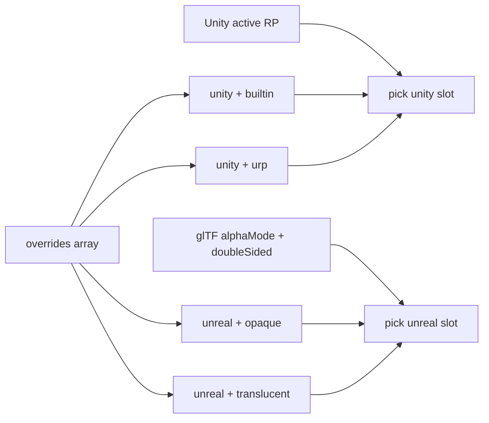

# VRMXT_materials_override

Per-material glTF extension. Lets an author mark a VRM 1.0 material for optional
consumer-side override. Stock VRM 1.0 importers that ignore the extension MUST still
load the material through normal glTF / MToon / unlit / PBR rules.

The extension stores engine-specific override entries. Each entry names a target
material definition and MAY bind MToon shade values to its parameters.

## Scope

| Item | Value |
|------|-------|
| Extension name | `VRMXT_materials_override` |
| Target | VRM 1.0 (`VRMC_vrm` 1.0) only |
| Attachment | `materials[i].extensions.VRMXT_materials_override` |
| Engine entries | `overrides[]` |
| Root `extensions` | not used for this extension |
| Stock importer | no required change |
| Consumer package | optional; interprets the extension when present |

## Normative requirements

1. Files that use this extension MUST list `VRMXT_materials_override` in
   `extensionsUsed`.
2. The extension object MUST appear on a glTF `materials[]` entry under
   `extensions.VRMXT_materials_override`.
3. The extension object MUST contain `specVersion` with value `"1.0"` for this draft.
4. The extension object MUST contain a non-empty `overrides` array.
5. Each `overrides` entry MUST contain an `engine` string identifying its target engine.
6. A material MUST NOT contain more than one override with the same **selection key**.
   The default selection key is `engine` alone. An engine profile MAY refine the key
   (Unity and Unreal both use `engine` plus `material.variant`). When a profile defines
   a refined key, that key MUST be unique among entries for that engine.
7. A supporting implementation MUST select at most one override for its engine according
   to that engine profile's selection rules. It MUST ignore entries for other or unknown
   engines.
8. Implementations that do not support the extension MUST ignore it and import the
   material using remaining glTF and VRM 1.0 material rules
   (`VRMC_materials_mtoon`, `KHR_materials_unlit`, core PBR, in that existing precedence).
9. Implementations MUST NOT require this extension in `extensionsRequired` unless the
   file is intentionally unusable without a supporting consumer.
10. An override MUST contain a `material` object valid for its engine profile.
11. A supporting implementation MUST ignore material definitions it does not recognize.
12. If the material definition or any required asset cannot be resolved, a supporting
    implementation MUST use stock VRM 1.0 material import for that material.
13. An override MAY contain `bindings`. Each binding maps one MToon source semantic to
    one engine-specific target material parameter.
14. Each binding MUST contain `source`, `target`, and `targetType`.
15. A supporting implementation MUST resolve MToon source values from the sibling
    `VRMC_materials_mtoon` extension. When a source property is omitted, it MUST use the
    default defined by the supported `VRMC_materials_mtoon` version.
16. A supporting implementation MUST ignore a binding when the material has no
    `VRMC_materials_mtoon` extension or does not recognize the binding's source semantic.
17. Override properties other than `engine`, `material`, `bindings`, and `properties` are
    **TBD** and MUST NOT be treated as stable until this specification marks them accepted.
18. Validity of a file that uses this extension MUST NOT depend on membership of any
    `material` identifier in a closed registry or allowlist.
19. A supporting implementation MUST NOT fail import of a VRM solely because a material
    identifier is absent from a catalog. Unresolved materials MUST follow rules 11 and 12.
20. Optional public catalogs are non-normative indexes or samples. Consumers MAY consult
    them for discovery. Catalog absence MUST NOT be treated as a hard error.
21. When an engine profile defines `provider`, that field is advisory. A consumer MAY warn
    on package or plugin mismatch; it MUST NOT treat a missing or mismatched `provider` as
    grounds to reject the file.
22. An override MAY contain a `properties` array. Each entry sets a literal value on one
    engine-specific material parameter, independent of `VRMC_materials_mtoon`. `properties`
    MAY be omitted or empty.
23. `properties[].name` MUST NOT equal any `bindings[].target` value within the same
    override. Exporters MUST omit a `properties` entry for a target already covered by a
    `bindings` entry. A supporting implementation MUST still apply `properties` before
    `bindings` and let `bindings` win on conflict, so behavior stays defined for
    non-conforming files.
24. A supporting implementation MUST ignore a `properties` entry with an unrecognized
    `type` or a value it cannot resolve, including an out-of-range `texture` index. It
    MUST NOT fail import of the material for that reason; rules 11 and 12 continue to
    apply.
25. `properties[].value` MUST be literal data stored directly in the file. `properties`
    MUST NOT reference, duplicate, or replace `VRMC_materials_mtoon` fields; use `bindings`
    to transfer MToon-sourced values instead.
26. An exporter that emits a `properties[].texture` reference MUST register the referenced
    image through its normal glTF texture export path so the index resolves in the output
    file. An index that does not resolve is unresolvable under rule 24.

## Extension properties

| Property | Type | Required | Meaning |
|----------|------|----------|---------|
| `specVersion` | string | yes | Version of this extension; currently `"1.0"` |
| `overrides` | object[] | yes | Non-empty list of engine-specific overrides (selection key per rules 6–7) |
| `overrides[].engine` | string | yes | Case-sensitive engine identifier |
| `overrides[].material` | object | yes | Definition specified by the engine profile |
| `overrides[].bindings` | object[] | no | MToon semantic-to-target bindings |
| `bindings[].source` | string | yes | MToon source semantic listed below |
| `bindings[].target` | string | yes | Engine-specific material parameter identifier |
| `bindings[].targetType` | string | yes | `scalar`, `vector`, `texture`, or `shaderFeature` |
| `overrides[].properties` | object[] | no | Literal parameter values applied directly, independent of `VRMC_materials_mtoon` |
| `properties[].name` | string | yes | Engine-specific material parameter identifier |
| `properties[].type` | string | yes | `scalar`, `vector`, `texture`, or `shaderFeature` |
| `properties[].value` | number, number[], or boolean | required unless `type` is `texture` | Literal value matching `type` |
| `properties[].texture` | integer | required when `type` is `texture` | Index into glTF `textures[]` |

`scalar` and `vector` carry numeric data directly. `texture` carries an index into the
file's glTF `textures[]`. `shaderFeature` is a boolean toggle for a discrete shader
capability rather than an assigned value: a Unity shader keyword driven by
`#pragma shader_feature`, an Unreal Material **Static Switch** parameter, or a ShaderLab
`[Toggle]`-backed keyword.

Engine profiles define the contents of `material`, provider identifiers, supported
`targetType` and `properties[].type` operations, and engine-specific fallback constraints.
Material identifiers in those profiles are open engine-specific strings (or
profile-defined objects). Rules 18–21 apply to every profile; rules 22–26 govern
`properties`.

## Engine profiles

This draft defines two case-sensitive engine identifiers:

| Engine | Profile |
|--------|---------|
| `unity` | [UniVRMXT materials override](../../../implementations/univrm-vrmxt.md#materials-override) |
| `unreal` | [VRM4U VRMXT](../../../implementations/vrm4u-vrmxt.md) |

New engines require a separate profile. Adding a profile does not change this base
extension version unless it changes common fields or behavior.

### Selection overview

Non-normative. Sibling `overrides[]` entries can share an `engine` when the profile
refines the selection key with `material.variant` (rules 6–7). Each consumer picks at
most one slot for its engine:



| Profile | How the consumer picks the slot |
|---------|----------------------------------|
| Unity | Active host render pipeline (`builtin` / `urp` / `hdrp`) |
| Unreal | This glTF material’s `alphaMode` + `doubleSided` |

Full selection and survival rules: [UniVRMXT materials override](../../../implementations/univrm-vrmxt.md#materials-override),
[VRM4U VRMXT](../../../implementations/vrm4u-vrmxt.md).

## MToon shading source semantics

The following `source` identifiers refer to resolved values from
`VRMC_materials_mtoon`. They do not name engine material parameters.

| Source | Value |
|--------|-------|
| `shadeColorFactor` | RGB shade color factor |
| `shadeMultiplyTexture` | Shade multiply texture and its texture-info metadata |
| `shadingShiftFactor` | Base shading shift scalar |
| `shadingShiftTexture` | Shading shift texture and its texture-info metadata |
| `shadingShiftTexture.scale` | Scalar applied to the shading shift texture |
| `shadingToonyFactor` | Shading boundary toony scalar |
| `giEqualizationFactor` | Global illumination equalization scalar |

Bindings transfer the resolved source value to `target` using `targetType`. Consumers
MUST ignore incompatible source/target combinations. Color-vector conversion,
texture-coordinate handling, and shader-feature rebuild behavior are **TBD**.

## Literal material properties

`overrides[].properties` sets literal values on engine material parameters straight from
the file, with no dependency on `VRMC_materials_mtoon`. Use `properties` for authored
constants; use `bindings` for values that should track sibling MToon data.

Rules 22–26 govern omission, conflicts with `bindings`, unresolvable entries, and texture
registration. A material MAY use `bindings`, `properties`, both, or neither.

## Attachment example

Non-normative. One material with Unity Built-in + URP slots and Unreal opaque +
translucent slots (see Selection overview). Profile-specific bindings and properties are
omitted here; see the Unity and Unreal profile notes for fuller single-slot examples.

```json
{
  "extensionsUsed": [
    "VRMC_vrm",
    "VRMC_materials_mtoon",
    "VRMXT_materials_override"
  ],
  "materials": [
    {
      "name": "Face",
      "pbrMetallicRoughness": {
        "baseColorFactor": [1.0, 1.0, 1.0, 1.0]
      },
      "extensions": {
        "VRMC_materials_mtoon": {
          "specVersion": "1.0"
        },
        "VRMXT_materials_override": {
          "specVersion": "1.0",
          "overrides": [
            {
              "engine": "unity",
              "material": {
                "idType": "shaderName",
                "id": "VRMXT/Samples/TestOverrideBuiltin",
                "variant": "builtin"
              },
              "properties": [
                { "name": "_Color", "type": "vector", "value": [0, 1, 0, 1] }
              ]
            },
            {
              "engine": "unity",
              "material": {
                "idType": "shaderName",
                "id": "VRMXT/Samples/TestOverrideURP",
                "variant": "urp"
              },
              "properties": [
                { "name": "_Color", "type": "vector", "value": [1, 1, 0, 1] }
              ]
            },
            {
              "engine": "unreal",
              "material": {
                "idType": "resourcePath",
                "id": "/Game/Example/M_Skin_Opaque",
                "variant": "opaque"
              }
            },
            {
              "engine": "unreal",
              "material": {
                "idType": "resourcePath",
                "id": "/Game/Example/M_Skin_Translucent",
                "variant": "translucent"
              }
            }
          ]
        }
      }
    }
  ]
}
```

## Relationship to other material extensions

- Core glTF material fields remain the portable base (base color, alpha, normals,
  emissive, double-sided).
- `VRMC_materials_mtoon` remains the VRM 1.0 toon material extension when present.
- `VRMXT_materials_override` is a sibling under `materials[i].extensions`. It does not
  replace MToon JSON.
- `bindings` transfer existing MToon shade values to target material parameters. They do
  not redefine MToon values.
- `properties` set literal values with no MToon dependency. Rule 23 fixes precedence
  between `properties` and `bindings` on the same target; override-vs-MToon precedence at
  the whole-material level is otherwise **TBD** (override vs MToon vs coexistence).
- `KHR_materials_variants` is a different mechanism (primitive → portable `materials[]`
  swap for named skins). It does not carry engine material identities or MToon bindings.
  Research: [KHR / glTF overlap](../../../references/khr-gltf-overlap.md).

## Optional consumer interpretation

Supporting tools MAY select an override for their engine (rule 7), resolve `material`,
apply `properties` and then `bindings`, and create a local material instance. Missing
providers, unresolved assets, unsupported identities, unknown engines, or no matching
variant leave stock VRM 1.0 import intact.

The VRM / glTF file does not embed engine shader or material programs. A supporting
consumer that wants overrides at runtime or in the editor MUST supply the referenced
shaders or parent materials in its own project, package, or cooked content (rules 18–21).
Resolution is local to that consumer: look up the profile identifier, apply the override
when the asset is present, otherwise use stock import for that material (rules 11–12).
This specification does not require remote download or runtime compilation of shader
source from the file or from a registry.

Engine integration details are documented in
[UniVRMXT materials override](../../../implementations/univrm-vrmxt.md#materials-override),
[VRM4U VRMXT](../../../implementations/vrm4u-vrmxt.md), and
[Blender VRMXT materials override](../../../implementations/blender-vrmxt.md#materials-override).

Host ops **Apply**, **Materialize**, and **Transfer** (override ↔ material asset /
live instance) are defined in
[VRMXT Editor](../../../implementations/vrmxt-editor.md#materials-apply-materialize-and-transfer).
They do not add fields to this extension.

## Open questions

- [ ] Binding color conversions and texture transforms
- [ ] Shader-feature rebuild behavior
- [ ] Precedence vs `VRMC_materials_mtoon` and `KHR_materials_unlit`
- [ ] Whether `extensionsRequired` is ever appropriate
- [ ] Export rules for Blender / other authoring tools (format uses `idType` / `id`;
      authoring plan in
      [Blender VRMXT authoring UI](../../../implementations/blender-vrmxt.md#authoring-ui-plan))
- [ ] Authoring UX when a material stores multiple `unity` or `unreal` variant slots
      (Unity multi-variant rules sketched in the Blender authoring plan; Unreal still open)
- [ ] Stable `specVersion` policy after first accepted property set

## Related

- Upstream MToon: `VRMC_materials_mtoon` in the VRM 1.0 specification
- Core materials: glTF 2.0 `materials` schema
- [KHR / glTF overlap](../../../references/khr-gltf-overlap.md) (non-normative)
- [VRoid Hub VRMXT round-trip](../../../references/vroid-hub-vrmxt-roundtrip.md) (non-normative)
- [VRMXT Editor](../../../implementations/vrmxt-editor.md) (Apply / Materialize / Transfer)
- [UniVRMXT materials override](../../../implementations/univrm-vrmxt.md#materials-override)
- [VRM4U VRMXT](../../../implementations/vrm4u-vrmxt.md)
- [Blender VRMXT materials override](../../../implementations/blender-vrmxt.md#materials-override)
- [VRMXT_sprite_particle](../vfx/vrmxt-sprite-particle.md)
- [VRMXT_springBone_override](../physics/vrmxt-spring-bone-override.md)
- [VRMXT_lattice](../deformation/vrmxt-lattice.md) (research draft)
