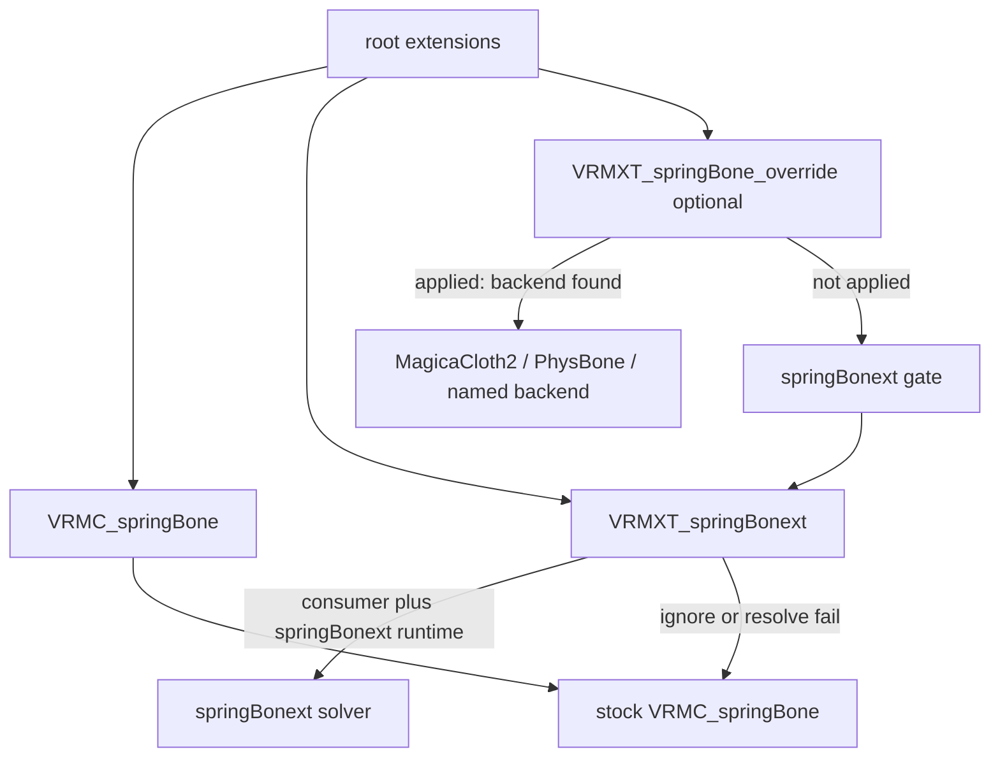

# VRMXT_springBonext

Root glTF extension. Carries extras for VRM 1.0 spring chains next to stock
`VRMC_springBone` on the same asset.

The extras object is named `VRMXT_springBonext`. This document is an Extended VRM
draft. It is not a VRM Consortium specification.

Stock VRM 1.0 importers ignore unrecognized root extensions and keep ordinary
`VRMC_springBone` simulation.

Field tables for extras are **TBD**. This page is the extension identity, attachment,
conformance, and load gate.

## Scope

| Item | Value |
|------|-------|
| Extension name | `VRMXT_springBonext` |
| Target | VRM 1.0 (`VRMC_vrm` 1.0) only |
| Attachment | Root `extensions.VRMXT_springBonext` |
| Required sibling | Root `extensions.VRMC_springBone` |
| Per-spring extras | `springs[].spring` indexes `VRMC_springBone.springs` |
| Plane / inside colliders | Sibling Consortium [`VRMC_springBone_extended_collider`](https://github.com/vrm-c/vrm-specification/tree/master/specification/VRMC_springBone_extended_collider-1.0) on `colliders[i].extensions` |
| Stock importer | no required change |
| Consumer package | optional; MAY replace FastSpringBone (or equivalent) with a springBonext solver when extras apply |

Do not add extra keys inside `VRMC_springBone` objects. UniVRM export may drop unknown
fields there. Do not nest this extension on `VRMC_springBone.springs[i].extensions`.
Do not attach spring extras through `VRMXT_springBone_override`; that extension selects
an engine backend (MagicaCloth2, PhysBone, and similar).

Plane and inside colliders stay on Consortium
`VRMC_springBone_extended_collider` on each collider object.

## Conformance

This specification conforms to [VRMXT Conformance](../../../core/vrmxt-conformance.md).

Family naming (`…xt` vs `_override`) is in
[Architecture Naming](../../../../architecture.md#naming).

## Normative requirements

1. Files that use this extension MUST list `VRMXT_springBonext` in `extensionsUsed`.
2. The extension object MUST appear at root `extensions.VRMXT_springBonext`.
3. The file MUST also contain a valid root `VRMC_springBone` extension. If that sibling
   is missing, a supporting implementation MUST ignore `VRMXT_springBonext` and keep
   stock VRM 1.0 spring import.
4. The extension object MUST contain `specVersion` with value `"1.0"` for this draft.
5. Files MUST NOT list `VRMXT_springBonext` in `extensionsRequired`.
6. Implementations that do not support the extension MUST ignore it.
7. Each entry in `springs` (when present) MUST contain `spring`, a zero-based index into
   `VRMC_springBone.springs`. Duplicate `spring` indices in one object are invalid for
   those entries; a supporting implementation MUST skip the duplicate entries and MAY
   keep the first.
8. A supporting implementation MAY apply extras and MAY swap that spring to its
   springBonext solver only when all of the following hold:
   - the consumer claims this capability;
   - this extension object is valid (`specVersion` and sibling `VRMC_springBone`
     present);
   - the referenced `spring` index exists;
   - the consumer can resolve its springBonext runtime.
9. When rule 8 holds for a spring, the implementation MUST:
   - keep joint nodes, stiffness, gravity, drag, hit radius, colliders, and related
     stock state from the sibling `VRMC_springBone` spring;
   - then apply extras defined for that index (none specified in this draft).
10. When rule 8 does not hold for a spring, the implementation MUST keep stock
    `VRMC_springBone` behavior for that spring and MUST NOT apply extras for that
    index.
11. The skippable unit is this root object's data for one `springs[]` entry, or the
    whole `VRMXT_springBonext` object when the sibling is missing. Invalid data MUST
    NOT make the glTF or VRM 1.0 asset invalid.
12. Unrecognized properties on the extension object and on `springs[]` entries MUST
    be ignored.
13. This extension MUST NOT duplicate `VRMC_springBone` joint fields (`stiffness`,
    `gravityPower`, `gravityDir`, `dragForce`, `hitRadius`, `node`).
14. When `VRMXT_springBone_override` **applies** on the same spring (engine selected,
    backend resolved, runtime present), a supporting implementation MUST use that
    override and MUST NOT apply `VRMXT_springBonext` extras or a springBonext solver
    swap on that spring. If the override is absent, is for another engine, or fails
    to resolve for that spring, the implementation MUST run rules 8–10 for that
    spring.
15. The glTF file MUST NOT embed MagicaCloth2 or VRChat PhysBone SDK types. Those
    backends belong on `VRMXT_springBone_override`.

## Load gate



## Extension properties

| Property | Type | Required | Meaning |
|----------|------|----------|---------|
| `specVersion` | string | yes | Extension version; currently `"1.0"` |
| `springs` | object[] | no | Per-spring extras keyed by index; omitted or empty means no extras this draft |
| `springs[].spring` | integer | yes when the entry exists | Zero-based index into `VRMC_springBone.springs` |

Further per-spring fields are **TBD**.

## Attachment example

Non-normative. Hair (index 0) lists an XT entry with no extra fields yet. Chest
(index 1) uses Magica override, so Apply skips XT on that spring. Plane collider
stays Consortium.

```json
{
  "extensionsUsed": [
    "VRMC_vrm",
    "VRMC_springBone",
    "VRMC_springBone_extended_collider",
    "VRMXT_springBonext",
    "VRMXT_springBone_override"
  ],
  "extensions": {
    "VRMC_vrm": {},
    "VRMC_springBone": {
      "specVersion": "1.0",
      "colliders": [
        {
          "node": 2,
          "shape": { "sphere": { "radius": 0.05 } },
          "extensions": {
            "VRMC_springBone_extended_collider": {
              "specVersion": "1.0",
              "shape": { "plane": {} }
            }
          }
        }
      ],
      "colliderGroups": [{ "colliders": [0] }],
      "springs": [
        { "name": "Hair", "joints": [{ "node": 10 }, { "node": 11 }] },
        { "name": "Chest", "joints": [{ "node": 24 }] }
      ]
    },
    "VRMXT_springBonext": {
      "specVersion": "1.0",
      "springs": [
        { "spring": 0 }
      ]
    },
    "VRMXT_springBone_override": {
      "specVersion": "1.0",
      "overrides": [
        {
          "engine": "unity",
          "backend": "magicaCloth2",
          "bindings": [
            {
              "spring": 1,
              "mode": "boneSpring"
            }
          ]
        }
      ]
    }
  }
}
```

## Optional consumer interpretation

A supporting consumer MAY parse this object after stock `VRMC_springBone` import.
With no extra fields defined, Apply is a no-op beyond storing the instance for
round-trip. Stock FastSpringBone (or equivalent) keeps simulating.

## Open questions

- [ ] Extra field tables (limits, topology, stretch / squish, and similar)
- [ ] Whether `springs` MUST be non-empty when the extension object is present
- [ ] springBonext solver identity in UniVRMXT / three-vrmxt / Blender preview
- [ ] Stable `specVersion` policy after the first accepted property set

## Related

- [VRMXT Conformance](../../../core/vrmxt-conformance.md)
- [Architecture Naming](../../../../architecture.md#naming)
- Upstream spring bone: [VRMC_springBone 1.0](https://github.com/vrm-c/vrm-specification/tree/master/specification/VRMC_springBone-1.0)
- [VRMC_springBone_extended_collider 1.0](https://github.com/vrm-c/vrm-specification/tree/master/specification/VRMC_springBone_extended_collider-1.0)
- [VRMXT_springBone_override](../vrmxt-spring-bone-override.md)
- [VRMXT_materials_mtoonxt](../../materials/vrmxt-materials-mtoonxt/README.md) (same `…xt` role)
- [Spring bone / secondary physics systems](../../../../references/spring-bone-physics-systems.md)
