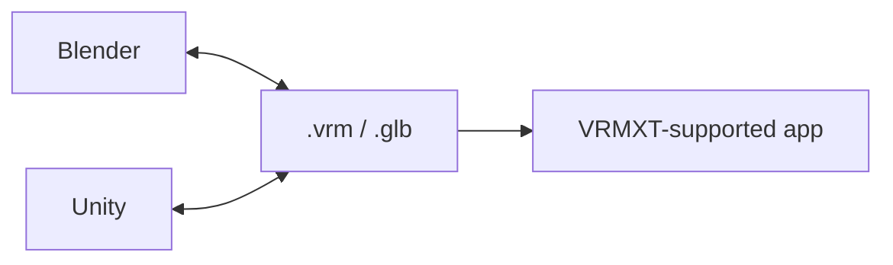

# Tutorials

Walkthroughs if you already have a VRM 1.0 avatar and want to add VRMXT in
Blender or Unity, then load the file in a VRMXT-supported app (Warudo, VRMXT
Player, etc).

Implementing an importer or editor? Use [specs/](../specs/) and
[implementations/](../implementations/) instead.

## Path that ships today

1. Author and export in Blender or Unity.
2. Load the same `.vrm` in a VRMXT-supported app.

## Pages

| Note | What you will do | Status |
|------|------------------|--------|
| [Getting started in Blender](getting-started-blender.md) | Install Extended VRM + VRMXT from GitHub Releases | draft |
| [Getting started in Unity](getting-started-unity.md) | Install Extended UniVRM + UniVRMXT via UPM git URLs | draft |
| [Getting started in Warudo](getting-started-warudo.md) | Subscribe Workshop plugins and load a Character | draft |
| [Blender materials override](blender-materials-override.md) | Point a material at a Unity shader | draft |
| [Blender sprite particles](blender-sprite-particles.md) | Add sprite emitters on the armature | draft |
| [Blender MToonXT stencil](blender-mtoonxt-stencil.md) | Set MToon stencil | draft |
| [Unity MToonXT stencil](unity-mtoonxt-stencil.md) | Set MToon stencil in UniVRMXT | draft |
| [Warudo patch export](warudo-patch-export.md) | Write Warudo override edits back to a copy | draft |
