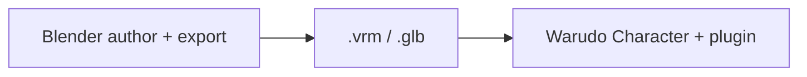

# Tutorials

Walkthroughs if you already have a VRM 1.0 avatar and want to add VRMXT in
Blender, then see it in Warudo.

Implementing an importer or editor? Use [specs/](../specs/) and
[implementations/](../implementations/) instead.

## Path that ships today

1. Author and export in Blender.
2. Load the same `.vrm` as a Warudo Character with the VRMXT plugin.

There is no Unity Player tutorial yet (the app is still planned).

## Pages

| Note | What you will do | Status |
|------|------------------|--------|
| [Getting started in Blender](getting-started-blender.md) | Install Extended VRM + VRMXT from GitHub Releases | draft |
| [Getting started in Unity](getting-started-unity.md) | Install Extended UniVRM + UniVRMXT via UPM git URLs | draft |
| [Blender materials override](blender-materials-override.md) | Point a material at a Unity shader | draft |
| [Blender sprite particles](blender-sprite-particles.md) | Add sprite emitters on the armature | draft |
| [Blender MToonXT stencil](blender-mtoonxt-stencil.md) | Set MToon stencil | draft |
| [Unity MToonXT stencil](unity-mtoonxt-stencil.md) | Set MToon stencil in UniVRMXT | draft |
| [Warudo apply](warudo-apply.md) | Load the file and see particles, shaders, and stencil | draft |
| [Warudo patch export](warudo-patch-export.md) | Write Warudo override edits back to a copy | draft |
